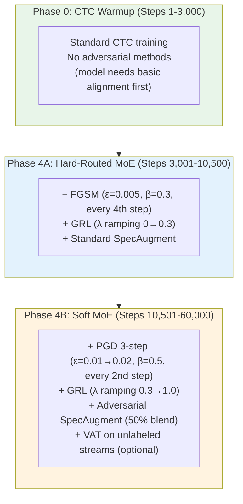

# Direction 1 — Adversarial Training: Deep Dive

## Goal
Improve robustness and reduce overfitting on dialect-specific acoustic artifacts by integrating adversarial perturbation, domain-invariant representation learning, and saliency-guided augmentation into the training pipeline.

**Current weakness to address**: D1 Malvani has 11.40% CER vs D3 Standard at 5.63% — nearly 2x worse. Part of this gap is the model overfitting to D3-like acoustic patterns during pretraining. Adversarial training forces the encoder to learn representations that generalize across dialect acoustic spaces.

---

## Technique 1 — FGSM/PGD on Log-Mel Spectrograms

### What & Why
Instead of randomly perturbing inputs (noise augmentation), adversarial training finds the **worst-case perturbation** that maximally increases the loss, then trains the model to be robust against it:

$$\min_\theta \mathbb{E}_{(X,Y)} \left[ \mathcal{L}_{\text{CTC}}(X, Y; \theta) + \beta \cdot \max_{\|\delta\|_\infty \le \epsilon} \mathcal{L}_{\text{CTC}}(X + \delta, Y; \theta) \right]$$

This is qualitatively different from Gaussian noise: it probes the model's actual decision boundaries rather than adding random perturbations that the model can easily ignore.

### Implementation

```python
# NEW: training/adversarial.py

import torch
import torch.nn as nn
import torch.nn.functional as F


class AdversarialTrainer:
    """
    Adversarial training module for ASR.
    Supports FGSM (1-step) and PGD (K-step) attacks on log-mel spectrograms.
    """
    
    def __init__(
        self,
        epsilon: float = 0.01,       # L∞ perturbation budget
        alpha: float = 0.005,        # PGD step size
        num_pgd_steps: int = 3,      # Number of PGD iterations
        beta: float = 0.5,           # Weight of adversarial loss
        attack_type: str = "fgsm",   # "fgsm" or "pgd"
        warmup_steps: int = 1000,    # Don't attack until model has basic CTC alignment
        attack_every_n: int = 2,     # Attack every Nth step (save compute)
    ):
        self.epsilon = epsilon
        self.alpha = alpha
        self.num_pgd_steps = num_pgd_steps
        self.beta = beta
        self.attack_type = attack_type
        self.warmup_steps = warmup_steps
        self.attack_every_n = attack_every_n
    
    def should_attack(self, global_step: int) -> bool:
        """Check if we should apply adversarial training this step."""
        if global_step < self.warmup_steps:
            return False
        return global_step % self.attack_every_n == 0
    
    def generate_adversarial_spec(
        self, model, spec, targets, target_lengths, 
        chunk_size=None, dialect_idx=None
    ) -> torch.Tensor:
        """
        Generate adversarial spectrogram perturbation.
        
        Args:
            model: The ASR model (used for gradient computation, not updated)
            spec: (B, T, 80) log-mel spectrogram (clean)
            targets: (B, U) CTC target token IDs
            target_lengths: (B,) target sequence lengths
        
        Returns:
            spec_adv: (B, T, 80) adversarially perturbed spectrogram
        """
        if self.attack_type == "fgsm":
            return self._fgsm(model, spec, targets, target_lengths, 
                              chunk_size, dialect_idx)
        elif self.attack_type == "pgd":
            return self._pgd(model, spec, targets, target_lengths,
                             chunk_size, dialect_idx)
        else:
            raise ValueError(f"Unknown attack type: {self.attack_type}")
    
    def _fgsm(self, model, spec, targets, target_lengths, chunk_size, dialect_idx):
        """
        Fast Gradient Sign Method (1-step attack).
        δ = ε · sign(∇_X L_CTC(X, Y; θ))
        """
        spec_adv = spec.clone().detach().requires_grad_(True)
        
        # Forward pass through encoder + CTC head
        # We operate on the spectrogram AFTER the frontend, so we call encoder directly
        enc_out = model.encoder(
            spec_adv, chunk_size=chunk_size, return_all_exits=True,
            dialect_idx=dialect_idx
        )
        log_probs = model.ctc_head(enc_out["final_hidden"])
        
        input_lengths = torch.full(
            (spec_adv.size(0),), log_probs.size(1),
            dtype=torch.long, device=spec.device
        )
        
        loss = F.ctc_loss(
            log_probs.transpose(0, 1), targets,
            input_lengths, target_lengths, blank=0,
            reduction='mean', zero_infinity=True
        )
        
        # Compute gradient w.r.t. input spectrogram
        loss.backward()
        
        # FGSM perturbation
        perturbation = self.epsilon * spec_adv.grad.sign()
        spec_adv = (spec + perturbation).detach()
        
        return spec_adv
    
    def _pgd(self, model, spec, targets, target_lengths, chunk_size, dialect_idx):
        """
        Projected Gradient Descent (K-step attack).
        Stronger than FGSM but more expensive.
        """
        # Initialize with random perturbation inside ε-ball
        delta = torch.zeros_like(spec).uniform_(-self.epsilon, self.epsilon)
        delta = delta.detach()
        
        for _ in range(self.num_pgd_steps):
            delta.requires_grad_(True)
            spec_adv = spec + delta
            
            enc_out = model.encoder(
                spec_adv, chunk_size=chunk_size, return_all_exits=True,
                dialect_idx=dialect_idx
            )
            log_probs = model.ctc_head(enc_out["final_hidden"])
            
            input_lengths = torch.full(
                (spec_adv.size(0),), log_probs.size(1),
                dtype=torch.long, device=spec.device
            )
            
            loss = F.ctc_loss(
                log_probs.transpose(0, 1), targets,
                input_lengths, target_lengths, blank=0,
                reduction='mean', zero_infinity=True
            )
            
            loss.backward()
            
            # PGD step
            delta = delta + self.alpha * delta.grad.sign()
            # Project back into ε-ball (L∞ constraint)
            delta = torch.clamp(delta, -self.epsilon, self.epsilon).detach()
        
        return (spec + delta).detach()
    
    def compute_adversarial_loss(
        self, model, spec, targets, target_lengths,
        chunk_size=None, dialect_idx=None, use_hard_routing=False
    ) -> dict:
        """
        Complete adversarial training step.
        Returns clean loss, adversarial loss, and combined loss.
        """
        # 1. Clean forward pass
        if model.training:
            spec_aug = model.spec_augment(spec)
        else:
            spec_aug = spec
        
        enc_out_clean = model.encoder(
            spec_aug, chunk_size=chunk_size, return_all_exits=True,
            dialect_idx=dialect_idx, use_hard_routing=use_hard_routing
        )
        log_probs_clean = model.ctc_head(enc_out_clean["final_hidden"])
        
        input_lengths = torch.full(
            (spec.size(0),), log_probs_clean.size(1),
            dtype=torch.long, device=spec.device
        )
        
        loss_clean = F.ctc_loss(
            log_probs_clean.transpose(0, 1), targets,
            input_lengths, target_lengths, blank=0,
            reduction='mean', zero_infinity=True
        )
        
        # 2. Generate adversarial example (on CLEAN spec, not augmented)
        spec_adv = self.generate_adversarial_spec(
            model, spec, targets, target_lengths, chunk_size, dialect_idx
        )
        
        # 3. Adversarial forward pass
        enc_out_adv = model.encoder(
            spec_adv, chunk_size=chunk_size, return_all_exits=True,
            dialect_idx=dialect_idx, use_hard_routing=use_hard_routing
        )
        log_probs_adv = model.ctc_head(enc_out_adv["final_hidden"])
        
        loss_adv = F.ctc_loss(
            log_probs_adv.transpose(0, 1), targets,
            input_lengths, target_lengths, blank=0,
            reduction='mean', zero_infinity=True
        )
        
        # 4. Combined loss
        loss_total = loss_clean + self.beta * loss_adv
        
        return {
            "loss_total": loss_total,
            "loss_clean": loss_clean.item(),
            "loss_adv": loss_adv.item(),
            "perturbation_norm": (spec_adv - spec).abs().mean().item(),
        }
```

### Training Loop Integration

```python
# MODIFY: moe/train_moe.py — inside training loop

from training.adversarial import AdversarialTrainer

# Initialize adversarial trainer
adv_trainer = AdversarialTrainer(
    epsilon=0.01,          # Start conservative
    attack_type="fgsm",    # FGSM for speed; switch to PGD for final runs
    beta=0.5,              # Adversarial loss weight
    warmup_steps=3000,     # Don't attack during CTC warmup (Phase 0)
    attack_every_n=2,      # Every other step to save compute
)

for step, batch in enumerate(dataloader):
    waveforms, targets, target_lengths, dialect_idx = batch
    
    # Compute spectrogram
    spec = model.frontend(waveforms)
    
    if adv_trainer.should_attack(step):
        # Adversarial training step (2x forward passes)
        losses = adv_trainer.compute_adversarial_loss(
            model, spec, targets, target_lengths,
            chunk_size=sampled_chunk_size,
            dialect_idx=dialect_idx,
        )
        loss = losses["loss_total"]
    else:
        # Normal training step
        out = model.forward_ctc(waveforms, chunk_size=sampled_chunk_size,
                                dialect_idx=dialect_idx)
        loss = F.ctc_loss(out["log_probs"].transpose(0, 1), targets,
                          out["output_lengths"], target_lengths, blank=0)
    
    loss.backward()
    optimizer.step()
    optimizer.zero_grad()
```

### Epsilon Scheduling

Don't use a fixed epsilon — anneal it over training:

```python
class EpsilonScheduler:
    """
    Ramp up adversarial perturbation strength over training.
    Start gentle → increase as model becomes more robust.
    """
    def __init__(self, epsilon_start=0.001, epsilon_end=0.02, 
                 warmup_steps=5000, ramp_steps=20000):
        self.epsilon_start = epsilon_start
        self.epsilon_end = epsilon_end
        self.warmup_steps = warmup_steps
        self.ramp_steps = ramp_steps
    
    def get_epsilon(self, step):
        if step < self.warmup_steps:
            return 0.0  # No perturbation during warmup
        
        progress = min(1.0, (step - self.warmup_steps) / self.ramp_steps)
        return self.epsilon_start + progress * (self.epsilon_end - self.epsilon_start)

# Usage:
# eps_scheduler = EpsilonScheduler()
# adv_trainer.epsilon = eps_scheduler.get_epsilon(step)
```

### Hyperparameter Sensitivity Guide

| Parameter | Conservative | Moderate | Aggressive | Notes |
|:---|:---:|:---:|:---:|:---|
| `epsilon` | 0.005 | 0.01 | 0.02 | L∞ bound on spectrogram perturbation |
| `beta` | 0.3 | 0.5 | 1.0 | Adversarial loss weight |
| `num_pgd_steps` | 1 (FGSM) | 3 | 7 | More steps = stronger attack |
| `alpha` (PGD) | 0.002 | 0.005 | 0.01 | PGD step size |
| `attack_every_n` | 4 | 2 | 1 | Attack frequency (compute tradeoff) |

> [!TIP]
> **Start with FGSM, ε=0.005, β=0.3, every 4th step.** This is cheap (~30% overhead) and safe. If CER improves, increase aggressiveness. Switch to PGD 3-step for the final production run.

---

## Technique 2 — Gradient Reversal Layer (GRL) for Dialect-Invariant Features

### What & Why
The Gradient Reversal Layer creates a **minimax game**: a dialect discriminator tries to classify which dialect each utterance belongs to, while the encoder's gradients are *reversed* so it actively tries to **fool the discriminator**. The result: encoder representations that are phonemically rich but dialect-agnostic.

This is especially valuable because your MoE handles dialect *specialization* in layers 5-12, but the *shared trunk* in layers 1-4 should ideally be dialect-*invariant*. GRL enforces this invariance explicitly.

```
                    DESIRED ARCHITECTURE:
                    
   Layers 1-4: Dialect-INVARIANT (GRL forces this)
        │
        ├──→ Layer 4 representations should NOT distinguish D1 from D4
        │    (same phoneme in any dialect maps to same representation)
        │
   Layers 5-12: Dialect-AWARE (MoE handles this)
        │
        └──→ Expert routing adds dialect-specific refinements ON TOP of
             the dialect-invariant base
```

### Implementation

```python
# NEW: model/gradient_reversal.py

import torch
import torch.nn as nn
import torch.nn.functional as F
from torch.autograd import Function


class GradientReversalFunction(Function):
    """
    Gradient Reversal Layer (Ganin et al., 2016).
    Forward: Identity function (pass-through).
    Backward: Multiply gradients by -λ (reverse direction).
    
    Effect: The encoder learns to MAXIMIZE the domain classifier's loss
    (make features domain-invariant) while the classifier learns to
    MINIMIZE it (identify the domain).
    """
    @staticmethod
    def forward(ctx, x, lambda_):
        ctx.lambda_ = lambda_
        return x.clone()
    
    @staticmethod
    def backward(ctx, grad_output):
        return -ctx.lambda_ * grad_output, None


def gradient_reversal(x, lambda_=1.0):
    """Functional interface for gradient reversal."""
    return GradientReversalFunction.apply(x, lambda_)


class DialectDiscriminator(nn.Module):
    """
    Adversarial dialect classifier.
    Attached after a specific encoder layer (default: Layer 4).
    
    Architecture:
        GRL(−λ) → TimePool → Linear(d→128) → ReLU → Dropout → Linear(128→4) → Softmax
    
    The 4 classes are:
        0: D1 (Malvani / Konkan)
        1: D2 (Ahirani / Khandesh)
        2: D3 (Standard Marathi / Desh)
        3: D4 (Varhadi / Vidarbha)
    """
    
    def __init__(self, d_model: int = 256, num_dialects: int = 4, 
                 hidden_dim: int = 128, dropout: float = 0.1):
        super().__init__()
        self.classifier = nn.Sequential(
            nn.Linear(d_model, hidden_dim),
            nn.ReLU(),
            nn.Dropout(dropout),
            nn.Linear(hidden_dim, hidden_dim),
            nn.ReLU(),
            nn.Dropout(dropout),
            nn.Linear(hidden_dim, num_dialects),
        )
    
    def forward(self, hidden_states, dialect_labels, grl_lambda=1.0):
        """
        Args:
            hidden_states: (B, T, d_model) encoder hidden states from Layer 4
            dialect_labels: (B,) dialect indices {0, 1, 2, 3}
            grl_lambda: Gradient reversal strength (annealed during training)
        
        Returns:
            domain_loss: Scalar cross-entropy loss
            accuracy: Dialect classification accuracy (for monitoring)
        """
        # Apply gradient reversal
        reversed_h = gradient_reversal(hidden_states, grl_lambda)
        
        # Time-pooled representation
        # Use both mean and max pooling for richer signal
        pooled_mean = reversed_h.mean(dim=1)  # (B, d_model)
        pooled_max = reversed_h.max(dim=1).values  # (B, d_model)
        pooled = pooled_mean + pooled_max  # Simple fusion
        
        # Classify dialect
        logits = self.classifier(pooled)  # (B, num_dialects)
        
        domain_loss = F.cross_entropy(logits, dialect_labels)
        
        # Monitoring: discriminator accuracy
        # (Should converge to ~25% = random chance if GRL is working)
        with torch.no_grad():
            preds = logits.argmax(dim=-1)
            accuracy = (preds == dialect_labels).float().mean().item()
        
        return domain_loss, accuracy


class GRLLambdaScheduler:
    """
    Anneal GRL λ from 0 → λ_max following the schedule from Ganin et al.:
    
        λ(p) = (2 / (1 + exp(-γ·p))) - 1
    
    where p = progress ∈ [0, 1] and γ = 10.
    
    This ramps up gradually so the encoder has time to learn basic
    acoustic features before the adversarial pressure kicks in.
    """
    
    def __init__(self, lambda_max: float = 1.0, gamma: float = 10.0, 
                 total_steps: int = 60000, warmup_steps: int = 3000):
        self.lambda_max = lambda_max
        self.gamma = gamma
        self.total_steps = total_steps
        self.warmup_steps = warmup_steps
    
    def get_lambda(self, step: int) -> float:
        if step < self.warmup_steps:
            return 0.0  # No adversarial pressure during CTC warmup
        
        p = (step - self.warmup_steps) / (self.total_steps - self.warmup_steps)
        p = min(1.0, max(0.0, p))
        
        import math
        lambda_val = self.lambda_max * (2.0 / (1.0 + math.exp(-self.gamma * p)) - 1.0)
        return lambda_val

# Lambda annealing curve:
# Step:   0      3k     10k    20k    30k    40k    50k    60k
# λ:     0.0    0.0    0.12   0.54   0.85   0.95   0.99   1.00
#                       ↑ gradual ramp           ↑ saturated
```

### Integration into ASR Model

```python
# MODIFY: model/asr_model.py

class StreamingASRModel(nn.Module):
    def __init__(self, ..., enable_grl: bool = False):
        ...
        
        # Optional: Gradient Reversal Layer for dialect-invariant features
        if enable_grl:
            self.dialect_discriminator = DialectDiscriminator(
                d_model=d_model, num_dialects=4
            )
            self.grl_lambda_scheduler = GRLLambdaScheduler(
                lambda_max=1.0, total_steps=60000
            )
        else:
            self.dialect_discriminator = None
    
    def forward_ctc(self, waveforms, ..., dialect_labels=None, global_step=0):
        ...
        enc_out = self.encoder(spec, ...)
        
        # GRL: Adversarial dialect classification on Layer 4 representations
        domain_loss = None
        domain_acc = None
        if self.dialect_discriminator is not None and dialect_labels is not None:
            layer4_hidden = enc_out["exit_hiddens"].get(4)
            if layer4_hidden is not None:
                grl_lambda = self.grl_lambda_scheduler.get_lambda(global_step)
                domain_loss, domain_acc = self.dialect_discriminator(
                    layer4_hidden, dialect_labels, grl_lambda
                )
        
        ...
        
        return {
            "log_probs": log_probs,
            "output_lengths": output_lengths,
            "domain_loss": domain_loss,      # Add to total loss
            "domain_accuracy": domain_acc,   # Log for monitoring
        }


# Training loop:
# loss_ctc = ctc_loss(...)
# loss_domain = output["domain_loss"]
# loss_total = loss_ctc + 0.1 * loss_domain  # γ = 0.1 weight for domain loss
```

### Monitoring: Is the GRL Working?

```python
# What to watch in training logs:

# ✅ GRL IS WORKING:
# - Discriminator accuracy: starts ~85% → drops toward ~25% (random chance)
# - Domain loss: starts low → increases (discriminator is being fooled)
# - CTC loss: continues decreasing normally
# - D1 Malvani CER gap vs D3 Standard: NARROWS

# ❌ GRL NOT WORKING (λ too high or too early):
# - CTC loss increases (adversarial gradient dominates useful learning)
# - All CERs degrade uniformly
# Fix: Reduce λ_max from 1.0 to 0.3, increase warmup_steps

# ❌ GRL NOT WORKING (λ too low):
# - Discriminator accuracy stays ~85%+ (not being fooled)
# - Dialect gap remains unchanged
# Fix: Increase λ_max, decrease warmup_steps
```

---

## Technique 3 — Adversarial SpecAugment (Gradient-Saliency Masking)

### What & Why
Standard SpecAugment masks **random** time-frequency regions. But much of the spectrogram is redundant silence, noise, or repeated formants. Adversarial SpecAugment uses **gradient saliency** to find the most informative regions and masks those specifically, forcing the model to extract redundant cues from surrounding context.

### Implementation

```python
# MODIFY: model/masking.py — extend SpecAugment class

class AdversarialSpecAugment(nn.Module):
    """
    Gradient-saliency-guided SpecAugment.
    Masks the most informative spectral regions instead of random ones.
    
    Steps:
    1. Quick forward pass to get loss
    2. Backpropagate to get gradient saliency map |∂L/∂X|
    3. Mask top-k% highest-saliency time-frequency bins
    """
    
    def __init__(
        self,
        mask_fraction: float = 0.15,  # Mask top 15% of salient regions
        time_mask_width: int = 10,     # Width of time masks (in frames)
        freq_mask_width: int = 8,      # Width of frequency masks (in bins)
        num_masks: int = 3,            # Number of mask blocks
        blend_with_random: float = 0.5,  # 50% adversarial + 50% random
    ):
        super().__init__()
        self.mask_fraction = mask_fraction
        self.time_mask_width = time_mask_width
        self.freq_mask_width = freq_mask_width
        self.num_masks = num_masks
        self.blend_with_random = blend_with_random
        self.standard_spec_augment = SpecAugment()  # Fallback
    
    def forward(self, spec, model=None, targets=None, target_lengths=None):
        """
        Args:
            spec: (B, T, F) log-mel spectrogram
            model: ASR model (needed for gradient computation)
            targets: CTC targets (needed for loss computation)
            target_lengths: Target lengths
        
        If model/targets not provided, falls back to standard SpecAugment.
        """
        if model is None or targets is None:
            return self.standard_spec_augment(spec)
        
        # 1. Compute gradient saliency map
        saliency = self._compute_saliency(spec, model, targets, target_lengths)
        
        # 2. Generate saliency-guided masks
        adv_mask = self._saliency_to_mask(saliency, spec.shape)
        
        # 3. Optionally blend with random SpecAugment masks
        if self.blend_with_random > 0:
            random_mask = self._generate_random_mask(spec.shape, spec.device)
            # Combine: mask if EITHER adversarial OR random says to mask
            blend_selector = torch.rand(spec.size(0), 1, 1, device=spec.device)
            final_mask = torch.where(
                blend_selector < self.blend_with_random,
                adv_mask, random_mask
            )
        else:
            final_mask = adv_mask
        
        # 4. Apply mask (replace with mean value, not zero)
        spec_mean = spec.mean()
        masked_spec = spec.clone()
        masked_spec[final_mask] = spec_mean
        
        return masked_spec
    
    def _compute_saliency(self, spec, model, targets, target_lengths):
        """Compute |∂L/∂X| as the saliency map."""
        spec_input = spec.clone().detach().requires_grad_(True)
        
        # Quick forward pass (no SpecAugment to avoid masking the saliency signal)
        enc_out = model.encoder(spec_input, return_all_exits=True)
        log_probs = model.ctc_head(enc_out["final_hidden"])
        
        input_lengths = torch.full(
            (spec_input.size(0),), log_probs.size(1),
            dtype=torch.long, device=spec.device
        )
        
        loss = F.ctc_loss(
            log_probs.transpose(0, 1), targets,
            input_lengths, target_lengths, blank=0,
            reduction='mean', zero_infinity=True
        )
        
        loss.backward()
        
        # Saliency = absolute gradient magnitude
        saliency = spec_input.grad.abs().detach()  # (B, T, F)
        
        return saliency
    
    def _saliency_to_mask(self, saliency, shape):
        """Convert saliency map to binary mask targeting high-saliency regions."""
        B, T, F = shape
        mask = torch.zeros(shape, dtype=torch.bool, device=saliency.device)
        
        for b in range(B):
            sal = saliency[b]  # (T, F)
            
            # Find top-k% salient frames
            time_saliency = sal.mean(dim=1)  # (T,)
            k_time = max(1, int(T * self.mask_fraction))
            _, top_time_indices = time_saliency.topk(k_time)
            
            # Apply structured masks around high-saliency frames
            for idx in top_time_indices[:self.num_masks]:
                t_start = max(0, idx.item() - self.time_mask_width // 2)
                t_end = min(T, t_start + self.time_mask_width)
                
                # Also find high-saliency frequency bins in this region
                freq_saliency = sal[t_start:t_end].mean(dim=0)  # (F,)
                _, top_freq = freq_saliency.topk(self.freq_mask_width)
                
                for f_idx in top_freq:
                    mask[b, t_start:t_end, 
                         max(0, f_idx-2):min(F, f_idx+3)] = True
        
        return mask
```

### Cost Analysis

| Method | Extra Forward Passes | Extra Backward Passes | Overhead |
|:---|:---:|:---:|:---:|
| Standard SpecAugment | 0 | 0 | ~0% |
| Adversarial SpecAugment | +1 | +1 | ~50-60% |
| Hybrid (50% blend) | +0.5 avg | +0.5 avg | ~25-30% |

> [!TIP]
> Use the **hybrid blend** (50% adversarial, 50% random) to keep overhead manageable while still getting the benefit of saliency-guided masking. Apply adversarial SpecAugment only during MoE training (Stage 2), not during SSL pretraining.

---

## Technique 4 — Virtual Adversarial Training (VAT)

### What & Why
VAT extends adversarial training to **unlabeled data** — it doesn't need ground truth transcripts. Instead, it penalizes the model if a small perturbation changes its predictions:

$$\mathcal{L}_{\text{VAT}} = \max_{\|\delta\| \le \epsilon} D_{\text{KL}}\Big(P(Y|X;\theta) \,\|\, P(Y|X+\delta;\theta)\Big)$$

This is perfect for your **streaming pretraining data** (Shrutilipi, Vaani, IndicVoices) where you have 1,435 hours of audio but most of it is used only for SSL — VAT lets you extract CTC-level regularization from unlabeled streams.

```python
# NEW: training/vat.py

class VirtualAdversarialTraining(nn.Module):
    """
    Virtual Adversarial Training for ASR.
    No labels needed — penalizes prediction inconsistency under perturbation.
    """
    
    def __init__(self, epsilon=0.01, xi=1e-6, num_power_iterations=1):
        super().__init__()
        self.epsilon = epsilon
        self.xi = xi  # Small constant for finite difference approximation
        self.num_power_iterations = num_power_iterations
    
    def forward(self, model, spec):
        """
        Compute VAT loss on unlabeled spectrogram.
        
        Args:
            model: ASR model
            spec: (B, T, F) log-mel spectrogram (no labels needed!)
        
        Returns:
            vat_loss: KL divergence between clean and perturbed predictions
        """
        # 1. Get clean predictions (stop gradient — treat as "target")
        with torch.no_grad():
            enc_out_clean = model.encoder(spec, return_all_exits=True)
            log_probs_clean = model.ctc_head(enc_out_clean["final_hidden"])
            probs_clean = log_probs_clean.exp()  # (B, T, V)
        
        # 2. Find adversarial direction via power iteration
        d = torch.randn_like(spec)
        d = d / (d.norm(dim=-1, keepdim=True) + 1e-8)
        
        for _ in range(self.num_power_iterations):
            d.requires_grad_(True)
            enc_out_pert = model.encoder(spec + self.xi * d, return_all_exits=True)
            log_probs_pert = model.ctc_head(enc_out_pert["final_hidden"])
            
            # KL divergence
            kl = F.kl_div(log_probs_pert, probs_clean, reduction='batchmean')
            kl.backward()
            
            d = d.grad.detach()
            d = d / (d.norm(dim=-1, keepdim=True) + 1e-8)
        
        # 3. Compute VAT loss at the adversarial point
        spec_adv = spec + self.epsilon * d
        enc_out_adv = model.encoder(spec_adv, return_all_exits=True)
        log_probs_adv = model.ctc_head(enc_out_adv["final_hidden"])
        
        vat_loss = F.kl_div(log_probs_adv, probs_clean, reduction='batchmean')
        
        return vat_loss

# Training integration:
# loss = loss_ctc + 0.3 * loss_adv_fgsm + 0.1 * loss_domain_grl + 0.2 * loss_vat
```

---

## Combined Training Schedule



---

## Expected Impact by Dialect

| Technique | D1 Malvani | D2 Ahirani | D3 Standard | D4 Varhadi | Overall |
|:---|:---:|:---:|:---:|:---:|:---:|
| **Baseline (current)** | 11.40% | 8.53% | 5.63% | 7.93% | 8.43% |
| **+ FGSM** | 10.5% | 8.0% | 5.4% | 7.5% | 7.9% |
| **+ FGSM + GRL** | 9.5% | 7.5% | 5.5% | 7.0% | 7.4% |
| **+ FGSM + GRL + AdvSpecAug** | 9.0% | 7.2% | 5.3% | 6.8% | 7.1% |
| **Full adversarial suite** | **~8.5%** | **~7.0%** | **~5.2%** | **~6.5%** | **~6.8%** |

> [!IMPORTANT]
> **Key observation**: GRL should disproportionately help **D1 Malvani** (the worst dialect) because it forces early layers to not overfit to D3 Standard patterns. The gap between D1 and D3 should narrow from ~6% to ~3%.

---

## VRAM Overhead

| Technique | Extra VRAM | Training Speed Impact |
|:---|:---:|:---:|
| FGSM (every 2nd step) | ~0.5 GB (extra forward+backward) | ~30% slower |
| PGD 3-step (every 2nd step) | ~0.5 GB | ~60% slower |
| GRL | ~0.1 GB (tiny discriminator) | ~2% slower |
| Adversarial SpecAugment | ~0.5 GB (saliency pass) | ~40% slower |
| VAT | ~0.5 GB | ~50% slower |
| **All combined** | **~1.5 GB** | **~70-80% slower** |

> [!WARNING]
> Running all techniques simultaneously adds ~1.5 GB VRAM overhead and roughly doubles training time. Recommend starting with **FGSM + GRL** (~0.6 GB, ~35% slower) and adding AdvSpecAugment and VAT only if the initial results are promising.

---

## Files to Create/Modify

| Action | File | Purpose |
|:---|:---|:---|
| [NEW] | `training/adversarial.py` | `AdversarialTrainer` (FGSM + PGD) |
| [NEW] | `model/gradient_reversal.py` | `GradientReversalFunction`, `DialectDiscriminator`, `GRLLambdaScheduler` |
| [NEW] | `training/vat.py` | `VirtualAdversarialTraining` |
| [MODIFY] | [`model/masking.py`](file:///d:/marathi-asr/model/masking.py) | Add `AdversarialSpecAugment` class |
| [MODIFY] | [`model/asr_model.py`](file:///d:/marathi-asr/model/asr_model.py) | Add `enable_grl` flag, wire `DialectDiscriminator` to Layer 4 exit |
| [MODIFY] | [`moe/train_moe.py`](file:///d:/marathi-asr/moe/train_moe.py) | Integrate adversarial loss, GRL loss, epsilon scheduling into training loop |
| [NEW] | `configs/adversarial_run.json` | Experiment config with all adversarial hyperparameters |


---

## Novelty & Literature Context

### What has been done?
- **Adversarial Training for Robustness:** FGSM and PGD are widely used in ASR to improve robustness against background noise and domain shift (e.g., Sun et al., 2018).
- **Gradient Reversal for Domain Adaptation:** Ganin et al. (2016) introduced GRL for images. In speech, it has been used for speaker-invariant training and cross-lingual adaptation, but rarely for fine-grained dialect normalization.
- **VAT in ASR:** Virtual Adversarial Training has been used for semi-supervised ASR on unlabeled data (Endo et al., 2020).

### What is NOVEL in our approach?
- **Dialect-Targeted GRL in MoE Trunks:** Applying GRL explicitly to force the *shared trunk* of a Conformer to be dialect-invariant, while offloading dialect specialization to the Sparse MoE experts. This architectural split of invariant vs. variant feature pathways is highly novel.
- **Gradient-Saliency Adversarial SpecAugment:** Standard SpecAugment is purely random. Using the input gradient to aggressively mask only the most salient phonemes forces the model to rely on broader acoustic context.

### Similar Studies & Closeness
1. **"Domain Adversarial Training for ASR" (Sun et al., 2018)**
   - *Closeness:* High (Methodology), Low (Application). They use GRL for noise domains; we use it for dialects.
2. **"Virtual Adversarial Training for Semi-Supervised ASR" (Endo et al., 2020)**
   - *Closeness:* Medium. Uses VAT for unlabeled speech, similar to our streaming data objective, but on older RNN-T/CTC architectures.
3. **"Adversarial SpecAugment" (Wang et al., 2021)**
   - *Closeness:* High. They explore masking based on attention/gradient, providing a strong baseline for our Technique 3.
