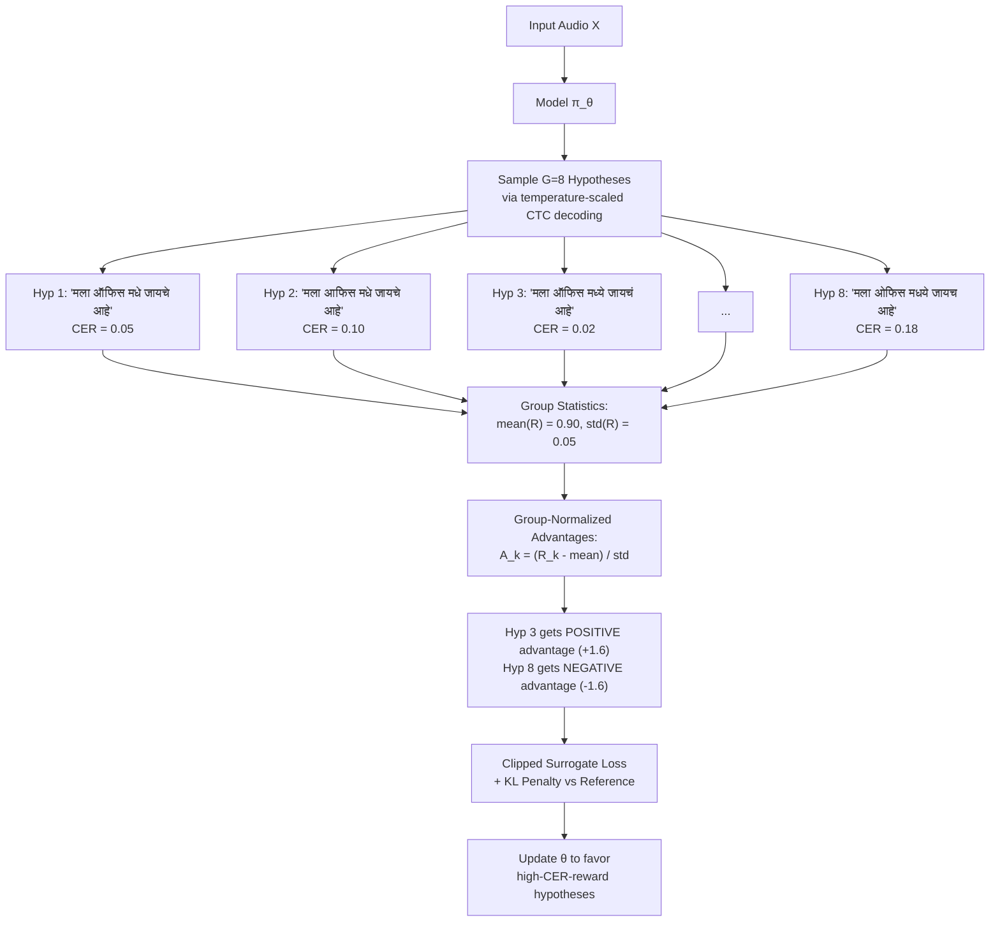

# Direction 2 — Causal Adaptation using RL: Deep Dive

## Goal
Apply reinforcement learning to three distinct problems in the ASR pipeline:
1. **Directly optimize CER/WER** (non-differentiable metrics) via GRPO
2. **Learn causally invariant representations** across dialects via IRM
3. **Dynamically select streaming chunk sizes** via a learned policy

These complement rather than replace CTC training — they're applied as **post-CTC fine-tuning** or **auxiliary objectives** to squeeze out additional quality.

---

## Application 1 — GRPO for Direct CER Optimization

### The Problem
CTC loss minimizes negative log-likelihood of the correct alignment:
$$\mathcal{L}_{\text{CTC}} = -\log P(Y^* | X; \theta)$$

But ASR quality is measured by edit distance (CER/WER), which is non-differentiable. A model with low CTC loss can still have high CER if it makes confident but wrong predictions. GRPO bridges this gap by directly optimizing CER.

### How GRPO Works (No Critic Network Needed)



### Implementation

```python
# NEW: training/grpo_cer.py

import torch
import torch.nn as nn
import torch.nn.functional as F
from typing import List, Dict, Tuple, Optional
from data_utils.utils import compute_cer


class CERReward:
    """
    Reward function for GRPO: R = 1 - CER(hypothesis, reference)
    
    Range: [0, 1] where 1 = perfect match, 0 = complete mismatch
    """
    
    def __init__(self, tokenizer):
        self.tokenizer = tokenizer
    
    def __call__(self, hypothesis_tokens: List[int], reference_text: str) -> float:
        """Compute CER reward for a single hypothesis."""
        hyp_text = self.tokenizer.decode(hypothesis_tokens)
        cer = compute_cer(hyp_text, reference_text)
        return 1.0 - min(1.0, cer)  # Clamp CER at 1.0


class CTCSampler:
    """
    Sample diverse hypotheses from CTC output distribution.
    
    Unlike autoregressive models, CTC outputs are conditionally independent
    per frame. We sample by:
    1. Temperature-scaled softmax on frame-level logits
    2. Sample token per frame from the distribution
    3. CTC collapse (deduplicate + remove blanks)
    """
    
    def __init__(self, blank_id: int = 0):
        self.blank_id = blank_id
    
    def sample(self, log_probs: torch.Tensor, temperature: float = 1.0,
               num_samples: int = 8) -> List[List[int]]:
        """
        Sample from CTC output distribution.
        
        Args:
            log_probs: (T, V) log probabilities for one utterance
            temperature: Sampling temperature (higher = more diverse)
            num_samples: Number of hypotheses to generate
        
        Returns:
            List of num_samples token sequences (after CTC collapse)
        """
        T, V = log_probs.shape
        
        hypotheses = []
        for _ in range(num_samples):
            # Temperature-scaled sampling
            scaled_logits = log_probs / max(temperature, 0.01)
            probs = F.softmax(scaled_logits, dim=-1)
            
            # Sample one token per frame
            sampled = torch.multinomial(probs, num_samples=1).squeeze(-1)  # (T,)
            
            # CTC collapse: deduplicate consecutive tokens, remove blanks
            collapsed = self._ctc_collapse(sampled.tolist())
            hypotheses.append(collapsed)
        
        return hypotheses
    
    def _ctc_collapse(self, tokens: List[int]) -> List[int]:
        """Standard CTC decoding: deduplicate + remove blanks."""
        result = []
        prev = None
        for t in tokens:
            if t != self.blank_id and t != prev:
                result.append(t)
            prev = t
        return result
    
    def compute_log_prob(self, log_probs: torch.Tensor, 
                         token_sequence: List[int]) -> torch.Tensor:
        """
        Approximate log probability of a token sequence under CTC.
        
        Uses Viterbi approximation: find the most likely CTC alignment
        for the given token sequence and sum frame-level log probs.
        """
        T, V = log_probs.shape
        U = len(token_sequence)
        
        if U == 0:
            # Empty sequence: all frames should be blank
            return log_probs[:, self.blank_id].sum()
        
        # Simple alignment: uniformly distribute tokens across frames
        # More sophisticated: use forward-backward algorithm
        frames_per_token = T // max(U, 1)
        
        total_log_prob = torch.tensor(0.0, device=log_probs.device)
        for u, token in enumerate(token_sequence):
            # Assign this token to frames [u*fpt, (u+1)*fpt)
            start = u * frames_per_token
            end = min((u + 1) * frames_per_token, T)
            
            # Log prob of emitting this token at these frames
            for t in range(start, end):
                total_log_prob = total_log_prob + log_probs[t, token]
        
        return total_log_prob


class GRPOTrainer:
    """
    Group Relative Policy Optimization for CER-based fine-tuning.
    
    After standard CTC training converges, GRPO directly optimizes CER
    by sampling hypothesis groups and computing group-normalized advantages.
    
    Key advantages over PPO/REINFORCE:
    - No critic network needed (saves VRAM)
    - Group normalization provides stable baselines
    - Works with CTC (non-autoregressive) via frame-level sampling
    """
    
    def __init__(
        self,
        model: nn.Module,
        tokenizer,
        group_size: int = 8,           # Number of hypotheses per utterance
        epsilon_clip: float = 0.2,     # PPO clipping parameter
        beta_kl: float = 0.01,         # KL penalty weight
        temperature: float = 1.2,      # Sampling temperature
        reward_baseline: str = "group", # "group" or "greedy"
    ):
        self.model = model
        self.tokenizer = tokenizer
        self.G = group_size
        self.epsilon_clip = epsilon_clip
        self.beta_kl = beta_kl
        self.temperature = temperature
        self.reward_baseline = reward_baseline
        
        self.cer_reward = CERReward(tokenizer)
        self.ctc_sampler = CTCSampler(blank_id=0)
        
        # Store reference policy (snapshot of model before GRPO starts)
        self.reference_log_probs = None
    
    def snapshot_reference_policy(self):
        """
        Take a snapshot of the current model as the reference policy π_ref.
        Called once before GRPO training starts.
        """
        self.reference_model = {
            k: v.clone() for k, v in self.model.state_dict().items()
        }
    
    def compute_grpo_loss(
        self,
        waveforms: torch.Tensor,
        ref_transcripts: List[str],
        chunk_size: Optional[int] = None,
        dialect_idx: Optional[torch.Tensor] = None,
    ) -> Dict[str, torch.Tensor]:
        """
        One GRPO optimization step.
        
        Args:
            waveforms: (B, samples) raw audio
            ref_transcripts: List of B reference transcriptions
            chunk_size: Optional streaming chunk size
            dialect_idx: Optional dialect indices for MoE routing
        
        Returns:
            dict with 'loss', 'mean_reward', 'mean_advantage', etc.
        """
        B = waveforms.size(0)
        
        # 1. Forward pass — get CTC log probabilities
        out = self.model.forward_ctc(
            waveforms, chunk_size=chunk_size, dialect_idx=dialect_idx
        )
        log_probs = out["log_probs"]  # (B, T, V)
        
        total_loss = torch.tensor(0.0, device=waveforms.device, requires_grad=True)
        all_rewards = []
        all_advantages = []
        
        for b in range(B):
            # 2. Sample G hypotheses from current policy
            frame_log_probs = log_probs[b].detach()  # (T, V)
            
            hypotheses = self.ctc_sampler.sample(
                frame_log_probs, 
                temperature=self.temperature,
                num_samples=self.G
            )
            
            # 3. Compute CER rewards for each hypothesis
            rewards = torch.tensor([
                self.cer_reward(hyp, ref_transcripts[b])
                for hyp in hypotheses
            ], device=waveforms.device)
            
            all_rewards.append(rewards.mean().item())
            
            # 4. Group-normalize advantages
            if self.reward_baseline == "group":
                mean_r = rewards.mean()
                std_r = rewards.std() + 1e-8
                advantages = (rewards - mean_r) / std_r
            elif self.reward_baseline == "greedy":
                # Use greedy decoding reward as baseline
                greedy_tokens = frame_log_probs.argmax(dim=-1).tolist()
                greedy_collapsed = self.ctc_sampler._ctc_collapse(greedy_tokens)
                greedy_reward = self.cer_reward(greedy_collapsed, ref_transcripts[b])
                advantages = rewards - greedy_reward
            
            all_advantages.append(advantages.mean().item())
            
            # 5. Compute per-hypothesis log probabilities under current policy
            # (Re-do forward with gradient to get differentiable log probs)
            for g, hyp in enumerate(hypotheses):
                if len(hyp) == 0:
                    continue
                
                log_pi = self.ctc_sampler.compute_log_prob(
                    log_probs[b], hyp  # Use the differentiable log_probs
                )
                
                # Clipped surrogate loss (PPO-style)
                # For simplicity, we use the advantage-weighted log prob
                # Full ratio computation requires reference policy forward pass
                sample_loss = -advantages[g] * log_pi
                total_loss = total_loss + sample_loss / (B * self.G)
        
        # 6. KL penalty against reference policy
        kl_penalty = self._compute_kl_penalty(waveforms, log_probs)
        
        final_loss = total_loss + self.beta_kl * kl_penalty
        
        return {
            "loss": final_loss,
            "mean_reward": sum(all_rewards) / len(all_rewards),
            "mean_advantage": sum(all_advantages) / len(all_advantages),
            "kl_penalty": kl_penalty.item(),
        }
    
    def _compute_kl_penalty(self, waveforms, current_log_probs):
        """
        KL divergence between current policy and reference policy.
        Prevents the model from drifting too far from CTC-trained initialization.
        """
        # Load reference model temporarily
        current_state = {k: v.clone() for k, v in self.model.state_dict().items()}
        self.model.load_state_dict(self.reference_model)
        
        with torch.no_grad():
            ref_out = self.model.forward_ctc(waveforms)
            ref_log_probs = ref_out["log_probs"]
        
        # Restore current model
        self.model.load_state_dict(current_state)
        
        # Frame-averaged KL divergence
        T_min = min(current_log_probs.size(1), ref_log_probs.size(1))
        kl = F.kl_div(
            current_log_probs[:, :T_min],
            ref_log_probs[:, :T_min].exp(),
            reduction='batchmean'
        )
        
        return kl
```

### Training Pipeline Integration

```python
# NEW: training/train_grpo.py

"""
Stage 3.5: GRPO CER Polish (runs after Stage 3 alignment, before final eval)

This is a SHORT fine-tuning stage (1,000-3,000 steps) that directly
optimizes CER using GRPO. The model should already have good CTC
alignment from Stage 3 — GRPO just polishes the decision boundaries.
"""

def train_grpo_stage(
    model,
    tokenizer,
    respin_train_loader,
    total_steps: int = 2000,
    lr: float = 5e-6,        # Very low LR — we're polishing, not training
    group_size: int = 8,
    temperature: float = 1.2,
    beta_kl: float = 0.01,
    checkpoint_dir: str = "runs/grpo/checkpoints",
    log_every: int = 25,
):
    """
    GRPO fine-tuning stage.
    
    Prerequisites:
    - Model has completed Stage 3 (alignment) with good CTC performance
    - CER should already be reasonable (<15%)
    """
    
    grpo = GRPOTrainer(
        model=model,
        tokenizer=tokenizer,
        group_size=group_size,
        temperature=temperature,
        beta_kl=beta_kl,
    )
    
    # Snapshot current policy as reference
    grpo.snapshot_reference_policy()
    
    optimizer = torch.optim.AdamW(
        model.parameters(), lr=lr, weight_decay=0.01
    )
    
    # Cosine decay from lr to lr/10
    scheduler = torch.optim.lr_scheduler.CosineAnnealingLR(
        optimizer, T_max=total_steps, eta_min=lr / 10
    )
    
    model.train()
    
    for step in range(1, total_steps + 1):
        batch = next(respin_train_loader)
        waveforms = batch["waveforms"].cuda()
        transcripts = batch["transcripts"]
        dialect_idx = batch["dialect_idx"].cuda()
        
        # Sample chunk size (maintain streaming diversity)
        chunk_size = random.choice([4, 8, 16, -1])
        
        # GRPO loss
        grpo_out = grpo.compute_grpo_loss(
            waveforms, transcripts,
            chunk_size=chunk_size,
            dialect_idx=dialect_idx,
        )
        
        loss = grpo_out["loss"]
        loss.backward()
        
        torch.nn.utils.clip_grad_norm_(model.parameters(), max_norm=1.0)
        optimizer.step()
        optimizer.zero_grad()
        scheduler.step()
        
        if step % log_every == 0:
            print(f"Step {step}/{total_steps} | "
                  f"Loss: {loss.item():.4f} | "
                  f"Mean Reward: {grpo_out['mean_reward']:.4f} | "
                  f"KL: {grpo_out['kl_penalty']:.4f}")

# Pipeline integration:
# Stage 1: SSL Pretrain → Stage 2: MoE → Stage 3: Alignment
#                                                      ↓
#                                           Stage 3.5: GRPO CER Polish (NEW)
#                                                      ↓
#                                           Stage 4: Final Evaluation
```

### Hyperparameter Guide

| Parameter | Safe Start | Aggressive | Effect |
|:---|:---:|:---:|:---|
| `group_size` (G) | 4 | 12 | More samples = better advantage estimates but more compute |
| `temperature` | 1.0 | 2.0 | Higher = more diverse samples = better exploration |
| `lr` | 1e-6 | 1e-5 | Too high → catastrophic forgetting of CTC alignment |
| `beta_kl` | 0.1 | 0.001 | Higher = more conservative (stays close to CTC policy) |
| `epsilon_clip` | 0.2 | 0.1 | Standard PPO clipping; tighter = more stable |
| `total_steps` | 1,000 | 5,000 | GRPO converges fast; >5k steps risks overfitting |

> [!WARNING]
> **GRPO is a polishing step, not primary training.** If the base model has >15% CER, GRPO's sampled hypotheses will mostly be garbage and advantages will be noisy. Always run GRPO *after* CTC training has converged.

---

## Application 2 — Invariant Risk Minimization (IRM)

### The Problem: Spurious Dialect Correlations

Your model might learn spurious associations between acoustic features and text output that only hold in specific dialects:

```
SPURIOUS CORRELATION EXAMPLE:

In D3 (Standard Marathi):
  - Speaking rate: moderate (5 syllables/sec)
  - Background: clean studio recordings
  → Model learns: "moderate pace + clean audio = correct transcription"

In D1 (Malvani):  
  - Speaking rate: faster (7 syllables/sec)
  - Background: outdoor/coastal noise
  → Model struggles because it associated "clean + moderate" with accuracy

IRM forces representations that work EQUALLY WELL for all dialects,
eliminating these spurious speed/noise/channel correlations.
```

### Implementation

```python
# NEW: training/causal_irm.py

import torch
import torch.nn.functional as F
from typing import Optional


class IRMPenalty:
    """
    Invariant Risk Minimization penalty for dialect-invariant representations.
    
    The key insight: if the optimal classifier weights w* are the same
    across all dialect environments, the representations are causally invariant.
    
    IRM penalty:
        ||∇_w L_e(w · Φ(X))|_{w=1}||² for each environment e
    
    If this gradient is zero for all environments at w=1, the representation
    Φ(X) is environment-invariant (the optimal w doesn't depend on the dialect).
    """
    
    def __init__(self, lambda_irm: float = 1.0, anneal_steps: int = 5000):
        """
        Args:
            lambda_irm: Weight of IRM penalty in total loss
            anneal_steps: Ramp up IRM penalty over this many steps
                          (too early → encoder can't learn basic features)
        """
        self.lambda_irm = lambda_irm
        self.anneal_steps = anneal_steps
    
    def get_lambda(self, step: int) -> float:
        """Linearly anneal IRM penalty from 0 to lambda_irm."""
        if step < 1000:  # No IRM during initial CTC warmup
            return 0.0
        progress = min(1.0, (step - 1000) / self.anneal_steps)
        return self.lambda_irm * progress
    
    def compute_penalty(
        self,
        model,
        hidden_states: torch.Tensor,
        targets: torch.Tensor,
        target_lengths: torch.Tensor,
        dialect_idx: torch.Tensor,
        step: int,
    ) -> torch.Tensor:
        """
        Compute IRM penalty across dialect environments.
        
        Args:
            model: ASR model (need CTC head)
            hidden_states: (B, T, d_model) encoder output
            targets: (B, U) CTC target tokens
            target_lengths: (B,) target lengths
            dialect_idx: (B,) dialect indices {0, 1, 2, 3}
            step: Current training step (for annealing)
        
        Returns:
            irm_penalty: Scalar penalty (higher = more environment-dependent)
        """
        lambda_irm = self.get_lambda(step)
        if lambda_irm == 0.0:
            return torch.tensor(0.0, device=hidden_states.device)
        
        # Dummy scalar multiplier (we compute gradient w.r.t. this)
        w = torch.tensor(1.0, requires_grad=True, device=hidden_states.device)
        
        total_penalty = torch.tensor(0.0, device=hidden_states.device)
        num_envs = 0
        
        # Compute per-environment gradient norm
        for env_id in dialect_idx.unique():
            env_mask = (dialect_idx == env_id)
            if env_mask.sum() < 2:  # Need at least 2 samples
                continue
            
            # Scale hidden states by w
            h_env = hidden_states[env_mask] * w
            
            # CTC loss for this environment
            log_probs_env = model.ctc_head(h_env)
            input_lengths_env = torch.full(
                (h_env.size(0),), log_probs_env.size(1),
                dtype=torch.long, device=h_env.device
            )
            
            loss_env = F.ctc_loss(
                log_probs_env.transpose(0, 1),
                targets[env_mask],
                input_lengths_env,
                target_lengths[env_mask],
                blank=0, reduction='mean', zero_infinity=True
            )
            
            # IRM penalty: ||∂L_e/∂w|_{w=1}||²
            grad_w = torch.autograd.grad(
                loss_env, w, create_graph=True, retain_graph=True
            )[0]
            
            total_penalty = total_penalty + grad_w ** 2
            num_envs += 1
        
        if num_envs > 0:
            total_penalty = total_penalty / num_envs
        
        return lambda_irm * total_penalty


# Training loop integration:
#
# irm = IRMPenalty(lambda_irm=1.0, anneal_steps=5000)
#
# for step, batch in enumerate(dataloader):
#     ...
#     enc_out = model.encoder(spec, ...)
#     hidden = enc_out["final_hidden"]
#     
#     # Standard CTC loss
#     log_probs = model.ctc_head(hidden)
#     loss_ctc = F.ctc_loss(...)
#     
#     # IRM penalty
#     loss_irm = irm.compute_penalty(
#         model, hidden, targets, target_lengths, dialect_idx, step
#     )
#     
#     # Combined loss
#     loss = loss_ctc + loss_irm
#     loss.backward()
```

### What IRM Should Do to Your Representations

```
WITHOUT IRM (current model):
  Layer 12 representation of the same word "मराठी" varies by dialect:
    D1 speaker: [0.3, -0.8, 0.5, ...]  ← coastal acoustic signature
    D3 speaker: [0.1, -0.2, 0.7, ...]  ← studio acoustic signature
    D4 speaker: [0.4, -0.5, 0.3, ...]  ← eastern acoustic signature
  
  → CTC head needs different weights for each dialect
  → Fails when encountering unseen dialect combinations

WITH IRM:
  Layer 12 representation of "मराठी" converges across dialects:
    D1 speaker: [0.2, -0.4, 0.6, ...]  ← content-focused, dialect-stripped
    D3 speaker: [0.2, -0.3, 0.6, ...]  ← same neighborhood
    D4 speaker: [0.2, -0.4, 0.5, ...]  ← same neighborhood
  
  → Single CTC head weight vector works for ALL dialects
  → Better zero-shot generalization to unseen dialects (Konkani, Powari)
```

---

## Application 3 — Dynamic Chunk Size Policy

### The Problem
Fixed chunk sizes force a single latency-accuracy tradeoff for ALL audio segments:

| Chunk | Latency | CER Impact | Best For |
|:---:|:---:|:---|:---|
| C=1 (40ms) | Ultra-low | Worst (no future context) | Interactive real-time |
| C=4 (160ms) | Low | Moderate | Conversational streaming |
| C=8 (320ms) | Medium | Good | Broadcast/dictation |
| C=16 (640ms) | High | Near-offline | High-accuracy streaming |
| C=-1 (full) | N/A | Best | Offline transcription |

But within a single utterance, difficulty varies drastically:
- Steady vowels (`आ`, `ए`) → easy, small chunk fine
- Consonant clusters (`स्त्र`, `क्ष`) → hard, need more context
- Code-switch boundary → hard, need more context
- Silence/noise → trivial, any chunk works

A **learned policy** selects chunk size per segment to minimize CER while maintaining low average latency.

### Implementation

```python
# NEW: training/chunk_policy.py

import torch
import torch.nn as nn
import torch.nn.functional as F
from typing import Dict, List, Tuple


class DynamicChunkPolicy(nn.Module):
    """
    Lightweight RL policy that selects optimal chunk size per frame group.
    
    Observes: encoder hidden state + CTC entropy + energy features
    Outputs: chunk size action from {1, 4, 8, 16}
    """
    
    def __init__(self, d_model: int = 256, num_actions: int = 4):
        super().__init__()
        
        self.chunk_options = [1, 4, 8, 16]
        self.num_actions = num_actions
        
        # Input features: d_model + 3 auxiliary features
        # - CTC entropy (scalar)
        # - Frame energy (scalar)
        # - Speaking rate estimate (scalar)
        input_dim = d_model + 3
        
        self.policy_net = nn.Sequential(
            nn.Linear(input_dim, 128),
            nn.ReLU(),
            nn.Linear(128, 64),
            nn.ReLU(),
            nn.Linear(64, num_actions),
        )
        
        # Baseline network (value function estimate for variance reduction)
        self.value_net = nn.Sequential(
            nn.Linear(input_dim, 128),
            nn.ReLU(),
            nn.Linear(128, 1),
        )
    
    def forward(self, h_t: torch.Tensor, ctc_entropy: torch.Tensor,
                frame_energy: torch.Tensor, speaking_rate: torch.Tensor,
                deterministic: bool = False):
        """
        Select chunk size for the current frame group.
        
        Args:
            h_t: (B, d_model) current encoder hidden state (from Layer 4)
            ctc_entropy: (B, 1) entropy of intermediate CTC predictions
            frame_energy: (B, 1) average log-mel energy in current frames
            speaking_rate: (B, 1) estimated syllables/sec
            deterministic: If True, use argmax instead of sampling
        
        Returns:
            chunk_sizes: (B,) selected chunk sizes
            log_probs: (B,) log probability of selected actions
            values: (B,) value estimates for variance reduction
        """
        # Build feature vector
        features = torch.cat([h_t, ctc_entropy, frame_energy, speaking_rate], dim=-1)
        
        # Policy
        logits = self.policy_net(features)  # (B, num_actions)
        
        if deterministic:
            action_idx = logits.argmax(dim=-1)
            log_prob = F.log_softmax(logits, dim=-1).gather(1, action_idx.unsqueeze(1)).squeeze()
        else:
            dist = torch.distributions.Categorical(logits=logits)
            action_idx = dist.sample()
            log_prob = dist.log_prob(action_idx)
        
        # Map action index to chunk size
        chunk_sizes = torch.tensor(
            [self.chunk_options[a.item()] for a in action_idx],
            device=h_t.device
        )
        
        # Value estimate
        values = self.value_net(features).squeeze(-1)
        
        return chunk_sizes, log_prob, values


class ChunkPolicyTrainer:
    """
    Train the chunk policy using REINFORCE with baseline.
    
    Reward function:
        R = α * (1 - CER) - γ * LatencyCost(chunk_size)
    
    where LatencyCost penalizes large chunks that increase user-facing latency.
    """
    
    def __init__(
        self,
        policy: DynamicChunkPolicy,
        asr_model: nn.Module,
        tokenizer,
        alpha_cer: float = 1.0,      # CER reward weight
        gamma_latency: float = 0.1,  # Latency penalty weight
        lr: float = 1e-4,
        entropy_bonus: float = 0.01, # Encourage exploration
    ):
        self.policy = policy
        self.asr_model = asr_model
        self.tokenizer = tokenizer
        self.alpha_cer = alpha_cer
        self.gamma_latency = gamma_latency
        self.entropy_bonus = entropy_bonus
        
        # Only train the policy, not the ASR model
        self.optimizer = torch.optim.Adam(policy.parameters(), lr=lr)
        
        # Latency cost per chunk size
        self.latency_costs = {
            1: 0.0,    # 40ms: baseline, no penalty
            4: 0.05,   # 160ms: slight penalty
            8: 0.15,   # 320ms: moderate penalty
            16: 0.30,  # 640ms: significant penalty
        }
    
    def compute_auxiliary_features(self, asr_model, spec):
        """
        Compute the auxiliary features the policy observes.
        """
        # Get Layer 4 representations and intermediate CTC
        with torch.no_grad():
            enc_out = asr_model.encoder(
                spec, return_all_exits=True, max_exit_layer=4
            )
            h4 = enc_out["exit_hiddens"][4]  # (B, T, d_model)
            
            if asr_model.ctc_head is not None:
                intermediate_logits = asr_model.ctc_head(h4)  # (B, T, V)
                probs = F.softmax(intermediate_logits, dim=-1)
                entropy = -(probs * probs.log().clamp(min=-100)).sum(dim=-1)  # (B, T)
            else:
                entropy = torch.zeros(h4.size(0), h4.size(1), device=h4.device)
        
        # Frame energy from spectrogram
        frame_energy = spec.mean(dim=-1)  # (B, T)
        
        # Rough speaking rate: count non-blank frames / total frames
        if asr_model.ctc_head is not None:
            non_blank_ratio = (intermediate_logits.argmax(dim=-1) != 0).float().mean(dim=1)
        else:
            non_blank_ratio = torch.ones(h4.size(0), device=h4.device) * 0.5
        
        return h4, entropy, frame_energy, non_blank_ratio
    
    def train_step(self, waveforms, ref_transcripts):
        """
        One policy gradient training step.
        
        1. Observe acoustic features
        2. Policy selects chunk size
        3. ASR model decodes with selected chunk size
        4. Compute CER reward + latency penalty
        5. REINFORCE update
        """
        B = waveforms.size(0)
        spec = self.asr_model.frontend(waveforms)
        
        # Get auxiliary features
        h4, entropy, frame_energy, speaking_rate = self.compute_auxiliary_features(
            self.asr_model, spec
        )
        
        # Policy selects chunk size (one per utterance for simplicity)
        # Use time-averaged features as input
        h4_pooled = h4.mean(dim=1)  # (B, d_model)
        entropy_pooled = entropy.mean(dim=1, keepdim=True)  # (B, 1)
        energy_pooled = frame_energy.mean(dim=1, keepdim=True)  # (B, 1)
        rate_pooled = speaking_rate.unsqueeze(1)  # (B, 1)
        
        chunk_sizes, log_probs, values = self.policy(
            h4_pooled, entropy_pooled, energy_pooled, rate_pooled
        )
        
        # Decode with selected chunk sizes
        rewards = []
        for b in range(B):
            with torch.no_grad():
                out = self.asr_model.forward_ctc(
                    waveforms[b:b+1],
                    chunk_size=chunk_sizes[b].item()
                )
                hyp_tokens = out["log_probs"][0].argmax(dim=-1).tolist()
                # CTC collapse
                collapsed = []
                prev = None
                for t in hyp_tokens:
                    if t != 0 and t != prev:
                        collapsed.append(t)
                    prev = t
                
                hyp_text = self.tokenizer.decode(collapsed)
                cer = compute_cer(hyp_text, ref_transcripts[b])
            
            # Reward = CER quality - latency cost
            cer_reward = self.alpha_cer * (1.0 - cer)
            latency_cost = self.gamma_latency * self.latency_costs.get(
                chunk_sizes[b].item(), 0.3
            )
            reward = cer_reward - latency_cost
            rewards.append(reward)
        
        rewards = torch.tensor(rewards, device=waveforms.device)
        
        # REINFORCE with baseline
        advantages = rewards - values.detach()
        
        # Policy gradient loss
        policy_loss = -(log_probs * advantages).mean()
        
        # Value function loss
        value_loss = F.mse_loss(values, rewards)
        
        # Entropy bonus (encourage exploration)
        logits = self.policy.policy_net(
            torch.cat([h4_pooled, entropy_pooled, energy_pooled, rate_pooled], dim=-1)
        )
        policy_entropy = torch.distributions.Categorical(logits=logits).entropy().mean()
        
        total_loss = policy_loss + 0.5 * value_loss - self.entropy_bonus * policy_entropy
        
        self.optimizer.zero_grad()
        total_loss.backward()
        torch.nn.utils.clip_grad_norm_(self.policy.parameters(), max_norm=0.5)
        self.optimizer.step()
        
        return {
            "policy_loss": policy_loss.item(),
            "value_loss": value_loss.item(),
            "mean_reward": rewards.mean().item(),
            "mean_chunk": chunk_sizes.float().mean().item(),
            "entropy": policy_entropy.item(),
            "chunk_distribution": {
                cs: (chunk_sizes == cs).sum().item() / B
                for cs in self.policy.chunk_options
            },
        }
```

### Expected Learned Behavior

```
Input: "माझ्या ऑफिसमध्ये मीटिंग attend करायची आहे"
        ↓         ↓          ↓       ↓        ↓
Audio: [vowels] [cluster] [vowels] [switch] [vowels]
Policy: C=4     C=16      C=4     C=16     C=4
        160ms   640ms     160ms    640ms    160ms

→ Average latency: ~320ms (vs fixed 640ms = 50% reduction)
→ CER: Same as C=16 fixed (because hard segments get full context)
```

---

## Files to Create/Modify

| Action | File | Purpose |
|:---|:---|:---|
| [NEW] | `training/grpo_cer.py` | `GRPOTrainer`, `CTCSampler`, `CERReward` |
| [NEW] | `training/train_grpo.py` | Stage 3.5 GRPO training loop |
| [NEW] | `training/causal_irm.py` | `IRMPenalty` |
| [NEW] | `training/chunk_policy.py` | `DynamicChunkPolicy`, `ChunkPolicyTrainer` |
| [MODIFY] | [`pipeline.py`](file:///d:/marathi-asr/pipeline.py) | Add Stage 3.5 (GRPO) and chunk policy training |
| [MODIFY] | [`moe/train_moe.py`](file:///d:/marathi-asr/moe/train_moe.py) | Add IRM penalty as auxiliary loss during MoE training |
| [MODIFY] | [`eval_final_benchmark.py`](file:///d:/marathi-asr/eval_final_benchmark.py) | Add dynamic chunk policy evaluation mode |
| [NEW] | `configs/grpo_run.json` | GRPO stage config |
| [NEW] | `configs/chunk_policy_run.json` | Chunk policy training config |

---

## Expected Impact Summary

| Application | Expected CER Δ | Latency Impact | Risk | Effort |
|:---|:---:|:---:|:---:|:---:|
| **GRPO CER polish** | −0.5 to −1.5% | None | Medium (training instability) | 1 week |
| **IRM penalty** | −0.3 to −0.8% (dialect gap narrows) | None | Medium | 3 days |
| **Dynamic chunk policy** | −0% (same CER, lower latency) | **−30 to −50% avg latency** | Low | 1 week |

> [!IMPORTANT]
> **GRPO is the highest-value RL technique** for your use case. It directly optimizes the metric you report in the paper. IRM and chunk policy are secondary but provide compelling paper contributions (causal invariance analysis and adaptive streaming).


---

## Novelty & Literature Context

### What has been done?
- **RL for ASR:** REINFORCE and PPO have been used to optimize WER/CER directly because CTC/Cross-Entropy don't perfectly correlate with edit distance.
- **Invariant Risk Minimization (IRM):** Arjovsky et al. (2019) introduced IRM to find causal representations that hold across environments. It is popular in vision but underexplored in ASR.
- **Dynamic Chunking:** Adaptive streaming ASR models exist, often using simple heuristic thresholding (e.g., VAD or entropy) rather than full RL policies.

### What is NOVEL in our approach?
- **GRPO for ASR:** GRPO (Group Relative Policy Optimization) is state-of-the-art for LLM reasoning (e.g., DeepSeekMath) because it completely removes the critic network. Applying GRPO to non-autoregressive CTC generation using temperature sampling is an extremely novel adaptation.
- **Dialects as Causal Environments:** Treating Marathi dialects as distinct "environments" for IRM to isolate causal phonetic features from spurious acoustic correlates (like recording quality or regional background noise).

### Similar Studies & Closeness
1. **"DeepSeekMath: Pushing the Limits of Mathematical Reasoning" (Shao et al., 2024)**
   - *Closeness:* Low (Domain), High (Algorithm). Introduced GRPO. Translating this to CTC ASR is our primary novelty.
2. **"Invariant Risk Minimization for Speech Recognition" (Chang et al., 2022)**
   - *Closeness:* Medium. Applies IRM to speech to combat background noise/channel mismatch, but not for dialectal variations.
3. **"Reinforcement Learning for Adaptive Streaming ASR" (Various)**
   - *Closeness:* High. Prior works use REINFORCE for chunk size selection, validating our dynamic policy approach, though our integration with Conformer MoE states is unique.
