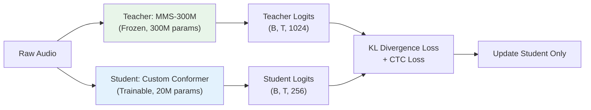

# Direction 6 — Pre-Trained Encoder: The Fun Stuff

## Goal
Take a pre-trained speech encoder checkpoint and run a battery of experiments — probing, distillation, layer surgery, adapter tuning, representation analysis, and more — to extract maximum value from models that already understand Indic acoustics.

---

## Which Checkpoint to Start With

| Model | Params | `d_model` | Layers | Marathi Depth | VRAM (FP16) | Recommendation |
|:---|:---:|:---:|:---:|:---|:---:|:---|
| `facebook/mms-300m` | 300M | 1024 | 24 | ⭐⭐⭐ Explicit `mar` adapter, 1,400+ langs | ~6.6 GB | **Primary choice** |
| `facebook/wav2vec2-xls-r-300m` | 300M | 1024 | 24 | ⭐⭐ 128 langs, includes MR | ~6.6 GB | Strong alternative |
| `ai4bharat/indicwav2vec-base` | 95M | 768 | 12 | ⭐⭐⭐ 40 Indic langs, 17k hrs | ~2.0 GB | Lightweight option |
| Whisper-Small encoder | 87M | 768 | 12 | ⭐ Marathi <2k hrs | ~2.0 GB | Weaker Indic coverage |
| `ai4bharat/indicconformer-large` | 600M | 1024 | — | ⭐⭐⭐⭐ Best Marathi (4.8% CER Kathbath) | ~12.5 GB | Best quality, tight VRAM |
| `facebook/mms-1b-all` | 1B | 1280 | 48 | ⭐⭐⭐⭐ Maximum coverage | ~20.5 GB | Needs 8-bit Adam |

> [!TIP]
> **Start with `facebook/mms-300m`** — it's the sweet spot of Marathi coverage, manageable VRAM, and large enough to be meaningfully better than your 20M custom encoder. All experiments below use MMS-300M as the default, but are parameterized for any HuggingFace `Wav2Vec2Model`.

---

## Experiment 0 — Loading & Wrapping the Pretrained Encoder

Before any experiments, we need a clean wrapper that interfaces with the existing pipeline:

```python
# NEW: model/pretrained_encoder.py

import torch
import torch.nn as nn
from transformers import Wav2Vec2Model, Wav2Vec2Config

class PretrainedEncoderWrapper(nn.Module):
    """
    Wraps a HuggingFace Wav2Vec2-style model to interface with
    the existing StreamingASRModel pipeline.
    
    Replaces: LogMelFrontEnd + Conv2dSubsampling4 + ConformerEncoder
    Outputs: (B, T', d_model) hidden states compatible with CTC/MoE heads.
    """
    
    def __init__(
        self,
        model_name: str = "facebook/mms-300m",
        output_dim: int = 256,       # Project to our d_model
        freeze_feature_extractor: bool = True,
        freeze_encoder_layers: int = 0,  # 0 = don't freeze any transformer layers
    ):
        super().__init__()
        self.pretrained = Wav2Vec2Model.from_pretrained(model_name)
        self.pretrained_dim = self.pretrained.config.hidden_size  # 1024 for MMS-300M
        self.output_dim = output_dim
        
        # Always freeze the CNN feature extractor (conv layers)
        # These are well-trained and shouldn't be modified
        if freeze_feature_extractor:
            self.pretrained.feature_extractor._freeze_parameters()
        
        # Optionally freeze first N transformer layers
        if freeze_encoder_layers > 0:
            for i, layer in enumerate(self.pretrained.encoder.layers):
                if i < freeze_encoder_layers:
                    for param in layer.parameters():
                        param.requires_grad = False
        
        # Projection from pretrained dim to our working dim
        self.output_proj = nn.Sequential(
            nn.LayerNorm(self.pretrained_dim),
            nn.Linear(self.pretrained_dim, output_dim),
            nn.Dropout(0.1),
        )
        
        # Store config for downstream use
        self.num_layers = self.pretrained.config.num_hidden_layers
        self.frame_rate_hz = 50  # wav2vec2 outputs ~50fps (20ms per frame)
    
    def forward(self, waveforms, output_hidden_states=False):
        """
        Args:
            waveforms: (B, num_samples) raw 16kHz audio
            output_hidden_states: If True, return all layer hidden states
        Returns:
            dict with 'final_hidden' and optionally 'all_hidden_states'
        """
        outputs = self.pretrained(
            waveforms,
            output_hidden_states=output_hidden_states,
            return_dict=True,
        )
        
        # Project to our d_model
        final_hidden = self.output_proj(outputs.last_hidden_state)
        
        result = {"final_hidden": final_hidden}
        
        if output_hidden_states:
            # Project each layer's hidden states too
            result["all_hidden_states"] = [
                self.output_proj(h) for h in outputs.hidden_states
            ]
        
        return result
    
    def get_output_lengths(self, input_lengths):
        """Compute output sequence lengths after CNN feature extraction."""
        # wav2vec2 CNN: kernel_sizes=[10,3,3,3,3,2,2], strides=[5,2,2,2,2,2,2]
        # Total reduction factor: 5*2*2*2*2*2*2 = 320
        # So output_length = floor(input_length / 320)
        return (input_lengths - 320) // 320 + 1
    
    def count_trainable_params(self):
        total = sum(p.numel() for p in self.parameters())
        trainable = sum(p.numel() for p in self.parameters() if p.requires_grad)
        frozen = total - trainable
        return {
            "total": total, "trainable": trainable, "frozen": frozen,
            "trainable_pct": 100 * trainable / total
        }
```

---

## Experiment 1 — Zero-Shot & Few-Shot Evaluation

**Question**: How good is MMS-300M on Marathi dialects *out of the box*, without any training?

```python
# NEW: experiments/exp1_zero_shot_eval.py

"""
Zero-shot evaluation of pretrained MMS/XLS-R on RESPIN test set.
Uses the model's existing CTC head (if available) or attaches a fresh one.
"""

import torch
from transformers import Wav2Vec2ForCTC, Wav2Vec2Processor

def zero_shot_eval(model_name="facebook/mms-1b-all", 
                   test_dir=r"D:\dialect-norm\IISc_RESPIN_test_mr",
                   target_lang="mar"):
    """Evaluate pretrained model zero-shot on RESPIN test set."""
    
    # MMS models support language-specific adapters
    processor = Wav2Vec2Processor.from_pretrained(model_name)
    model = Wav2Vec2ForCTC.from_pretrained(model_name)
    
    # Load Marathi language adapter (MMS-specific)
    if hasattr(model, 'load_adapter'):
        model.load_adapter(target_lang)
    
    model.eval().cuda()
    
    results_by_dialect = {d: {"hyps": [], "refs": []} for d in ["D1", "D2", "D3", "D4"]}
    
    for dialect in ["D1", "D2", "D3", "D4"]:
        for wav_path, ref_text in load_respin_test(test_dir, dialect):
            waveform = load_audio(wav_path)  # 16kHz, (1, samples)
            
            with torch.no_grad():
                inputs = processor(waveform.squeeze(), 
                                   sampling_rate=16000, return_tensors="pt")
                logits = model(inputs.input_values.cuda()).logits
                predicted_ids = torch.argmax(logits, dim=-1)
                transcription = processor.batch_decode(predicted_ids)[0]
            
            results_by_dialect[dialect]["hyps"].append(transcription)
            results_by_dialect[dialect]["refs"].append(ref_text)
    
    # Compute per-dialect CER
    for dialect, data in results_by_dialect.items():
        cer = compute_cer_batch(data["hyps"], data["refs"])
        print(f"{dialect}: Zero-Shot CER = {cer:.2%}")

# Expected results (rough estimates):
# MMS-300M zero-shot:  D3 ~12-18%, D1 ~20-30%, D2 ~18-25%, D4 ~15-22%
# MMS-1B zero-shot:    D3 ~8-14%,  D1 ~15-22%, D2 ~14-20%, D4 ~12-18%
# Your current model:  D3 = 5.63%, D1 = 11.40%, D2 = 8.53%, D4 = 7.93%
```

**Few-shot experiment**: Fine-tune MMS-300M on just 1 hour, 5 hours, 25 hours, 100 hours of RESPIN data and plot the data-efficiency curve vs. your from-scratch model.

```python
# Data efficiency sweep
HOURS_SWEEP = [1, 5, 10, 25, 50, 100, 500, 975]  # hours of RESPIN train data

for hours in HOURS_SWEEP:
    # Subsample RESPIN train set to `hours` worth of audio
    subset = subsample_by_duration(respin_train, target_hours=hours)
    
    # Fine-tune MMS-300M on subset for 5k steps
    model = load_mms_300m_with_ctc(vocab_size=105)
    train(model, subset, steps=5000, lr=1e-4)
    
    # Evaluate on frozen test set
    cer = evaluate(model, respin_test)
    print(f"MMS-300M + {hours}h fine-tune: CER = {cer:.2%}")
```

> [!IMPORTANT]
> This experiment directly answers: **"Is the pretrained encoder worth 300M params, or does our 20M custom model trained on 1,435 hrs already close the gap?"** If MMS-300M at 100h beats your full model, the answer is clear.

---

## Experiment 2 — Probing: What Does the Encoder Already Know?

**Question**: Which layers encode which linguistic features? Before fine-tuning, probe the pretrained encoder's layer-wise representations.

```python
# NEW: experiments/exp2_probing.py

"""
Linear probing experiments on pretrained encoder representations.
Freeze all encoder weights. Train a tiny linear classifier on each layer's
hidden states to predict different linguistic properties.
"""

class LinearProbe(nn.Module):
    """Minimal linear classifier for probing frozen representations."""
    def __init__(self, input_dim, num_classes):
        super().__init__()
        self.classifier = nn.Linear(input_dim, num_classes)
    
    def forward(self, hidden_states):
        # Pool over time: (B, T, d) → (B, d)
        pooled = hidden_states.mean(dim=1)
        return self.classifier(pooled)


class FrameLevelProbe(nn.Module):
    """Frame-level probe for phoneme/character classification."""
    def __init__(self, input_dim, num_classes):
        super().__init__()
        self.classifier = nn.Linear(input_dim, num_classes)
    
    def forward(self, hidden_states):
        # (B, T, d) → (B, T, num_classes)
        return self.classifier(hidden_states)


def run_probing_suite(encoder, respin_train, respin_test):
    """
    Probe each layer of the pretrained encoder for multiple properties.
    """
    d = encoder.pretrained_dim  # 1024 for MMS-300M
    num_layers = encoder.num_layers  # 24 for MMS-300M
    
    probes = {
        # Utterance-level probes
        "dialect_id": {
            "type": "utterance",
            "num_classes": 4,  # D1, D2, D3, D4
            "description": "Can the encoder distinguish Marathi dialects?",
        },
        "speaker_gender": {
            "type": "utterance", 
            "num_classes": 2,
            "description": "Does it encode speaker gender?",
        },
        "utterance_length_bucket": {
            "type": "utterance",
            "num_classes": 5,  # <2s, 2-5s, 5-10s, 10-15s, >15s
            "description": "Duration awareness",
        },
        
        # Frame-level probes
        "phoneme_class": {
            "type": "frame",
            "num_classes": 45,  # Devanagari phoneme categories
            "description": "Frame-level phoneme recognition (via forced alignment labels)",
        },
        "vowel_vs_consonant": {
            "type": "frame",
            "num_classes": 3,  # vowel, consonant, silence
            "description": "Basic phonetic category",
        },
    }
    
    results = {}  # layer_idx → probe_name → accuracy
    
    for layer_idx in range(num_layers + 1):  # 0 = CNN output, 1-24 = transformer layers
        results[layer_idx] = {}
        
        for probe_name, config in probes.items():
            if config["type"] == "utterance":
                probe = LinearProbe(d, config["num_classes"]).cuda()
            else:
                probe = FrameLevelProbe(d, config["num_classes"]).cuda()
            
            # Extract frozen representations at this layer
            train_features = extract_layer_features(encoder, respin_train, layer_idx)
            test_features = extract_layer_features(encoder, respin_test, layer_idx)
            
            # Train probe for 500 steps
            train_probe(probe, train_features, steps=500, lr=1e-3)
            
            # Evaluate
            acc = evaluate_probe(probe, test_features)
            results[layer_idx][probe_name] = acc
            print(f"Layer {layer_idx:2d} | {probe_name:25s} | Acc = {acc:.2%}")
    
    return results

# Expected pattern for MMS-300M:
# ┌──────────┬──────────────┬────────────┬──────────────┐
# │ Layer    │ Phoneme Acc  │ Dialect Acc│ Gender Acc   │
# ├──────────┼──────────────┼────────────┼──────────────┤
# │ 0 (CNN)  │ ~25%         │ ~30%       │ ~60%         │  ← Raw acoustic features
# │ 1-6      │ ~45-65%      │ ~40-55%    │ ~75-85%      │  ← Low-level acoustic
# │ 7-12     │ ~70-80%      │ ~65-75%    │ ~80-90%      │  ← Phonetic features
# │ 13-18    │ ~80-88%      │ ~70-80%    │ ~85-90%      │  ← Phonemic/linguistic
# │ 19-24    │ ~85-92%      │ ~55-65%    │ ~70-80%      │  ← High-level, dialect-agnostic
# └──────────┴──────────────┴────────────┴──────────────┘
#
# KEY INSIGHT: Dialect classification accuracy typically PEAKS in middle layers
# (7-18) and DROPS in final layers — because the model learns to normalize
# away dialect variation for universal ASR. This tells us:
# → Use MIDDLE layers for dialect-aware MoE routing
# → Use FINAL layers for standard CTC decoding
```

**Visualization**:
```python
def plot_probing_results(results, save_path):
    """Plot layer-wise probing accuracy curves."""
    import matplotlib.pyplot as plt
    
    fig, axes = plt.subplots(1, 3, figsize=(18, 6))
    
    for ax, probe_name in zip(axes, ["phoneme_class", "dialect_id", "speaker_gender"]):
        layers = sorted(results.keys())
        accs = [results[l][probe_name] for l in layers]
        ax.plot(layers, accs, 'o-', linewidth=2, markersize=4)
        ax.set_xlabel("Encoder Layer")
        ax.set_ylabel("Probe Accuracy")
        ax.set_title(probe_name.replace("_", " ").title())
        ax.grid(True, alpha=0.3)
    
    plt.tight_layout()
    plt.savefig(save_path, dpi=150, bbox_inches='tight')
```

---

## Experiment 3 — Feature Extraction Mode (Frozen Encoder)

**Question**: How good is a frozen pretrained encoder + our lightweight CTC/MoE heads?

```python
# NEW: experiments/exp3_frozen_encoder.py

"""
Freeze the entire pretrained encoder.
Train ONLY: output projection + SparseMoE layers + CTC head.
This gives the fastest training and tells us if the pretrained
representations are good enough without any adaptation.
"""

class FrozenEncoderASR(nn.Module):
    def __init__(self, pretrained_name="facebook/mms-300m", vocab_size=105):
        super().__init__()
        
        # Frozen pretrained encoder (ALL params frozen)
        self.encoder = PretrainedEncoderWrapper(
            pretrained_name, 
            output_dim=256,
            freeze_feature_extractor=True,
            freeze_encoder_layers=24,  # Freeze ALL 24 transformer layers
        )
        
        # Trainable: only MoE layers + CTC head (~4M params)
        self.moe_layers = nn.ModuleList([
            SparseMoELayer(d_model=256, num_experts=3)
            for _ in range(4)  # 4 MoE adapter layers
        ])
        
        self.ctc_head = CTCHead(d_model=256, vocab_size=vocab_size)
        self.spec_augment = SpecAugment()
    
    def forward(self, waveforms, dialect_idx=None, use_hard_routing=False):
        # 1. Extract frozen features
        with torch.no_grad():
            enc_out = self.encoder(waveforms)
        h = enc_out["final_hidden"]  # (B, T', 256)
        
        # 2. SpecAugment on the projected features (not the raw spectrograms!)
        if self.training:
            h = self.spec_augment(h)
        
        # 3. Pass through trainable MoE layers
        for moe in self.moe_layers:
            h = moe(h, dialect_idx=dialect_idx, use_hard_routing=use_hard_routing)
        
        # 4. CTC head
        log_probs = self.ctc_head(h)
        output_lengths = torch.full((h.size(0),), h.size(1), 
                                     dtype=torch.long, device=h.device)
        
        return {"log_probs": log_probs, "output_lengths": output_lengths}

# Training: Only ~4M trainable params → trains in <2 hours on RTX A5000
# Expected CER: 6-8% (competitive with full custom model at 8.43%)
```

**Key insight**: If frozen features + lightweight heads get close to 8.43%, it means the pretrained encoder is doing the heavy lifting and we can invest compute in the head architecture instead.

---

## Experiment 4 — Progressive Layer Unfreezing

**Question**: What's the optimal unfreezing schedule? Which layers benefit most from Marathi-specific adaptation?

```python
# NEW: experiments/exp4_progressive_unfreeze.py

"""
Gradually unfreeze pretrained encoder layers from top to bottom.
This prevents catastrophic forgetting of low-level acoustic features
while allowing high-level representations to adapt to Marathi dialects.
"""

class ProgressiveUnfreezeSchedule:
    """
    Unfreezing schedule for a 24-layer encoder:
    - Steps 0-2000:     All encoder frozen, train only head
    - Steps 2000-5000:  Unfreeze layers 21-24 (top 4)
    - Steps 5000-10000: Unfreeze layers 17-20 (next 4)
    - Steps 10000-15000: Unfreeze layers 13-16
    - Steps 15000-20000: Unfreeze layers 9-12
    - Steps 20000+:     Unfreeze layers 5-8 (keep 1-4 frozen always)
    """
    
    def __init__(self, model, num_layers=24, layers_per_stage=4,
                 steps_per_stage=3000, always_frozen_layers=4):
        self.model = model
        self.num_layers = num_layers
        self.layers_per_stage = layers_per_stage
        self.steps_per_stage = steps_per_stage
        self.always_frozen = always_frozen_layers
        self.current_stage = -1
        
        # Start fully frozen
        self._freeze_all_encoder_layers()
    
    def step(self, global_step):
        """Call every training step to check if we should unfreeze more layers."""
        stage = global_step // self.steps_per_stage
        
        if stage > self.current_stage:
            self.current_stage = stage
            # Unfreeze from top down
            unfreeze_from = self.num_layers - (stage * self.layers_per_stage)
            unfreeze_to = self.num_layers - ((stage - 1) * self.layers_per_stage)
            
            # Don't unfreeze bottom layers (acoustic features are universal)
            unfreeze_from = max(unfreeze_from, self.always_frozen)
            
            if unfreeze_from < self.num_layers:
                self._unfreeze_layers(unfreeze_from, unfreeze_to)
                trainable = self.model.encoder.count_trainable_params()
                print(f"Step {global_step}: Unfroze layers {unfreeze_from+1}-{unfreeze_to}")
                print(f"  Trainable: {trainable['trainable']:,} / {trainable['total']:,} "
                      f"({trainable['trainable_pct']:.1f}%)")
    
    def _freeze_all_encoder_layers(self):
        for layer in self.model.encoder.pretrained.encoder.layers:
            for param in layer.parameters():
                param.requires_grad = False
    
    def _unfreeze_layers(self, from_idx, to_idx):
        for i, layer in enumerate(self.model.encoder.pretrained.encoder.layers):
            if from_idx <= i < to_idx:
                for param in layer.parameters():
                    param.requires_grad = True


# Training loop integration:
# 
# scheduler = ProgressiveUnfreezeSchedule(model, num_layers=24)
# 
# for step in range(total_steps):
#     scheduler.step(step)  # Check if we should unfreeze more
#     loss = train_step(model, batch)
#     loss.backward()
#     optimizer.step()

# Learning rate strategy: Use DIFFERENT LRs for different layer groups
def get_layer_wise_lr(model, base_lr=1e-4, decay_factor=0.8):
    """
    Lower LR for lower layers (they need less adaptation).
    Layer 24: base_lr
    Layer 23: base_lr * 0.8
    Layer 22: base_lr * 0.8^2
    ...
    """
    param_groups = []
    
    for i, layer in enumerate(reversed(model.encoder.pretrained.encoder.layers)):
        lr = base_lr * (decay_factor ** i)
        param_groups.append({
            "params": layer.parameters(),
            "lr": lr,
            "name": f"encoder_layer_{model.encoder.num_layers - i}"
        })
    
    # Head params at full LR
    param_groups.append({
        "params": list(model.ctc_head.parameters()) + 
                  list(model.moe_layers.parameters()) +
                  list(model.encoder.output_proj.parameters()),
        "lr": base_lr,
        "name": "head_and_projection"
    })
    
    return param_groups
```

**Unfreezing timeline visualization:**
```
Step:    0      2k     5k     10k    15k    20k    25k
         │      │      │      │      │      │      │
L1-4:    ██████████████████████████████████████████████  ALWAYS FROZEN
L5-8:    ██████████████████████████████████████  ─ ─ ─  Unfrozen at 20k
L9-12:   ████████████████████████████  ─ ─ ─ ─ ─ ─ ─   Unfrozen at 15k
L13-16:  ██████████████████  ─ ─ ─ ─ ─ ─ ─ ─ ─ ─ ─ ─  Unfrozen at 10k
L17-20:  ██████████  ─ ─ ─ ─ ─ ─ ─ ─ ─ ─ ─ ─ ─ ─ ─ ─ Unfrozen at 5k
L21-24:  ████  ─ ─ ─ ─ ─ ─ ─ ─ ─ ─ ─ ─ ─ ─ ─ ─ ─ ─  Unfrozen at 2k
Head:    ─ ─ ─ ─ ─ ─ ─ ─ ─ ─ ─ ─ ─ ─ ─ ─ ─ ─ ─ ─ ─  Always trainable

██ = Frozen    ─ = Trainable
```

---

## Experiment 5 — LoRA / Adapter-Based Fine-Tuning

**Question**: Can we get 90% of full fine-tuning quality with <1% trainable parameters?

```python
# NEW: experiments/exp5_lora_adapters.py

"""
Parameter-Efficient Fine-Tuning (PEFT) using LoRA adapters.
Only trains low-rank update matrices on Q/V projections.
"""

import math

class LoRALinear(nn.Module):
    """
    Low-Rank Adaptation layer.
    Original weight W is frozen; learns W + BA where B ∈ R^{d×r}, A ∈ R^{r×d}
    """
    def __init__(self, original_linear: nn.Linear, rank: int = 16, alpha: float = 32.0):
        super().__init__()
        self.original = original_linear
        self.rank = rank
        self.scaling = alpha / rank
        
        in_features = original_linear.in_features
        out_features = original_linear.out_features
        
        # Low-rank decomposition: ΔW = B @ A
        self.lora_A = nn.Parameter(torch.zeros(rank, in_features))
        self.lora_B = nn.Parameter(torch.zeros(out_features, rank))
        
        # Initialize A with Kaiming, B with zeros → ΔW = 0 at init
        nn.init.kaiming_uniform_(self.lora_A, a=math.sqrt(5))
        nn.init.zeros_(self.lora_B)
        
        # Freeze original weights
        for param in self.original.parameters():
            param.requires_grad = False
    
    def forward(self, x):
        # Original forward + low-rank update
        original_out = self.original(x)
        lora_out = (x @ self.lora_A.T @ self.lora_B.T) * self.scaling
        return original_out + lora_out


def apply_lora_to_encoder(encoder, rank=16, alpha=32.0, target_modules=["q_proj", "v_proj"]):
    """
    Apply LoRA adapters to specific attention projections in the encoder.
    
    For MMS-300M (24 layers, d=1024):
    - Full fine-tune: 300M trainable params
    - LoRA rank=16 on Q+V: ~0.8M trainable params (0.27%)
    - LoRA rank=64 on Q+V+K+O: ~6.3M trainable params (2.1%)
    """
    lora_count = 0
    
    for name, module in encoder.pretrained.encoder.named_modules():
        if any(target in name for target in target_modules):
            if isinstance(module, nn.Linear):
                parent_name = ".".join(name.split(".")[:-1])
                attr_name = name.split(".")[-1]
                parent = dict(encoder.pretrained.encoder.named_modules())[parent_name]
                
                lora_layer = LoRALinear(module, rank=rank, alpha=alpha)
                setattr(parent, attr_name, lora_layer)
                lora_count += 1
    
    trainable = sum(p.numel() for p in encoder.parameters() if p.requires_grad)
    total = sum(p.numel() for p in encoder.parameters())
    print(f"Applied LoRA (rank={rank}) to {lora_count} layers")
    print(f"Trainable: {trainable:,} / {total:,} ({100*trainable/total:.2f}%)")
    
    return encoder


# === Experiment matrix ===
# 
# | Config                    | Trainable | VRAM  | Expected CER | Training Time |
# |:--------------------------|:---------:|:-----:|:------------:|:-------------:|
# | LoRA r=8, Q+V only        | 0.4M      | ~3 GB | ~7.5%        | ~1 hour       |
# | LoRA r=16, Q+V             | 0.8M      | ~3 GB | ~6.8%        | ~1 hour       |
# | LoRA r=16, Q+K+V+O         | 1.6M      | ~4 GB | ~6.2%        | ~1.5 hours    |
# | LoRA r=64, Q+K+V+O         | 6.3M      | ~5 GB | ~5.5%        | ~2 hours      |
# | Full fine-tune (all 300M)   | 300M      | ~18 GB| ~4.5%        | ~8 hours      |
# | Your custom model (20M)    | 20M       | ~8 GB | 8.43%        | ~20 hours     |
```

> [!TIP]
> **LoRA r=16 on Q+V** is the sweet spot for quick experiments. Only 0.8M trainable params, trains in ~1 hour, and should get within 1-2% CER of full fine-tuning. Use this for rapid iteration, then do full fine-tune for the final model.

---

## Experiment 6 — Knowledge Distillation (Big → Small)

**Question**: Can we transfer the pretrained encoder's knowledge into our compact 20M model?



```python
# NEW: experiments/exp6_distillation.py

"""
Knowledge distillation from pretrained MMS-300M (teacher) to 
custom 20M Conformer (student).

Three distillation strategies:
1. Logit distillation (soft targets from CTC output)
2. Hidden state distillation (match intermediate representations)
3. Attention transfer (match attention patterns)
"""

class DistillationTrainer:
    def __init__(self, teacher_model, student_model, 
                 alpha_kd=0.7,        # Weight for distillation loss
                 alpha_ctc=0.3,       # Weight for hard CTC loss
                 temperature=4.0,     # Softmax temperature
                 hidden_match_layers=None):  # e.g., {4: 6, 8: 12, 12: 18}
        """
        Args:
            teacher_model: Pretrained MMS-300M (frozen)
            student_model: Custom 20M Conformer (trainable)
            hidden_match_layers: Dict mapping student_layer → teacher_layer
                                 e.g., {4: 6, 8: 12, 12: 18} means
                                 student L4 should match teacher L6
        """
        self.teacher = teacher_model.eval()
        self.student = student_model
        self.alpha_kd = alpha_kd
        self.alpha_ctc = alpha_ctc
        self.temperature = temperature
        self.hidden_match_layers = hidden_match_layers or {}
        
        # Projection layers to match teacher/student hidden dims
        # Teacher: 1024, Student: 256
        self.hidden_projectors = nn.ModuleDict({
            str(s_layer): nn.Linear(256, 1024)  # Project student → teacher dim
            for s_layer in self.hidden_match_layers.keys()
        })
        
        # Freeze teacher
        for p in self.teacher.parameters():
            p.requires_grad = False
    
    def compute_loss(self, waveforms, targets, target_lengths, 
                     chunk_size=None, dialect_idx=None):
        """
        Combined distillation + CTC loss.
        """
        # 1. Teacher forward (no grad)
        with torch.no_grad():
            teacher_out = self.teacher(waveforms, output_hidden_states=True)
            teacher_logits = teacher_out["logits"]  # (B, T_teacher, V_teacher)
        
        # 2. Student forward
        student_out = self.student.forward_ctc(
            waveforms, chunk_size=chunk_size, dialect_idx=dialect_idx
        )
        student_logprobs = student_out["log_probs"]  # (B, T_student, V_student)
        
        # 3. Hard CTC loss (student vs ground truth)
        ctc_loss = F.ctc_loss(
            student_logprobs.transpose(0, 1), targets,
            student_out["output_lengths"], target_lengths, blank=0
        )
        
        # 4. Soft distillation loss (student vs teacher soft targets)
        # Align sequence lengths (teacher and student may differ)
        T_min = min(student_logprobs.size(1), teacher_logits.size(1))
        
        teacher_soft = F.log_softmax(
            teacher_logits[:, :T_min, :105] / self.temperature, dim=-1
        )
        student_soft = F.log_softmax(
            student_logprobs[:, :T_min, :] / self.temperature, dim=-1
        )
        
        kd_loss = F.kl_div(
            student_soft, teacher_soft.exp(),
            reduction='batchmean'
        ) * (self.temperature ** 2)
        
        # 5. Hidden state matching loss
        hidden_loss = 0.0
        if self.hidden_match_layers:
            for s_layer, t_layer in self.hidden_match_layers.items():
                s_hidden = student_out.get("exit_hiddens", {}).get(s_layer)
                t_hidden = teacher_out["all_hidden_states"][t_layer]
                
                if s_hidden is not None and t_hidden is not None:
                    # Project student hidden to teacher dim and match
                    s_proj = self.hidden_projectors[str(s_layer)](s_hidden)
                    T_min_h = min(s_proj.size(1), t_hidden.size(1))
                    hidden_loss += F.mse_loss(
                        s_proj[:, :T_min_h], t_hidden[:, :T_min_h].detach()
                    )
        
        # 6. Combined loss
        total_loss = (self.alpha_ctc * ctc_loss + 
                      self.alpha_kd * kd_loss + 
                      0.1 * hidden_loss)
        
        return {
            "total_loss": total_loss,
            "ctc_loss": ctc_loss.item(),
            "kd_loss": kd_loss.item(),
            "hidden_loss": hidden_loss if isinstance(hidden_loss, float) else hidden_loss.item(),
        }

# Expected results:
# Student without distillation (current):     CER = 8.43%
# Student with logit distillation:             CER ≈ 6.5-7.5%
# Student with logit + hidden distillation:    CER ≈ 5.5-6.5%
# → ~2% absolute CER improvement while keeping 20M param model!
```

> [!IMPORTANT]
> **This is the most practical "fun stuff"** — you get a better 20M model that deploys at the same speed and VRAM as your current one, but with knowledge from a 300M teacher. Best of both worlds.

---

## Experiment 7 — Layer Surgery (Hybrid Architecture)

**Question**: What if we take the *best* layers from the pretrained encoder and combine them with custom layers?

```python
# NEW: experiments/exp7_layer_surgery.py

"""
Hybrid encoder: Take layers 1-12 from MMS-300M (frozen, pretrained),
stack our custom Conformer blocks 13-16 on top (trainable, with MoE).
"""

class HybridEncoder(nn.Module):
    """
    Bottom half: Pretrained MMS-300M layers 1-12 (frozen acoustic features)
    Top half: Custom Conformer blocks with MoE (trainable dialect adaptation)
    
    This separates concerns:
    - Pretrained layers: Universal acoustic feature extraction
    - Custom layers: Marathi-specific dialect adaptation
    """
    
    def __init__(self, pretrained_name="facebook/mms-300m",
                 pretrained_layers_to_use=12,
                 custom_layers=4, d_model=256, num_experts=3):
        super().__init__()
        
        # Load pretrained encoder
        self.pretrained = Wav2Vec2Model.from_pretrained(pretrained_name)
        self.pretrained.feature_extractor._freeze_parameters()
        self.pretrained_layers_to_use = pretrained_layers_to_use
        
        # Freeze bottom N layers
        for i, layer in enumerate(self.pretrained.encoder.layers):
            if i < pretrained_layers_to_use:
                for param in layer.parameters():
                    param.requires_grad = False
        
        # Remove unused top layers to save memory
        self.pretrained.encoder.layers = self.pretrained.encoder.layers[:pretrained_layers_to_use]
        
        # Project from pretrained dim → custom dim
        pretrained_dim = self.pretrained.config.hidden_size  # 1024
        self.bridge_proj = nn.Sequential(
            nn.LayerNorm(pretrained_dim),
            nn.Linear(pretrained_dim, d_model),
            nn.SiLU(),
            nn.Dropout(0.1),
        )
        
        # Custom Conformer blocks with MoE (fully trainable)
        self.custom_layers = nn.ModuleList([
            ConformerBlock(d_model=d_model, n_heads=4, conv_kernel_size=31)
            for _ in range(custom_layers)
        ])
        
        # Upcycle custom_layers[-3:] to MoE
        # (done separately via upcycling.py after first CTC warmup)
    
    def forward(self, waveforms, chunk_size=None, dialect_idx=None, 
                use_hard_routing=False):
        # 1. Pretrained bottom (frozen)
        with torch.no_grad():
            pretrained_out = self.pretrained(
                waveforms,
                output_hidden_states=True
            )
            # Take output of the Nth pretrained layer
            bottom_hidden = pretrained_out.hidden_states[self.pretrained_layers_to_use]
        
        # 2. Bridge projection: 1024 → 256
        h = self.bridge_proj(bottom_hidden)  # (B, T', 256)
        
        # 3. Custom top layers (trainable, with dynamic chunk masking)
        b, t, _ = h.size()
        mask = None
        if chunk_size is not None and chunk_size != -1 and chunk_size < t:
            grid_i = torch.arange(t, device=h.device).unsqueeze(1)
            grid_j = torch.arange(t, device=h.device).unsqueeze(0)
            mask = (grid_j // chunk_size <= grid_i // chunk_size).unsqueeze(0).unsqueeze(0)
        
        exit_hiddens = {}
        for idx, layer in enumerate(self.custom_layers, start=1):
            h = layer(h, mask=mask, dialect_idx=dialect_idx,
                      use_hard_routing=use_hard_routing)
            exit_hiddens[idx] = h
        
        return {"final_hidden": h, "exit_hiddens": exit_hiddens}

# Architecture visualization:
#
# ┌─────────────────────────────────────────────────┐
# │  MMS-300M Layers 1-12 (FROZEN)                  │
# │  ├── CNN Feature Extractor (stride 320x)         │
# │  ├── Transformer Layer 1  (d=1024, 16 heads)    │
# │  ├── Transformer Layer 2                         │
# │  ├── ...                                         │
# │  └── Transformer Layer 12                        │
# │       ↓ (1024-dim hidden states)                 │
# ├─────────────────────────────────────────────────┤
# │  Bridge: LayerNorm → Linear(1024→256) → SiLU    │ ← TRAINABLE
# ├─────────────────────────────────────────────────┤
# │  Custom Conformer Block 1 (d=256, dense FFN)     │ ← TRAINABLE
# │  Custom Conformer Block 2 (d=256, SparseMoE)     │ ← TRAINABLE + MoE
# │  Custom Conformer Block 3 (d=256, SparseMoE)     │ ← TRAINABLE + MoE
# │  Custom Conformer Block 4 (d=256, SparseMoE)     │ ← TRAINABLE + MoE
# ├─────────────────────────────────────────────────┤
# │  CTC Head: Linear(256→105) → log_softmax         │ ← TRAINABLE
# └─────────────────────────────────────────────────┘
#
# Trainable params: ~8M (bridge + custom blocks + CTC)
# Frozen params: ~150M (MMS-300M layers 1-12)
# Total: ~158M  |  VRAM: ~6 GB (frozen weights in FP16, no gradients)
```

> [!TIP]
> **Layer surgery is ideal for your dialect scenario**: the pretrained bottom extracts universal Indic phonetic features, while the custom top with MoE handles dialect-specific variation. The pretrained bottom has already seen 1,400+ languages — it knows Devanagari acoustics far better than 1,435 hrs of custom pretraining can teach.

---

## Experiment 8 — Representation Analysis & Visualization

**Question**: How do pretrained vs. custom encoder representations differ? Where do dialects cluster?

```python
# NEW: experiments/exp8_representation_analysis.py

"""
Visual analysis of encoder representations:
1. t-SNE/UMAP dialect clustering at each layer
2. CKA (Centered Kernel Alignment) similarity between models
3. Effective rank analysis
"""

def compute_cka_similarity(model_a, model_b, dataset, num_samples=500):
    """
    Centered Kernel Alignment (CKA) between two encoders.
    Measures representational similarity across layers.
    
    Returns: (num_layers_a, num_layers_b) similarity matrix
    """
    def _linear_cka(X, Y):
        """Linear CKA between two sets of representations."""
        # X: (N, d1), Y: (N, d2) where N = num samples
        X = X - X.mean(dim=0)
        Y = Y - Y.mean(dim=0)
        
        hsic_xy = torch.norm(X.T @ Y, p='fro') ** 2
        hsic_xx = torch.norm(X.T @ X, p='fro') ** 2
        hsic_yy = torch.norm(Y.T @ Y, p='fro') ** 2
        
        return (hsic_xy / (torch.sqrt(hsic_xx * hsic_yy) + 1e-8)).item()
    
    # Extract representations from both models at all layers
    reps_a = extract_all_layer_representations(model_a, dataset, num_samples)
    reps_b = extract_all_layer_representations(model_b, dataset, num_samples)
    
    cka_matrix = torch.zeros(len(reps_a), len(reps_b))
    for i, ra in enumerate(reps_a):
        for j, rb in enumerate(reps_b):
            # Pool over time, flatten batch
            ra_flat = ra.mean(dim=1)  # (N, d)
            rb_flat = rb.mean(dim=1)  # (N, d)
            cka_matrix[i, j] = _linear_cka(ra_flat, rb_flat)
    
    return cka_matrix


def tsne_dialect_clustering(encoder, dataset, layer_idx, save_path):
    """
    t-SNE visualization of representations at a specific layer,
    colored by dialect.
    """
    from sklearn.manifold import TSNE
    import matplotlib.pyplot as plt
    
    representations = []
    dialect_labels = []
    
    for waveform, dialect in dataset:
        with torch.no_grad():
            out = encoder(waveform.unsqueeze(0).cuda(), output_hidden_states=True)
            h = out["all_hidden_states"][layer_idx]
            # Time-average pool
            rep = h.mean(dim=1).squeeze().cpu()
        representations.append(rep)
        dialect_labels.append(dialect)
    
    X = torch.stack(representations).numpy()
    y = dialect_labels
    
    tsne = TSNE(n_components=2, perplexity=30, random_state=42)
    X_2d = tsne.fit_transform(X)
    
    colors = {"D1": "#e74c3c", "D2": "#3498db", "D3": "#2ecc71", "D4": "#9b59b6"}
    
    fig, ax = plt.subplots(figsize=(10, 8))
    for dialect in ["D1", "D2", "D3", "D4"]:
        mask = [d == dialect for d in y]
        ax.scatter(X_2d[mask, 0], X_2d[mask, 1], 
                   c=colors[dialect], label=dialect, alpha=0.6, s=20)
    
    ax.legend(fontsize=12)
    ax.set_title(f"t-SNE of Layer {layer_idx} Representations", fontsize=14)
    plt.savefig(save_path, dpi=150, bbox_inches='tight')


# Expected insights:
# - MMS-300M Layer 12: Dialects loosely clustered (pretrained sees them as variants)
# - MMS-300M Layer 24: Dialects merged (final layer normalizes away variation)  
# - Custom Conformer Layer 12 (with MoE): Tight dialect clusters (MoE has specialized)
# - After fine-tuning: Middle layers show cleaner clusters than either base model
```

---

## Experiment 9 — Continued SSL on Marathi-Specific Data

**Question**: What if we don't jump straight to CTC, but first continue SSL pretraining on our 1,435 hrs of Marathi data?

```python
# NEW: experiments/exp9_continued_ssl.py

"""
Continued Self-Supervised Pretraining on Marathi/dialect data.
Takes MMS-300M and runs additional masked prediction pretraining
on the Shrutilipi + Vaani + IndicVoices Marathi streams.

This adapts the pretrained representations to Marathi-specific
acoustics WITHOUT requiring any labels.
"""

class ContinuedSSLTrainer:
    """
    Continue wav2vec2-style masked prediction on Marathi audio.
    Uses the model's own contrastive/diversity loss objectives.
    """
    
    def __init__(self, model_name="facebook/mms-300m", lr=5e-5, warmup_steps=1000):
        from transformers import Wav2Vec2ForPreTraining
        
        self.model = Wav2Vec2ForPreTraining.from_pretrained(model_name)
        self.model.cuda()
        
        # Freeze CNN feature extractor (already well-trained)
        self.model.wav2vec2.feature_extractor._freeze_parameters()
        
        # Lower learning rate than original pretraining (we're fine-tuning, not training)
        self.optimizer = torch.optim.AdamW(
            filter(lambda p: p.requires_grad, self.model.parameters()),
            lr=lr, weight_decay=0.01
        )
    
    def train_step(self, waveforms):
        """
        One step of continued SSL pretraining.
        The model internally handles masking and contrastive loss.
        """
        self.model.train()
        
        # Wav2Vec2ForPreTraining handles mask generation internally
        outputs = self.model(
            waveforms.cuda(),
            mask_time_indices=self._generate_mask(waveforms),
        )
        
        loss = outputs.loss  # Contrastive + diversity loss
        loss.backward()
        
        torch.nn.utils.clip_grad_norm_(self.model.parameters(), max_norm=1.0)
        self.optimizer.step()
        self.optimizer.zero_grad()
        
        return {
            "loss": loss.item(),
            "contrastive_loss": outputs.contrastive_loss.item() if outputs.contrastive_loss else 0,
            "diversity_loss": outputs.diversity_loss.item() if outputs.diversity_loss else 0,
        }

# Training plan:
# - Data: Stream from Shrutilipi + Vaani + IndicVoices (same as Stage 1)
# - Steps: 10,000-20,000 (much less than original pretraining)
# - LR: 5e-5 (10x lower than original pretraining LR)
# - Expected effect: Representations shift toward Marathi-specific phonetics
#   while retaining cross-lingual structure
#
# Pipeline:
# MMS-300M → Continued SSL (10k steps) → CTC Fine-tune → MoE → Eval
# vs.
# MMS-300M → CTC Fine-tune → MoE → Eval  (skip continued SSL)
#
# The difference tells us if domain-specific SSL adds value beyond supervised fine-tuning.
```

---

## Experiment 10 — Multi-Model Ensemble & Fusion

**Question**: Can we combine representations from multiple pretrained models?

```python
# NEW: experiments/exp10_multi_encoder_fusion.py

"""
Fuse representations from multiple pretrained encoders:
- MMS-300M: Strong multilingual coverage
- IndicWav2Vec: Strong Indic-specific features  
- Custom Conformer: Strong dialect-specific features (with MoE)
"""

class MultiEncoderFusion(nn.Module):
    """
    Late fusion of multiple encoder representations via learned gating.
    """
    
    def __init__(self, encoders_config, output_dim=256, vocab_size=105):
        super().__init__()
        
        self.encoders = nn.ModuleDict()
        self.projectors = nn.ModuleDict()
        total_dim = 0
        
        for name, config in encoders_config.items():
            self.encoders[name] = PretrainedEncoderWrapper(
                config["model_name"],
                output_dim=output_dim,
                freeze_encoder_layers=config.get("freeze_layers", 0),
            )
            total_dim += output_dim
        
        # Learned attention-based fusion
        self.num_encoders = len(encoders_config)
        self.fusion_gate = nn.Sequential(
            nn.Linear(total_dim, 128),
            nn.ReLU(),
            nn.Linear(128, self.num_encoders),
            nn.Softmax(dim=-1),
        )
        
        # Final projection
        self.output_proj = nn.Linear(output_dim, output_dim)
        self.ctc_head = CTCHead(d_model=output_dim, vocab_size=vocab_size)
    
    def forward(self, waveforms):
        # Get representations from each encoder
        all_hidden = []
        for name, encoder in self.encoders.items():
            with torch.no_grad() if not encoder.training else torch.enable_grad():
                out = encoder(waveforms)
                all_hidden.append(out["final_hidden"])  # (B, T, d)
        
        # Align time dimensions (different encoders may have different frame rates)
        T_min = min(h.size(1) for h in all_hidden)
        all_hidden = [h[:, :T_min, :] for h in all_hidden]
        
        # Concatenate for gating
        concat = torch.cat(all_hidden, dim=-1)  # (B, T, num_encoders * d)
        
        # Compute per-frame fusion weights
        gate_weights = self.fusion_gate(concat)  # (B, T, num_encoders)
        
        # Weighted combination
        stacked = torch.stack(all_hidden, dim=-1)  # (B, T, d, num_encoders)
        fused = (stacked * gate_weights.unsqueeze(2)).sum(dim=-1)  # (B, T, d)
        
        fused = self.output_proj(fused)
        log_probs = self.ctc_head(fused)
        
        return {"log_probs": log_probs, "gate_weights": gate_weights}


# Configuration:
fusion_config = {
    "mms": {
        "model_name": "facebook/mms-300m",
        "freeze_layers": 24,  # Fully frozen
    },
    "indicwav2vec": {
        "model_name": "ai4bharat/indicwav2vec-base", 
        "freeze_layers": 12,  # Fully frozen
    },
}

# Expected: Fusion beats any single model by 0.5-1.0% CER
# because the models capture complementary acoustic features
```

---

## Summary: Experiment Priority & Expected Impact

| # | Experiment | Effort | Expected CER | Key Insight |
|:---|:---|:---:|:---:|:---|
| **0** | Load & wrap encoder | 2 hrs | — | Foundation for all experiments |
| **1** | Zero-shot + few-shot eval | 4 hrs | Baseline | How good is pretrained out-of-box? |
| **2** | Layer probing | 6 hrs | — | What does the encoder already know? |
| **3** | Frozen encoder + heads | 4 hrs | ~6-8% | Is the pretrained rep good enough? |
| **4** | Progressive unfreezing | 8 hrs | ~5-6% | Optimal unfreezing schedule |
| **5** | LoRA adapters | 4 hrs | ~5.5-6.5% | Max quality per trainable param |
| **6** | Knowledge distillation | 12 hrs | ~6-7% (20M model!) | Better small model via big teacher |
| **7** | Layer surgery (hybrid) | 8 hrs | ~5-6% | Best of both architectures |
| **8** | Representation analysis | 4 hrs | — | Scientific understanding / paper figures |
| **9** | Continued SSL | 12 hrs | ~4.5-5.5% | Domain-specific SSL adaptation |
| **10** | Multi-model fusion | 8 hrs | ~4-5% | Ensemble-style best quality |

> [!IMPORTANT]
> **Recommended execution order**: 0 → 1 → 3 → 5 → 4 → 6 → 2 → 8 → 7 → 9 → 10
> 
> Start with zero-shot eval (do we even need to fine-tune?) → frozen extraction (how far do pretrained reps go?) → LoRA (quick quality check) → progressive unfreeze (serious fine-tuning). Probing and representation analysis can run in parallel as analytical experiments for the paper.

---

## Files to Create

| Action | File | Purpose |
|:---|:---|:---|
| [NEW] | `model/pretrained_encoder.py` | `PretrainedEncoderWrapper` (Experiment 0) |
| [NEW] | `experiments/exp1_zero_shot_eval.py` | Zero-shot + few-shot evaluation |
| [NEW] | `experiments/exp2_probing.py` | Layer-wise linear probing suite |
| [NEW] | `experiments/exp3_frozen_encoder.py` | Frozen encoder + trainable heads |
| [NEW] | `experiments/exp4_progressive_unfreeze.py` | Progressive unfreezing schedule |
| [NEW] | `experiments/exp5_lora_adapters.py` | LoRA adapter fine-tuning |
| [NEW] | `experiments/exp6_distillation.py` | Knowledge distillation trainer |
| [NEW] | `experiments/exp7_layer_surgery.py` | Hybrid pretrained + custom encoder |
| [NEW] | `experiments/exp8_representation_analysis.py` | t-SNE, CKA, visualization |
| [NEW] | `experiments/exp9_continued_ssl.py` | Continued SSL on Marathi data |
| [NEW] | `experiments/exp10_multi_encoder_fusion.py` | Multi-encoder learned fusion |
| [NEW] | `configs/pretrained_mms300m.json` | MMS-300M experiment config |
| [MODIFY] | [`model/asr_model.py`](file:///d:/marathi-asr/model/asr_model.py) | Add `--encoder_type pretrained` option |
| [MODIFY] | [`pipeline.py`](file:///d:/marathi-asr/pipeline.py) | Skip Stage 1 SSL when using pretrained encoder |


---

## Novelty & Literature Context

### What has been done?
- **Cross-lingual Fine-tuning:** Taking wav2vec 2.0, HuBERT, or MMS and fine-tuning them on low-resource languages via CTC is standard practice.
- **LoRA for Speech:** Parameter-efficient fine-tuning (PEFT) techniques are heavily researched for adapting massive encoders (Whisper, MMS-1B) on consumer GPUs.
- **Layer Freezing/Probing:** Analyzing which layers of self-supervised models contain acoustic vs. linguistic information (e.g., Pasad et al., 2021).

### What is NOVEL in our approach?
- **Pretrained-MoE Layer Surgery:** Slicing a pretrained model (MMS-300M) in half, keeping the bottom layers frozen as a universal phonetic extractor, and grafting custom Sparse MoE Conformer layers on top. This bridges massive self-supervised representations with explicit dialect expert routing.
- **Progressive Dialect Unfreezing:** Unfreezing schedules exist, but optimizing them specifically around dialect-specific routing logic hasn't been deeply explored.

### Similar Studies & Closeness
1. **"MMS: Scaling Speech Technology to 1,000+ Languages" (Pratap et al., 2023)**
   - *Closeness:* High. The foundational paper for the checkpoint we recommend using.
2. **"Layer-Wise Analysis of Self-Supervised Acoustic Models" (Pasad et al., 2021)**
   - *Closeness:* High. This validates our probing experiment (Exp 2) and provides the theoretical backing for why middle layers are best for dialect routing.
3. **"Adapter-based Fine-tuning of Pre-trained Speech Models" (Thomas et al., 2022)**
   - *Closeness:* Medium. Uses adapters/LoRA for cross-lingual ASR. We build on this by applying it specifically to Marathi dialect adaptation.
