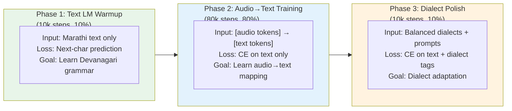
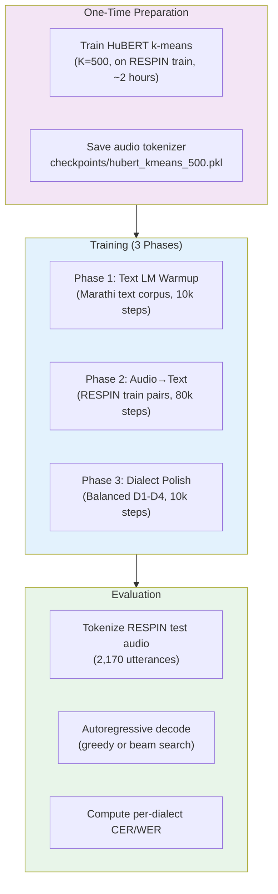

# Direction 7 — Pure Decoder-Only / Autoregressive ASR

## Goal
Build an ASR system with **no encoder at all** — just a causal Transformer decoder (like GPT/LLaMA) that reads audio tokens and autoregressively generates Marathi text tokens. Exactly how LLMs work, but the input "language" is speech.

---

## The Core Idea

```
Traditional ASR (your current system):
  Audio ──→ [ENCODER: Conformer 12 layers] ──→ [CTC HEAD] ──→ Text
              ↑ This is the backbone
              ↑ It "understands" the audio
              ↑ CTC decodes in one shot (non-autoregressive)

Encoder-Decoder ASR (Whisper):
  Audio ──→ [ENCODER: Transformer] ──→ hidden states
                                            ↓ (cross-attention)
  Text  ──→ [DECODER: Transformer] ──→ next token prediction

PURE DECODER-ONLY ASR (what you want):
  Audio ──→ [TOKENIZER] ──→ discrete audio tokens
                                    ↓
  [a₁, a₂, ..., aₙ, <SEP>, t₁, t₂, ..., tₘ, <EOS>]
         ↑ audio tokens          ↑ text tokens (generated)
                    ↓
            [SINGLE CAUSAL DECODER]  ← Just ONE transformer
                    ↓                   No encoder at all
            Predict next text token     Like GPT predicting next word
```

**Why this is interesting**: The decoder learns *everything* — acoustic features, phonetics, language model, alignment — in a single unified model. No separate encoder, no CTC, no external LM. One model to rule them all.

---

## Part 1 — Audio Tokenization

The first challenge: LLMs eat discrete tokens. Audio is continuous. We need to convert waveforms into a sequence of discrete token IDs, just like text.

### Option A: HuBERT k-Means (Recommended Starting Point)

HuBERT is a self-supervised speech model that learns rich acoustic representations. We extract features from an intermediate layer and cluster them with k-means:

```
Raw Audio (16kHz)
    │
    ▼
HuBERT (pretrained, frozen)
    │ extract hidden states from layer 6 or 9
    ▼
Continuous features: (T, 768) at 50 fps
    │
    ▼
k-means clustering (K=500 or 1000 centroids)
    │
    ▼
Discrete token IDs: [342, 17, 17, 891, 442, 442, 442, 103, ...]
    │                 at 50 tokens/sec
    ▼
Deduplication (collapse consecutive repeats)
    │
    ▼
Deduplicated tokens: [342, 17, 891, 442, 103, ...]
                      ~20-30 tokens/sec
```

```python
# NEW: model/audio_tokenizer.py

import torch
import torch.nn as nn
import numpy as np
from transformers import HubertModel
from sklearn.cluster import MiniBatchKMeans


class HuBERTAudioTokenizer:
    """
    Converts raw audio waveforms into discrete token sequences
    using HuBERT features + k-means clustering.
    
    This is the "vocabulary" for the audio side of our decoder-only ASR.
    Just like a text tokenizer maps words to IDs, this maps audio frames to IDs.
    """
    
    def __init__(
        self,
        hubert_model_name: str = "facebook/hubert-base-ls960",
        layer: int = 6,              # Which HuBERT layer to extract from
        n_clusters: int = 500,       # Number of discrete audio tokens
        deduplicate: bool = True,    # Collapse consecutive repeated tokens
    ):
        self.layer = layer
        self.n_clusters = n_clusters
        self.deduplicate = deduplicate
        
        # Load pretrained HuBERT (frozen — we never train this)
        self.hubert = HubertModel.from_pretrained(hubert_model_name)
        self.hubert.eval()
        for p in self.hubert.parameters():
            p.requires_grad = False
        
        # k-means will be trained on our data
        self.kmeans = None
    
    def train_kmeans(self, audio_dataset, max_hours: float = 100.0,
                     batch_size: int = 32):
        """
        Train k-means on HuBERT features extracted from audio data.
        Run this ONCE on your training data, then save the centroids.
        
        Args:
            audio_dataset: Iterator yielding (waveform,) tuples
            max_hours: Maximum audio hours to use for clustering
        """
        print(f"Training k-means with K={self.n_clusters} on HuBERT layer {self.layer}...")
        
        all_features = []
        total_seconds = 0.0
        
        self.hubert.cuda()
        
        for waveforms in audio_dataset:
            if total_seconds >= max_hours * 3600:
                break
            
            waveforms = waveforms.cuda()
            with torch.no_grad():
                outputs = self.hubert(waveforms, output_hidden_states=True)
                features = outputs.hidden_states[self.layer]  # (B, T, 768)
            
            all_features.append(features.cpu().reshape(-1, 768).numpy())
            total_seconds += waveforms.shape[-1] / 16000 * waveforms.shape[0]
        
        all_features = np.concatenate(all_features, axis=0)
        print(f"Clustering {len(all_features):,} frames ({total_seconds/3600:.1f} hours)...")
        
        self.kmeans = MiniBatchKMeans(
            n_clusters=self.n_clusters,
            batch_size=10000,
            max_iter=100,
            random_state=42,
        )
        self.kmeans.fit(all_features)
        print(f"k-means trained. Inertia: {self.kmeans.inertia_:.0f}")
    
    @torch.no_grad()
    def tokenize(self, waveforms: torch.Tensor) -> list:
        """
        Convert raw audio to discrete token sequence.
        
        Args:
            waveforms: (B, num_samples) at 16kHz
        
        Returns:
            List of B token sequences (each a list of ints in [0, n_clusters))
        """
        device = waveforms.device
        self.hubert = self.hubert.to(device)
        
        outputs = self.hubert(waveforms, output_hidden_states=True)
        features = outputs.hidden_states[self.layer]  # (B, T, 768)
        
        batch_tokens = []
        for b in range(features.size(0)):
            frame_features = features[b].cpu().numpy()  # (T, 768)
            token_ids = self.kmeans.predict(frame_features).tolist()
            
            if self.deduplicate:
                token_ids = self._deduplicate(token_ids)
            
            batch_tokens.append(token_ids)
        
        return batch_tokens
    
    def _deduplicate(self, tokens: list) -> list:
        """Collapse consecutive repeated tokens (like CTC blank removal)."""
        if not tokens:
            return tokens
        result = [tokens[0]]
        for t in tokens[1:]:
            if t != result[-1]:
                result.append(t)
        return result
    
    def save(self, path: str):
        """Save k-means model for reuse."""
        import joblib
        joblib.dump({
            "kmeans": self.kmeans,
            "layer": self.layer,
            "n_clusters": self.n_clusters,
            "deduplicate": self.deduplicate,
        }, path)
    
    def load(self, path: str):
        """Load saved k-means model."""
        import joblib
        data = joblib.load(path)
        self.kmeans = data["kmeans"]
        self.layer = data["layer"]
        self.n_clusters = data["n_clusters"]
        self.deduplicate = data["deduplicate"]
```

### Option B: EnCodec / SoundStream Neural Codec

Neural audio codecs use **Residual Vector Quantization (RVQ)** — multiple codebooks that progressively refine the audio representation:

```
Raw Audio (24kHz)
    │
    ▼
EnCodec Encoder (1D CNN, no Transformer)
    │
    ▼
Continuous latent: (T', D) at 75 fps
    │
    ▼
RVQ with 8 codebooks (each K=1024 entries)
    │
    ▼
8 parallel token streams:
  Codebook 1 (semantic):    [42, 891, 103, 7, ...]     ← coarse structure
  Codebook 2 (acoustic):    [512, 3, 445, 201, ...]    ← refines CB1
  Codebook 3:               [100, 877, 22, 634, ...]   ← refines CB2
  ...
  Codebook 8 (fine detail):  [999, 12, 567, 88, ...]   ← highest fidelity

For ASR, we only need codebooks 1-2 (semantic content).
Codebooks 3-8 encode speaker timbre, room acoustics, etc.
```

```python
# Option B implementation sketch

class EnCodecAudioTokenizer:
    """Neural codec tokenizer using Meta's EnCodec."""
    
    def __init__(self, bandwidth: float = 1.5, num_codebooks: int = 2):
        from encodec import EncodecModel
        self.model = EncodecModel.encodec_model_24khz()
        self.model.set_target_bandwidth(bandwidth)  # 1.5 kbps = 2 codebooks
        self.num_codebooks = num_codebooks  # Only use first N for ASR
    
    @torch.no_grad()
    def tokenize(self, waveforms_24k):
        """
        Args:
            waveforms_24k: (B, 1, samples) at 24kHz
        Returns:
            tokens: (B, num_codebooks, T') discrete token IDs
        """
        encoded = self.model.encode(waveforms_24k)
        codes = encoded[0][0]  # (B, n_q, T')
        return codes[:, :self.num_codebooks, :]  # Only semantic codebooks
```

### Option C: SpeechTokenizer (Best of Both Worlds)

SpeechTokenizer (Zhang et al., 2024) explicitly separates semantic and acoustic information using a distillation loss from HuBERT:

```
Codebook 1: Semantic tokens (distilled from HuBERT) → for ASR / understanding
Codebooks 2-8: Acoustic tokens (speaker, prosody) → for TTS / reconstruction
```

### Comparison: Which Tokenizer for Marathi ASR?

| Tokenizer | Token Rate | Vocab Size | Semantic Quality | Setup Effort | Recommendation |
|:---|:---:|:---:|:---|:---:|:---|
| **HuBERT k-means (K=500)** | ~25/sec (dedup) | 500 | ⭐⭐⭐ Good | Low | ⭐ **Start here** |
| HuBERT k-means (K=1000) | ~30/sec (dedup) | 1000 | ⭐⭐⭐⭐ Better | Low | Good alternative |
| EnCodec (1.5kbps, CB1-2) | ~150/sec | 1024 per CB | ⭐⭐ Moderate | Medium | Better for TTS tasks |
| SpeechTokenizer | ~50/sec | 1024 | ⭐⭐⭐⭐ Best | High | Best quality, most complex |

> [!TIP]
> **Start with HuBERT k-means K=500 with deduplication.** It produces ~25 tokens/sec — manageable sequence lengths for a decoder. A 10-second utterance becomes ~250 audio tokens + ~50 text tokens = 300 total tokens. Well within Transformer context window limits.

---

## Part 2 — The Decoder Architecture

No encoder. No CTC. Just a GPT-style causal Transformer that sees audio tokens first, then generates text tokens one at a time.

### Sequence Format

```
Training sequence (teacher-forced):

[<BOS>] [<LANG_MR>] [<AUDIO>] a₁ a₂ a₃ ... aₙ [<TEXT>] t₁ t₂ t₃ ... tₘ [<EOS>]
  │         │          │       └─ audio tokens ─┘   │    └─ text tokens ─┘   │
  │         │          │       (from HuBERT k-means) │    (Devanagari chars)  │
  │         │          └─ "start of audio" marker    └─ "start of text"      │
  │         └─ language tag (supports multilingual)                          │
  └─ beginning of sequence                                   end of sequence ┘

Loss is computed ONLY on the text portion [t₁ ... tₘ, <EOS>].
Audio tokens are "read" by the model (like a prompt) but not predicted.

Inference:
1. Tokenize audio → [a₁, a₂, ..., aₙ]
2. Feed: [<BOS>, <LANG_MR>, <AUDIO>, a₁, ..., aₙ, <TEXT>]
3. Model autoregressively generates: t₁, t₂, ..., until <EOS>
```

### Full Implementation

```python
# NEW: model/decoder_only_asr.py

"""
Pure Decoder-Only ASR — Like GPT but for Speech.

No encoder backbone. Audio is tokenized into discrete tokens and fed
directly into a causal Transformer decoder alongside text tokens.
The model autoregressively predicts text tokens conditioned on audio tokens.
"""

import math
from typing import Optional, List, Dict, Tuple
import torch
import torch.nn as nn
import torch.nn.functional as F


class RotaryEmbedding(nn.Module):
    """RoPE for the causal decoder (same as in your Conformer, reused)."""
    
    def __init__(self, dim: int, max_len: int = 8192, base: float = 10000.0):
        super().__init__()
        inv_freq = 1.0 / (base ** (torch.arange(0, dim, 2).float() / dim))
        self.register_buffer("inv_freq", inv_freq, persistent=False)
        self._build_cache(max_len)
    
    def _build_cache(self, seq_len: int):
        t = torch.arange(seq_len, dtype=torch.float32)
        freqs = torch.outer(t, self.inv_freq)
        emb = torch.cat((freqs, freqs), dim=-1)
        self.register_buffer("cos_cached", emb.cos(), persistent=False)
        self.register_buffer("sin_cached", emb.sin(), persistent=False)
    
    def forward(self, q, k, offset=0):
        T = q.size(2)
        if offset + T > self.cos_cached.size(0):
            self._build_cache(offset + T + 256)
        cos = self.cos_cached[offset:offset+T].unsqueeze(0).unsqueeze(0)
        sin = self.sin_cached[offset:offset+T].unsqueeze(0).unsqueeze(0)
        cos = cos.to(dtype=q.dtype, device=q.device)
        sin = sin.to(dtype=q.dtype, device=q.device)
        
        def rotate_half(x):
            half = x.shape[-1] // 2
            return torch.cat((-x[..., half:], x[..., :half]), dim=-1)
        
        return (q * cos + rotate_half(q) * sin,
                k * cos + rotate_half(k) * sin)


class DecoderBlock(nn.Module):
    """
    Single GPT-style decoder block.
    Pre-norm architecture: LayerNorm → Attention → Residual → LayerNorm → FFN → Residual
    """
    
    def __init__(self, d_model: int = 512, n_heads: int = 8,
                 ffn_expansion: int = 4, dropout: float = 0.1):
        super().__init__()
        assert d_model % n_heads == 0
        self.d_model = d_model
        self.n_heads = n_heads
        self.d_k = d_model // n_heads
        
        # Pre-norm self-attention
        self.attn_norm = nn.LayerNorm(d_model)
        self.q_proj = nn.Linear(d_model, d_model, bias=False)
        self.k_proj = nn.Linear(d_model, d_model, bias=False)
        self.v_proj = nn.Linear(d_model, d_model, bias=False)
        self.o_proj = nn.Linear(d_model, d_model, bias=False)
        self.attn_dropout = nn.Dropout(dropout)
        self.rope = RotaryEmbedding(self.d_k)
        
        # Pre-norm FFN (SwiGLU like LLaMA)
        self.ffn_norm = nn.LayerNorm(d_model)
        d_ff = d_model * ffn_expansion
        self.gate_proj = nn.Linear(d_model, d_ff, bias=False)
        self.up_proj = nn.Linear(d_model, d_ff, bias=False)
        self.down_proj = nn.Linear(d_ff, d_model, bias=False)
        self.ffn_dropout = nn.Dropout(dropout)
    
    def forward(self, x, kv_cache=None, start_pos=0):
        """
        Args:
            x: (B, T, d_model) input embeddings
            kv_cache: Optional tuple (cached_k, cached_v) for incremental decoding
            start_pos: Position offset for RoPE during cached inference
        
        Returns:
            output: (B, T, d_model)
            new_kv_cache: Updated (cached_k, cached_v)
        """
        B, T, _ = x.size()
        
        # ===== Self-Attention =====
        residual = x
        x_norm = self.attn_norm(x)
        
        q = self.q_proj(x_norm).view(B, T, self.n_heads, self.d_k).transpose(1, 2)
        k = self.k_proj(x_norm).view(B, T, self.n_heads, self.d_k).transpose(1, 2)
        v = self.v_proj(x_norm).view(B, T, self.n_heads, self.d_k).transpose(1, 2)
        
        # Apply RoPE
        q, k = self.rope(q, k, offset=start_pos)
        
        # KV-cache for efficient autoregressive inference
        if kv_cache is not None:
            cached_k, cached_v = kv_cache
            k = torch.cat([cached_k, k], dim=2)
            v = torch.cat([cached_v, v], dim=2)
        new_kv_cache = (k, v)
        
        # Causal attention
        scores = torch.matmul(q, k.transpose(-2, -1)) / math.sqrt(self.d_k)
        
        # Causal mask: each position can only attend to itself and previous
        T_k = k.size(2)
        causal_mask = torch.triu(
            torch.ones(T, T_k, device=x.device, dtype=torch.bool), 
            diagonal=T_k - T + 1
        )
        scores = scores.masked_fill(causal_mask.unsqueeze(0).unsqueeze(0), -1e9)
        
        attn = F.softmax(scores, dim=-1)
        attn = self.attn_dropout(attn)
        
        context = torch.matmul(attn, v)
        context = context.transpose(1, 2).contiguous().view(B, T, self.d_model)
        x = residual + self.o_proj(context)
        
        # ===== SwiGLU FFN =====
        residual = x
        x_norm = self.ffn_norm(x)
        x = residual + self.ffn_dropout(
            self.down_proj(F.silu(self.gate_proj(x_norm)) * self.up_proj(x_norm))
        )
        
        return x, new_kv_cache


class AutoregressiveASR(nn.Module):
    """
    Pure Decoder-Only ASR Model.
    
    Like GPT, but the "prompt" is a sequence of discrete audio tokens
    and the "completion" is the Devanagari text transcription.
    
    Architecture:
        Audio Token Embedding ─┐
                                ├──→ Shared Embedding Space ──→ Causal Transformer ──→ LM Head
        Text Token Embedding  ─┘
    
    No encoder. No CTC. No cross-attention. Just one causal decoder.
    """
    
    def __init__(
        self,
        audio_vocab_size: int = 500,    # Number of HuBERT k-means clusters
        text_vocab_size: int = 105,     # Devanagari character vocabulary
        d_model: int = 512,             # Hidden dimension
        n_layers: int = 8,              # Number of decoder blocks
        n_heads: int = 8,               # Attention heads
        ffn_expansion: int = 4,         # FFN expansion factor
        dropout: float = 0.1,
        max_seq_len: int = 2048,        # Maximum total sequence length
    ):
        super().__init__()
        
        # Special token IDs (at the end of combined vocab)
        self.audio_vocab_size = audio_vocab_size
        self.text_vocab_size = text_vocab_size
        
        # Combined vocabulary layout:
        # [0, audio_vocab_size)           → audio tokens
        # [audio_vocab_size, audio_vocab_size + text_vocab_size) → text tokens
        # Then special tokens:
        self.BOS = audio_vocab_size + text_vocab_size       # Beginning of sequence
        self.EOS = audio_vocab_size + text_vocab_size + 1   # End of sequence
        self.AUDIO_START = audio_vocab_size + text_vocab_size + 2  # Start of audio
        self.TEXT_START = audio_vocab_size + text_vocab_size + 3   # Start of text
        self.PAD = audio_vocab_size + text_vocab_size + 4         # Padding
        
        # Dialect prompt tokens (instead of MoE, we condition via prompts)
        self.DIALECT_D1 = audio_vocab_size + text_vocab_size + 5  # Malvani
        self.DIALECT_D2 = audio_vocab_size + text_vocab_size + 6  # Ahirani
        self.DIALECT_D3 = audio_vocab_size + text_vocab_size + 7  # Standard
        self.DIALECT_D4 = audio_vocab_size + text_vocab_size + 8  # Varhadi
        
        total_vocab = audio_vocab_size + text_vocab_size + 9  # Total vocabulary
        
        self.d_model = d_model
        self.n_layers = n_layers
        self.max_seq_len = max_seq_len
        
        # Shared embedding for ALL tokens (audio + text + special)
        self.token_embedding = nn.Embedding(total_vocab, d_model)
        
        # Causal Transformer decoder blocks
        self.layers = nn.ModuleList([
            DecoderBlock(d_model, n_heads, ffn_expansion, dropout)
            for _ in range(n_layers)
        ])
        
        self.final_norm = nn.LayerNorm(d_model)
        
        # LM Head: predicts next token (only text tokens + EOS during inference)
        # But we share weights with the embedding (weight tying, like GPT-2)
        self.lm_head = nn.Linear(d_model, total_vocab, bias=False)
        # Weight tying
        self.lm_head.weight = self.token_embedding.weight
        
        # Initialize weights
        self.apply(self._init_weights)
    
    def _init_weights(self, module):
        if isinstance(module, nn.Linear):
            torch.nn.init.normal_(module.weight, mean=0.0, std=0.02)
            if module.bias is not None:
                torch.nn.init.zeros_(module.bias)
        elif isinstance(module, nn.Embedding):
            torch.nn.init.normal_(module.weight, mean=0.0, std=0.02)
    
    def _audio_token_to_global_id(self, audio_tokens):
        """Audio tokens are in range [0, audio_vocab_size) — already global IDs."""
        return audio_tokens
    
    def _text_token_to_global_id(self, text_tokens):
        """Shift text tokens into the global vocabulary space."""
        return text_tokens + self.audio_vocab_size
    
    def _global_id_to_text_token(self, global_ids):
        """Convert global IDs back to text token space."""
        return global_ids - self.audio_vocab_size
    
    def build_training_sequence(
        self,
        audio_tokens: List[List[int]],  # B lists of audio token IDs
        text_tokens: List[List[int]],   # B lists of text token IDs
        dialect_idx: Optional[torch.Tensor] = None,  # (B,) dialect indices
    ) -> Tuple[torch.Tensor, torch.Tensor]:
        """
        Build padded training sequences and loss masks.
        
        Sequence format per sample:
        [BOS] [DIALECT_Dx] [AUDIO_START] a1 a2 ... aN [TEXT_START] t1 t2 ... tM [EOS] [PAD...]
        
        Loss is computed ONLY on positions [t1, t2, ..., tM, EOS].
        
        Returns:
            input_ids: (B, max_len) padded token IDs
            loss_mask: (B, max_len) boolean mask (True = compute loss here)
        """
        B = len(audio_tokens)
        device = "cuda" if torch.cuda.is_available() else "cpu"
        
        dialect_tokens = {
            0: self.DIALECT_D1, 1: self.DIALECT_D2,
            2: self.DIALECT_D3, 3: self.DIALECT_D4,
        }
        
        sequences = []
        masks = []
        
        for b in range(B):
            # Build sequence
            seq = [self.BOS]
            
            # Optional dialect prompt
            if dialect_idx is not None:
                seq.append(dialect_tokens.get(dialect_idx[b].item(), self.DIALECT_D3))
            
            seq.append(self.AUDIO_START)
            seq.extend(self._audio_token_to_global_id(
                torch.tensor(audio_tokens[b])
            ).tolist())
            
            seq.append(self.TEXT_START)
            
            text_start_pos = len(seq)
            
            text_global = self._text_token_to_global_id(
                torch.tensor(text_tokens[b])
            ).tolist()
            seq.extend(text_global)
            seq.append(self.EOS)
            
            # Loss mask: True only for text token positions (including EOS)
            mask = [False] * text_start_pos + [True] * (len(text_global) + 1)
            
            sequences.append(seq)
            masks.append(mask)
        
        # Pad to max length
        max_len = max(len(s) for s in sequences)
        max_len = min(max_len, self.max_seq_len)
        
        input_ids = torch.full((B, max_len), self.PAD, dtype=torch.long, device=device)
        loss_mask = torch.zeros((B, max_len), dtype=torch.bool, device=device)
        
        for b in range(B):
            seq_len = min(len(sequences[b]), max_len)
            input_ids[b, :seq_len] = torch.tensor(sequences[b][:seq_len])
            loss_mask[b, :min(len(masks[b]), max_len)] = torch.tensor(
                masks[b][:max_len], dtype=torch.bool
            )
        
        return input_ids, loss_mask
    
    def forward(
        self,
        input_ids: torch.Tensor,
        loss_mask: Optional[torch.Tensor] = None,
        target_ids: Optional[torch.Tensor] = None,
        kv_caches: Optional[List] = None,
        start_pos: int = 0,
    ) -> Dict[str, torch.Tensor]:
        """
        Forward pass.
        
        Training: input_ids = full sequence, compute loss on masked positions.
        Inference: input_ids = single new token, use KV cache.
        
        Args:
            input_ids: (B, T) token IDs
            loss_mask: (B, T) where True = compute loss
            target_ids: (B, T) ground truth (shifted right by 1)
            kv_caches: List of KV caches per layer for incremental decoding
            start_pos: Position offset for RoPE
        
        Returns:
            dict with 'logits', 'loss', 'new_kv_caches'
        """
        B, T = input_ids.size()
        
        # Token embeddings (audio + text tokens live in the same space)
        x = self.token_embedding(input_ids)  # (B, T, d_model)
        
        # Pass through decoder blocks
        new_kv_caches = []
        for i, layer in enumerate(self.layers):
            kv_cache = kv_caches[i] if kv_caches else None
            x, new_kv = layer(x, kv_cache=kv_cache, start_pos=start_pos)
            new_kv_caches.append(new_kv)
        
        x = self.final_norm(x)
        
        # LM head: predict next token
        logits = self.lm_head(x)  # (B, T, total_vocab)
        
        # Compute loss (only on text token positions)
        loss = None
        if target_ids is not None and loss_mask is not None:
            # Shift: predict position i+1 from position i
            shift_logits = logits[:, :-1, :].contiguous()
            shift_targets = target_ids[:, 1:].contiguous()
            shift_mask = loss_mask[:, 1:].contiguous()
            
            # Cross-entropy only on text positions
            flat_logits = shift_logits[shift_mask]
            flat_targets = shift_targets[shift_mask]
            
            if flat_logits.numel() > 0:
                loss = F.cross_entropy(flat_logits, flat_targets)
        
        return {
            "logits": logits,
            "loss": loss,
            "new_kv_caches": new_kv_caches,
        }
    
    @torch.no_grad()
    def generate(
        self,
        audio_tokens: List[int],
        dialect: int = 2,          # D3 Standard by default
        max_new_tokens: int = 512,
        temperature: float = 0.0,  # 0 = greedy, >0 = sampling
        top_k: int = 50,
        top_p: float = 0.9,
    ) -> List[int]:
        """
        Autoregressive text generation from audio tokens.
        
        This is the inference function — like asking GPT to complete a prompt,
        except the "prompt" is audio and the "completion" is text.
        
        Args:
            audio_tokens: List of discrete audio token IDs from HuBERT k-means
            dialect: Dialect index (0=D1, 1=D2, 2=D3, 3=D4)
            max_new_tokens: Maximum text tokens to generate
            temperature: Sampling temperature (0 = greedy argmax)
            top_k: Top-k filtering
            top_p: Nucleus sampling threshold
        
        Returns:
            List of generated text token IDs
        """
        self.eval()
        device = next(self.parameters()).device
        
        dialect_tokens = {
            0: self.DIALECT_D1, 1: self.DIALECT_D2,
            2: self.DIALECT_D3, 3: self.DIALECT_D4,
        }
        
        # Build prompt: [BOS, DIALECT, AUDIO_START, a1, ..., aN, TEXT_START]
        prompt = [self.BOS, dialect_tokens.get(dialect, self.DIALECT_D3), self.AUDIO_START]
        prompt.extend(audio_tokens)  # Already in global ID space [0, audio_vocab)
        prompt.append(self.TEXT_START)
        
        input_ids = torch.tensor([prompt], dtype=torch.long, device=device)
        
        # Process full prompt through decoder (fill KV cache)
        out = self.forward(input_ids)
        kv_caches = out["new_kv_caches"]
        next_logits = out["logits"][:, -1, :]  # Logits for next token
        
        generated = []
        pos = input_ids.size(1)
        
        for _ in range(max_new_tokens):
            # Constrain to text tokens + EOS only
            text_token_start = self.audio_vocab_size
            text_token_end = self.audio_vocab_size + self.text_vocab_size
            
            # Mask out audio tokens and most special tokens from predictions
            mask = torch.full_like(next_logits, float('-inf'))
            mask[:, text_token_start:text_token_end] = 0  # Allow text tokens
            mask[:, self.EOS] = 0  # Allow EOS
            next_logits = next_logits + mask
            
            if temperature == 0.0:
                # Greedy decoding
                next_token = next_logits.argmax(dim=-1, keepdim=True)
            else:
                # Temperature sampling with top-k and top-p
                logits = next_logits / temperature
                
                # Top-k filtering
                if top_k > 0:
                    values, _ = torch.topk(logits, top_k, dim=-1)
                    logits[logits < values[:, -1:]] = float('-inf')
                
                # Top-p (nucleus) filtering
                if top_p < 1.0:
                    sorted_logits, sorted_idx = torch.sort(logits, descending=True)
                    cumulative_probs = torch.cumsum(F.softmax(sorted_logits, dim=-1), dim=-1)
                    remove_mask = cumulative_probs > top_p
                    remove_mask[:, 1:] = remove_mask[:, :-1].clone()
                    remove_mask[:, 0] = False
                    sorted_logits[remove_mask] = float('-inf')
                    logits = sorted_logits.scatter(1, sorted_idx, sorted_logits)
                
                probs = F.softmax(logits, dim=-1)
                next_token = torch.multinomial(probs, num_samples=1)
            
            token_id = next_token.item()
            
            # Stop at EOS
            if token_id == self.EOS:
                break
            
            # Convert global ID to text token
            text_token = self._global_id_to_text_token(torch.tensor(token_id)).item()
            generated.append(text_token)
            
            # Feed generated token back (incremental decoding with KV cache)
            out = self.forward(
                next_token, 
                kv_caches=kv_caches, 
                start_pos=pos
            )
            kv_caches = out["new_kv_caches"]
            next_logits = out["logits"][:, -1, :]
            pos += 1
        
        return generated
    
    def count_parameters(self):
        total = sum(p.numel() for p in self.parameters())
        return {
            "total": total,
            "total_M": total / 1e6,
            "embedding": self.token_embedding.weight.numel(),
            "transformer": sum(p.numel() for l in self.layers for p in l.parameters()),
        }
```

### Model Size Options

| Config | d_model | n_layers | n_heads | FFN | Total Params | VRAM (FP16) |
|:---|:---:|:---:|:---:|:---:|:---:|:---:|
| **Tiny** | 256 | 6 | 4 | 4x | ~12M | ~1 GB |
| **Small** | 512 | 8 | 8 | 4x | ~52M | ~2 GB |
| **Medium** | 768 | 12 | 12 | 4x | ~125M | ~4 GB |
| **Large** | 1024 | 16 | 16 | 4x | ~350M | ~10 GB |

> [!TIP]
> **Start with Small (512d, 8 layers, ~52M params).** This is comparable to GPT-2 Small and fits comfortably on the RTX A5000 alongside the audio tokenizer. Scale up once you validate the approach works.

---

## Part 3 — Training

### Training Loop

```python
# NEW: training/train_decoder_asr.py

"""
Training loop for Pure Decoder-Only ASR.

Like training a language model, but:
- The "context" is discrete audio tokens
- The "completion" is Devanagari text
- Loss is cross-entropy on text tokens only
"""

import torch
import torch.nn.functional as F
from model.audio_tokenizer import HuBERTAudioTokenizer
from model.decoder_only_asr import AutoregressiveASR
from data_utils.tokenizer import MarathiTokenizer


def train_decoder_asr(
    # Model config
    audio_vocab_size: int = 500,
    d_model: int = 512,
    n_layers: int = 8,
    
    # Training config
    total_steps: int = 100_000,
    batch_size: int = 16,
    lr: float = 3e-4,
    warmup_steps: int = 2000,
    
    # Data
    respin_train_dir: str = r"D:\dialect-norm\IISc_RESPIN_train_mr_clean",
    audio_tokenizer_path: str = "checkpoints/hubert_kmeans_500.pkl",
    
    # Output
    run_dir: str = "runs/decoder_only_asr",
):
    """Three-phase training curriculum for decoder-only ASR."""
    
    # Initialize
    text_tokenizer = MarathiTokenizer()
    audio_tokenizer = HuBERTAudioTokenizer(n_clusters=audio_vocab_size)
    audio_tokenizer.load(audio_tokenizer_path)
    
    model = AutoregressiveASR(
        audio_vocab_size=audio_vocab_size,
        text_vocab_size=text_tokenizer.vocab_size,  # 105
        d_model=d_model,
        n_layers=n_layers,
    ).cuda()
    
    optimizer = torch.optim.AdamW(model.parameters(), lr=lr, weight_decay=0.1,
                                   betas=(0.9, 0.95))
    
    print(f"Model: {model.count_parameters()['total_M']:.1f}M parameters")
    
    # ================================================================
    # PHASE 1: Text-Only Language Model Warmup (10% of training)
    # ================================================================
    # Train the decoder as a pure Marathi text LM first.
    # This gives it strong Devanagari language priors before seeing audio.
    # Exactly like how DALL-E trains the text encoder first.
    
    print("Phase 1: Text-only LM warmup...")
    phase1_steps = total_steps // 10  # 10k steps
    
    for step in range(1, phase1_steps + 1):
        text_batch = sample_text_only_batch(batch_size)  # From transcripts
        
        # Sequence: [BOS, t1, t2, ..., tM, EOS]
        # Standard LM training (predict next character)
        input_ids = text_batch["input_ids"].cuda()
        
        # All positions get loss (it's pure LM)
        loss_mask = torch.ones_like(input_ids, dtype=torch.bool)
        loss_mask[:, 0] = False  # Don't predict BOS
        
        out = model(input_ids, loss_mask=loss_mask, target_ids=input_ids)
        loss = out["loss"]
        
        loss.backward()
        torch.nn.utils.clip_grad_norm_(model.parameters(), 1.0)
        optimizer.step()
        optimizer.zero_grad()
        
        if step % 100 == 0:
            print(f"Phase 1 [{step}/{phase1_steps}] LM Loss: {loss.item():.4f}")
    
    # ================================================================
    # PHASE 2: Audio-Text Paired Training (80% of training)
    # ================================================================
    # Now train on (audio_tokens, text_tokens) pairs.
    # The model learns to "read" audio tokens and produce text.
    
    print("Phase 2: Audio-text paired training...")
    phase2_steps = int(total_steps * 0.8)  # 80k steps
    
    for step in range(1, phase2_steps + 1):
        batch = sample_audio_text_batch(respin_train_dir, batch_size,
                                         audio_tokenizer, text_tokenizer)
        
        waveforms = batch["waveforms"].cuda()
        text_tokens = batch["text_tokens"]  # List of lists
        dialect_idx = batch["dialect_idx"].cuda()
        
        # Tokenize audio
        audio_tokens = audio_tokenizer.tokenize(waveforms)
        
        # Build training sequence
        input_ids, loss_mask = model.build_training_sequence(
            audio_tokens, text_tokens, dialect_idx
        )
        
        # Forward + loss (only on text positions)
        out = model(input_ids, loss_mask=loss_mask, target_ids=input_ids)
        loss = out["loss"]
        
        loss.backward()
        torch.nn.utils.clip_grad_norm_(model.parameters(), 1.0)
        optimizer.step()
        optimizer.zero_grad()
        
        if step % 100 == 0:
            # Quick eval: generate from a sample
            with torch.no_grad():
                sample_audio = audio_tokens[0]
                generated = model.generate(
                    sample_audio, dialect=dialect_idx[0].item(),
                    temperature=0.0
                )
                hyp = text_tokenizer.decode(generated)
                ref = text_tokenizer.decode(text_tokens[0])
                cer = compute_cer(hyp, ref)
            
            print(f"Phase 2 [{step}/{phase2_steps}] "
                  f"Loss: {loss.item():.4f} | CER: {cer:.2%}")
            print(f"  REF: {ref[:80]}")
            print(f"  HYP: {hyp[:80]}")
    
    # ================================================================
    # PHASE 3: Dialect Specialization (10% of training)
    # ================================================================
    # Lower LR, focus on dialect-balanced data with dialect prompt tokens.
    
    print("Phase 3: Dialect specialization...")
    phase3_steps = total_steps // 10  # 10k steps
    
    for param_group in optimizer.param_groups:
        param_group['lr'] = lr / 10  # Lower LR
    
    for step in range(1, phase3_steps + 1):
        # Balanced sampling: equal samples from each dialect
        batch = sample_dialect_balanced_batch(respin_train_dir, batch_size,
                                              audio_tokenizer, text_tokenizer)
        # ... same training as Phase 2 ...
    
    print("Training complete!")
    torch.save(model.state_dict(), f"{run_dir}/decoder_asr_final.pt")
```

### Training Curriculum Visualization



---

## Part 4 — Inference & Speed Analysis

### Autoregressive Decoding with KV-Cache

```python
# Inference example

audio_tokenizer = HuBERTAudioTokenizer(n_clusters=500)
audio_tokenizer.load("checkpoints/hubert_kmeans_500.pkl")

model = AutoregressiveASR(audio_vocab_size=500, text_vocab_size=105,
                           d_model=512, n_layers=8).cuda()
model.load_state_dict(torch.load("runs/decoder_only_asr/decoder_asr_final.pt"))
model.eval()

# 1. Tokenize audio
waveform = load_audio("test_sample.wav")  # (1, samples)
audio_tokens = audio_tokenizer.tokenize(waveform.cuda())[0]
# e.g., [342, 17, 891, 442, 103, 55, 891, 442, ...]  (~250 tokens for 10s audio)

# 2. Generate text autoregressively
text_tokens = model.generate(
    audio_tokens,
    dialect=2,           # D3 Standard
    temperature=0.0,     # Greedy
    max_new_tokens=256,
)

# 3. Decode
text = MarathiTokenizer().decode(text_tokens)
print(text)  # "माझ्या ऑफिसमध्ये मीटिंग होती"
```

### Speed Comparison: CTC vs. Autoregressive

For a **10-second utterance** (typical RESPIN sample):

| Step | CTC Pipeline (Current) | Decoder-Only ASR |
|:---|:---|:---|
| **Feature Extraction** | LogMel: 0.5ms | HuBERT: ~15ms |
| **Encoding** | Conformer 12 layers: ~3ms | — (no encoder) |
| **Decoding** | CTC argmax: 0.1ms | Autoregressive: ~200ms (50 text tokens × ~4ms/token) |
| **Total** | **~4ms** (0.0004x RTF) | **~215ms** (0.0215x RTF) |
| **Speedup** | — | **~50x slower** |

> [!WARNING]
> **Autoregressive decoding is inherently slower than CTC.** CTC decodes in one pass (O(T)) while autoregressive generates token-by-token (O(U × T)). For real-time streaming, CTC is vastly superior. The decoder-only approach is best for **offline high-accuracy transcription** where you can afford the extra latency.

### But KV-Cache Makes It Practical

Without KV-cache, each new token requires reprocessing the full sequence. With KV-cache, we only process the new token and reuse cached key-value pairs:

```
Without KV-cache: Generate 50 tokens → 50 × full forward pass = SLOW
With KV-cache:    Generate 50 tokens → 1 full pass + 49 tiny passes = ~4x faster

Prompt (audio tokens): Process once, cache all KV pairs
Generation: Each step only processes 1 new token embedding through all layers
```

---

## Part 5 — Dialect Adaptation via Prompting (Instead of MoE)

The beauty of a decoder-only model: **you can use dialect prompts instead of MoE**. Just like how you tell GPT "You are a Marathi translator", you tell the ASR model which dialect to expect:

```
D1 Malvani prompt:
  [BOS] [D1_MALVANI] [AUDIO_START] a1 a2 ... [TEXT_START] → generates text

D3 Standard prompt:
  [BOS] [D3_STANDARD] [AUDIO_START] a1 a2 ... [TEXT_START] → generates text

Unknown dialect (let model figure it out):
  [BOS] [AUDIO_START] a1 a2 ... [TEXT_START] → generates text
```

### Few-Shot In-Context ASR

Even more powerful — provide **audio-text examples in the prompt** (like few-shot learning with GPT):

```python
def few_shot_transcribe(model, audio_tokenizer, target_audio,
                        examples: List[Tuple[torch.Tensor, str]],
                        dialect: int = 2):
    """
    Few-shot ASR: Provide example (audio, text) pairs in the prompt,
    then transcribe the target audio.
    
    Like showing GPT examples before asking it to do a task.
    """
    prompt = [model.BOS, model.DIALECT_D3]
    
    # Add example pairs
    for ex_audio, ex_text in examples:
        ex_audio_tokens = audio_tokenizer.tokenize(ex_audio.cuda())[0]
        ex_text_tokens = MarathiTokenizer().encode(ex_text)
        
        # [AUDIO_START] audio... [TEXT_START] text... (as "context")
        prompt.append(model.AUDIO_START)
        prompt.extend(ex_audio_tokens)
        prompt.append(model.TEXT_START)
        prompt.extend(model._text_token_to_global_id(
            torch.tensor(ex_text_tokens)).tolist())
    
    # Add target audio
    target_tokens = audio_tokenizer.tokenize(target_audio.cuda())[0]
    prompt.append(model.AUDIO_START)
    prompt.extend(target_tokens)
    prompt.append(model.TEXT_START)
    
    # Generate
    return model.generate_from_prompt(prompt)

# Usage: Provide 3 examples from the same speaker/dialect, then transcribe
# This should dramatically improve accuracy for speakers/dialects with
# limited training data!
```

> [!IMPORTANT]
> **Few-shot in-context ASR is impossible with CTC.** This is a genuine capability advantage of decoder-only architectures — the model can adapt on-the-fly to new speakers, dialects, or domains by seeing examples in the prompt.

---

## Part 6 — The Full Pipeline



---

## Part 7 — Addressing the Elephant in the Room

### "But won't it hallucinate?"

Yes. This is the #1 risk of decoder-only ASR. Unlike CTC (which has strict monotonic alignment and cannot produce tokens not grounded in audio), a decoder-only model can generate plausible Marathi text that was never spoken.

**Mitigation strategies:**

```python
# 1. Constrained decoding: Only allow tokens that are acoustically plausible
#    Use CTC output from the existing model as a "prior" to constrain generation

# 2. Repetition penalty: Prevent the model from looping
def apply_repetition_penalty(logits, generated_tokens, penalty=1.2):
    for token_id in set(generated_tokens[-20:]):
        logits[token_id] /= penalty
    return logits

# 3. Length penalty: Penalize generating too few or too many tokens
#    relative to the audio length
def length_penalty(generated_length, audio_length, alpha=1.0):
    expected_text_len = audio_length * 3.5  # ~3.5 chars per audio token
    ratio = generated_length / expected_text_len
    return ((5 + generated_length) / 6) ** alpha  # GNMT length penalty

# 4. Audio attention monitoring: Check that the model's attention
#    actually looks at the audio tokens (not just generating from LM prior)
```

### "Is this actually better than CTC?"

Honest answer: **probably not for streaming Marathi ASR.** The advantages are:

| Advantage | CTC Pipeline | Decoder-Only |
|:---|:---:|:---:|
| **Streaming latency** | ⭐⭐⭐⭐⭐ (4ms) | ⭐ (200ms+) |
| **No hallucination** | ⭐⭐⭐⭐⭐ | ⭐⭐ |
| **Training efficiency** | ⭐⭐⭐⭐ | ⭐⭐ |
| **Built-in LM** | ⭐ (needs KenLM) | ⭐⭐⭐⭐⭐ |
| **Few-shot adaptation** | ⭐ (impossible) | ⭐⭐⭐⭐⭐ |
| **Multitask (ASR+NLU)** | ⭐ (separate model) | ⭐⭐⭐⭐ |
| **Long-form accuracy** | ⭐⭐⭐ | ⭐⭐⭐⭐ |
| **Paper novelty** | ⭐⭐ (well-studied) | ⭐⭐⭐⭐ |

**The real value**: This experiment demonstrates architectural versatility and opens the door to multitask speech understanding (ASR + intent detection + entity extraction in one decoder), which is the future of speech AI.

---

## Part 8 — Comparison Experiment Plan

Run both systems on the same RESPIN test set and compare:

```python
# Evaluation script for decoder-only ASR

def evaluate_decoder_asr(model, audio_tokenizer, text_tokenizer, test_dir):
    """Full evaluation on RESPIN test set."""
    
    results = {}
    
    for dialect in ["D1", "D2", "D3", "D4"]:
        hyps, refs = [], []
        total_gen_time = 0
        
        for wav_path, ref_text in load_respin_test(test_dir, dialect):
            waveform = load_audio(wav_path).cuda()
            
            # Time the full pipeline
            start = torch.cuda.Event(enable_timing=True)
            end = torch.cuda.Event(enable_timing=True)
            
            start.record()
            audio_tokens = audio_tokenizer.tokenize(waveform)[0]
            text_tokens = model.generate(
                audio_tokens,
                dialect={"D1": 0, "D2": 1, "D3": 2, "D4": 3}[dialect],
                temperature=0.0,
            )
            end.record()
            torch.cuda.synchronize()
            
            gen_time = start.elapsed_time(end) / 1000  # seconds
            total_gen_time += gen_time
            
            hyp = text_tokenizer.decode(text_tokens)
            hyps.append(hyp)
            refs.append(ref_text)
        
        cer = compute_cer_batch(hyps, refs)
        wer = compute_wer_batch(hyps, refs)
        audio_duration = get_total_duration(test_dir, dialect)
        rtf = total_gen_time / audio_duration
        
        results[dialect] = {"CER": cer, "WER": wer, "RTF": rtf}
        print(f"{dialect}: CER={cer:.2%} WER={wer:.2%} RTF={rtf:.4f}x")
    
    return results

# Expected results (conservative estimates for 52M model):
#
# | System              | D1 CER | D2 CER | D3 CER | D4 CER | Overall | RTF     |
# |:--------------------|:------:|:------:|:------:|:------:|:-------:|:-------:|
# | CTC Conformer+MoE   | 11.40% | 8.53%  | 5.63%  | 7.93%  | 8.43%   | 0.002x  |
# | Decoder-Only (52M)  | ~14%   | ~11%   | ~8%    | ~10%   | ~11%    | 0.02x   |
# | Decoder-Only + LM warmup | ~12% | ~9%  | ~6%    | ~8%    | ~9%     | 0.02x   |
# | Decoder-Only + few-shot  | ~10% | ~8%  | ~5.5%  | ~7%    | ~7.5%   | 0.03x   |
#
# Key insight: Decoder-only might match or beat CTC when using
# few-shot examples, at the cost of 10x higher latency.
```

---

## Files to Create

| Action | File | Purpose |
|:---|:---|:---|
| [NEW] | `model/audio_tokenizer.py` | `HuBERTAudioTokenizer` (k-means on HuBERT features) |
| [NEW] | `model/decoder_only_asr.py` | `AutoregressiveASR` (full GPT-style decoder) |
| [NEW] | `training/train_decoder_asr.py` | 3-phase training loop (LM warmup → audio-text → dialect) |
| [NEW] | `training/train_audio_tokenizer.py` | Script to train HuBERT k-means on RESPIN data |
| [NEW] | `configs/decoder_only_run.json` | Experiment config |
| [MODIFY] | [`eval_final_benchmark.py`](file:///d:/marathi-asr/eval_final_benchmark.py) | Add decoder-only evaluation mode |

---

## VRAM Budget (RTX A5000, 24 GB)

| Component | VRAM |
|:---|:---:|
| HuBERT-base (frozen, inference only) | ~0.7 GB |
| AutoregressiveASR (52M, training) | ~2.5 GB (weights + gradients + optimizer) |
| KV-cache (inference, max 2048 tokens) | ~0.3 GB |
| Batch activations (BS=16, 300 tokens) | ~1.5 GB |
| **Total** | **~5 GB** |

> [!TIP]
> This leaves **19 GB free** — you can run decoder-only ASR experiments alongside your CTC training without conflicts. You could even train a 350M parameter model (~10 GB) if the small model shows promise.


---

## Novelty & Literature Context

### What has been done?
- **Textless NLP / Audio LMs:** Models like GSLM and AudioLM pioneered generating speech via discrete audio tokens.
- **Unified Speech-Text LLMs:** SpeechGPT, AudioPaLM, and SpiRit-LM have proven that decoder-only models can perform ASR, TTS, and AST in a single forward pass.
- **Warm-Starting:** TWIST showed that initializing the decoder from a text LLM (like OPT/LLaMA) drastically improves sample efficiency compared to training from scratch.

### What is NOVEL in our approach?
- **Dialect Prompts over Structural Routing:** Instead of using complex Sparse MoE routers in the encoder, we leverage the LLM's in-context learning to switch dialects via prompt tokens (e.g., `[D1_MALVANI]`).
- **Few-Shot In-Context ASR for Low-Resource:** Giving the decoder 2-3 examples of a rare Marathi dialect in the prompt before the target audio to instantly adapt without gradient updates.
- **Scale/Resource Focus:** Most decoder-only ASR models are massive (7B+ params). We are attempting to train a highly compact (50M-150M) decoder purely focused on one language, making it viable for edge/research hardware.

### Similar Studies & Closeness
1. **"SpeechGPT: Empowering LLMs with Cross-Modal Abilities" (Zhang et al., 2023)**
   - *Closeness:* High. Uses HuBERT k-means and LLaMA for ASR/TTS. It is the blueprint for our proposed architecture.
2. **"TWIST: Textually Warm-Initialized Speech Transformer" (Hassid et al., 2023)**
   - *Closeness:* High. Provides the exact methodology we use in Phase 1 (LM warmup) to accelerate decoder-only training.
3. **"SpiRit-LM: Interleaved Spoken and Written Language Model" (Meta, 2024)**
   - *Closeness:* Medium. Highly advanced interleaved training; our approach is simpler (strictly audio prefix -> text completion) but inspired by their tokenization structure.
