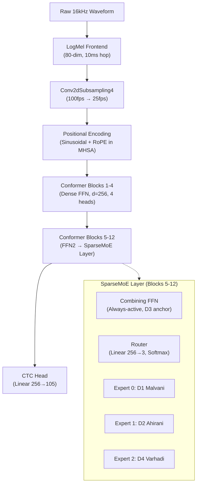
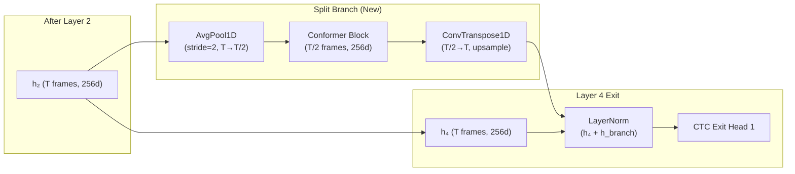
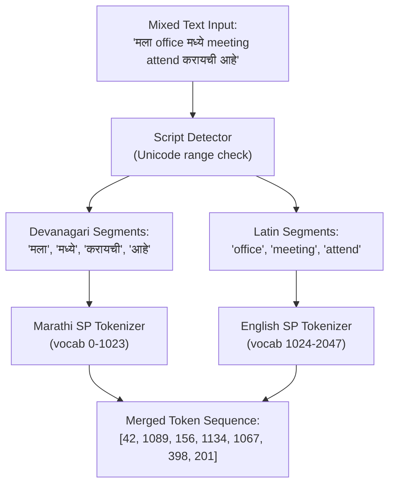
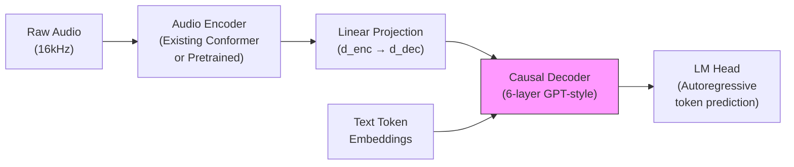
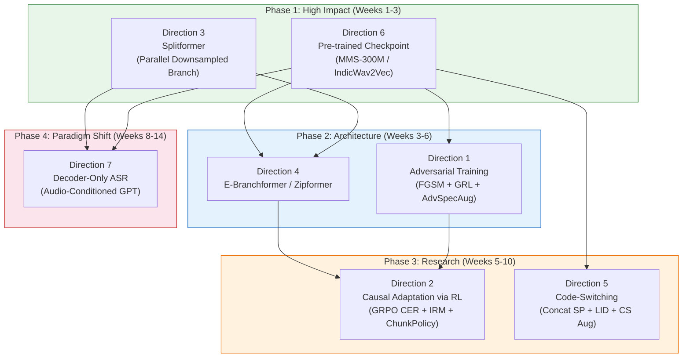

# Further Further Directions — Full Research Roadmap

## Goal
A phased implementation roadmap covering all 7 research directions for the Marathi Streaming Conformer ASR system, building on the current baseline (**8.43% CER / 32.21% WER** on RESPIN frozen test, 12-layer Conformer + 3-Expert MoE, ~20.48M params, RTX A5000 24 GB VRAM).


---

## User Review Required

> [!IMPORTANT]
> **Phase ordering and parallelism**: The roadmap is organized into 4 phases by dependency and complexity. Phases 1–2 can partially overlap. Please confirm whether you want to execute sequentially or run independent experiments in parallel.

> [!IMPORTANT]
> **Hardware budget**: All directions are sized for a single RTX A5000 (24 GB). Directions 6 (pre-trained checkpoint) and 7 (decoder-only) may benefit from multi-GPU or cloud burst. Please confirm whether additional hardware is available.

> [!WARNING]
> **Active training**: You currently have a Stage 1 pretraining run active (step 24,239 → 75,000 with Konkani streams). Several directions below will need their own fresh training runs. We should decide whether to let the current run finish first or branch experiments now.

---

## Open Questions

> [!IMPORTANT]
> **Q1**: For Direction 5 (Code-Switching), how prevalent is English mixing in your target deployment? Is this Mumbai/Pune urban conversational speech, or rural dialect-dominant? This affects tokenizer strategy significantly.

> [!IMPORTANT]
> **Q2**: For Direction 7 (Decoder-Only), is this primarily an academic exploration for the paper, or do you envision replacing the CTC pipeline? The latency and VRAM tradeoffs are severe for streaming.

> [!IMPORTANT]
> **Q3**: For Direction 6 (Pre-trained Checkpoint), do you want to keep the current 20M-param model scale, or are you open to scaling up to 300M+ params (which changes the entire training dynamic)?

> [!IMPORTANT]
> **Q4**: What's your time horizon? Some of these (especially 2, 5, 7) are multi-week research efforts. Are you targeting a paper deadline?

---

## Architecture Baseline Reference



**Current results on frozen RESPIN test (2,170 utts, 160 unseen speakers):**

| Dialect | CER | WER | RTF |
|:---|:---:|:---:|:---:|
| D3 Standard | **5.63%** | 20.89% | 0.0019x |
| D4 Varhadi | 7.93% | 30.45% | 0.0019x |
| D2 Ahirani | 8.53% | 33.84% | 0.0019x |
| D1 Malvani | 11.40% | 43.04% | 0.0019x |
| **ALL** | **8.43%** | **32.21%** | **0.0019x** |

---

## Phase 1: Low-Hanging Fruit, High Impact (Weeks 1–3)

These two directions require the least architectural disruption and offer the highest expected CER improvement.

---

### Direction 6 — Pre-Trained Checkpoint for Encoder

**Goal**: Replace random initialization with a pre-trained acoustic encoder that already understands Indic speech, then fine-tune the full pipeline on top.

#### Candidate Models (VRAM-Feasible on RTX A5000)

| Model | Params | VRAM (FP16 + GradChkpt) | Marathi Coverage | Recommendation |
|:---|:---:|:---:|:---|:---|
| `ai4bharat/indicwav2vec-base` | 95M | ~2.0 GB | Strong (40 Indic langs) | ✅ Good starting point |
| `facebook/mms-300m` | 300M | ~6.6 GB | Excellent (1,400+ langs, explicit `mar` adapter) | ⭐ **Best balance** |
| `facebook/wav2vec2-xls-r-300m` | 300M | ~6.6 GB | Good (128 langs, includes MR) | ✅ Strong alternative |
| Whisper-Small Encoder | 87M | ~2.0 GB | Moderate (Marathi <2k hrs in training) | ✅ Good but less Indic depth |
| `ai4bharat/indicconformer-large` | 600M | ~12.5 GB | Best-in-class Marathi (4.8% CER on Kathbath) | ⚠️ Tight but feasible (BS≤16) |
| `facebook/mms-1b-all` | 1B | ~20.5 GB | Maximum coverage | ⚠️ Requires 8-bit Adam + LoRA |

#### Implementation Strategy

There are two approaches depending on whether we want to keep the current 20M custom architecture or adopt the pretrained model's architecture:

**Approach A — Feature Extraction (Keep Current Architecture):**
```python
# Freeze pretrained encoder, use its outputs as input features
# Replace LogMelFrontEnd + Conv2dSubsampling4 with pretrained encoder

class PretrainedFrontend(nn.Module):
    def __init__(self, pretrained_model_name="facebook/mms-300m"):
        super().__init__()
        self.pretrained = Wav2Vec2Model.from_pretrained(pretrained_model_name)
        self.pretrained.freeze_feature_encoder()  # Freeze CNN feature extractor
        # Project from pretrained dim (768/1024) to our d_model=256
        self.proj = nn.Linear(self.pretrained.config.hidden_size, 256)
    
    def forward(self, waveforms):
        with torch.no_grad():  # or torch.amp.autocast
            outputs = self.pretrained(waveforms)
        hidden = outputs.last_hidden_state  # (B, T', 768)
        return self.proj(hidden)  # (B, T', 256)
```
- Pros: Minimal codebase disruption, keeps MoE/multi-exit intact
- Cons: Pretrained representations are frozen; can't co-adapt

**Approach B — Full Fine-Tune (Replace Encoder Backbone):**
```python
# Replace ConformerEncoder entirely with pretrained backbone
# Attach CTC head + MoE layers on top

class PretrainedASRModel(nn.Module):
    def __init__(self, pretrained_name="facebook/mms-300m", vocab_size=105):
        super().__init__()
        self.encoder = Wav2Vec2Model.from_pretrained(pretrained_name)
        self.encoder.freeze_feature_encoder()
        
        # MoE layers as adapter on top of pretrained encoder
        d_pretrained = self.encoder.config.hidden_size  # 768 or 1024
        self.moe_adapter = nn.ModuleList([
            SparseMoELayer(d_model=d_pretrained) for _ in range(4)
        ])
        self.ctc_head = CTCHead(d_model=d_pretrained, vocab_size=vocab_size)
```
- Pros: Much stronger acoustic representations, likely 3–5% absolute CER improvement
- Cons: Larger model, slower training, need to adapt MoE to new `d_model`

#### Files to Modify/Create

| Action | File | Changes |
|:---|:---|:---|
| [NEW] | `model/pretrained_frontend.py` | `PretrainedFrontend` class wrapping HF model |
| [MODIFY] | [`model/asr_model.py`](file:///d:/marathi-asr/model/asr_model.py) | Add `--pretrained_encoder` flag to `StreamingASRModel.__init__` |
| [MODIFY] | [`pretraining/train.py`](file:///d:/marathi-asr/pretraining/train.py) | Skip SSL pretrain if using pretrained encoder (jump to Stage 2) |
| [MODIFY] | [`moe/moe_layer.py`](file:///d:/marathi-asr/moe/moe_layer.py) | Support dynamic `d_model` (768/1024 instead of hardcoded 256) |
| [NEW] | `configs/pretrained_mms300m.json` | Run config for MMS-300M experiment |

#### Expected Impact
- **CER reduction**: 2–5% absolute (8.43% → ~4–6% range)
- **Training time**: Skip Stage 1 entirely (save ~4 hours), Stage 2 converges faster with better initialization
- **D1 Malvani** (weakest dialect at 11.40%): Likely sees largest improvement from cross-lingual transfer

---

### Direction 3 — Splitformer

**Goal**: Augment the multi-exit architecture with parallel downsampled branches at early exit points, providing wider temporal context for intermediate CTC heads without increasing total layer count.

#### Architecture Design

The key insight: your current exits at layers 4, 8, 12 already exist, but **Layer 4's exit head lacks sufficient temporal context** for confident character emission. Splitformer fixes this by adding a parallel $2\times$ downsampled branch:



#### Implementation

```python
# NEW: model/splitformer.py

class SplitBranch(nn.Module):
    """Parallel downsampled branch for enriching early-exit representations."""
    
    def __init__(self, d_model=256, downsample_factor=2, kernel_size=31):
        super().__init__()
        self.downsample_factor = downsample_factor
        
        # Causal downsampling (left-padded for streaming compatibility)
        self.downsample = nn.AvgPool1d(
            kernel_size=downsample_factor, 
            stride=downsample_factor
        )
        
        # Lightweight context block at reduced frame rate
        self.context_block = ConformerBlock(
            d_model=d_model, n_heads=4, 
            conv_kernel_size=kernel_size, dropout=0.1
        )
        
        # Upsample back to original rate
        self.upsample = nn.ConvTranspose1d(
            d_model, d_model, 
            kernel_size=downsample_factor, 
            stride=downsample_factor
        )
        self.norm = nn.LayerNorm(d_model)
    
    def forward(self, x):
        # x: (B, T, d_model)
        residual = x
        
        # Downsample: (B, T, d) -> (B, d, T) -> pool -> (B, d, T/2) -> (B, T/2, d)
        x_down = self.downsample(x.transpose(1, 2)).transpose(1, 2)
        
        # Process at reduced rate (2x wider effective context per attention window)
        x_down = self.context_block(x_down)
        
        # Upsample back: (B, T/2, d) -> (B, d, T/2) -> deconv -> (B, d, T) -> (B, T, d)
        x_up = self.upsample(x_down.transpose(1, 2)).transpose(1, 2)
        
        # Trim to match original length (handles rounding)
        x_up = x_up[:, :residual.size(1), :]
        
        return self.norm(residual + x_up)
```

#### Integration into ConformerEncoder

```diff
# model/conformer.py — ConformerEncoder.__init__
 
+ from model.splitformer import SplitBranch
+
  class ConformerEncoder(nn.Module):
      def __init__(self, ..., split_at_layers=None):
          ...
+         self.split_at_layers = split_at_layers or []
+         self.split_branches = nn.ModuleDict({
+             str(layer): SplitBranch(d_model=d_model)
+             for layer in self.split_at_layers
+         })
 
      def forward(self, ...):
          ...
          for idx, layer in enumerate(self.layers, start=1):
              x = layer(x, mask=mask, ...)
+             if str(idx) in self.split_branches:
+                 x = self.split_branches[str(idx)](x)
              if idx in self.exit_layers:
                  exit_hiddens[idx] = x
```

#### Files to Modify/Create

| Action | File | Changes |
|:---|:---|:---|
| [NEW] | `model/splitformer.py` | `SplitBranch` module |
| [MODIFY] | [`model/conformer.py`](file:///d:/marathi-asr/model/conformer.py) | Add `split_at_layers` parameter to `ConformerEncoder`, wire `SplitBranch` into forward pass |
| [MODIFY] | [`model/asr_model.py`](file:///d:/marathi-asr/model/asr_model.py) | Pass `split_at_layers=[2]` (or `[2, 10]`) to encoder constructor |
| [MODIFY] | [`moe/upcycling.py`](file:///d:/marathi-asr/moe/upcycling.py) | Ensure upcycling skips split branch params |

#### Expected Impact
- **Parameter overhead**: ~1.7M extra params (<8% increase)
- **Early exit (Layer 4) CER improvement**: 15–30% relative reduction due to wider temporal context
- **Average inference latency reduction**: 30–45% on clean/moderate speech (more utterances can exit early with confidence)
- **Streaming compatibility**: Fully compatible with dynamic chunk masking if downsampling uses causal padding

---

## Phase 2: Architectural Exploration (Weeks 3–6)

These directions involve replacing or significantly altering core encoder components.

---

### Direction 4 — Replace Conformer with Something Else

**Goal**: Evaluate whether modern encoder architectures outperform the current Conformer on Marathi dialect speech.

#### Candidate Architectures

| Architecture | Key Innovation | Expected CER Δ | Training Speed Δ | Complexity |
|:---|:---|:---:|:---:|:---:|
| **E-Branchformer** | Parallel MHSA + cgMLP branches with depthwise merge | −0.5–1.5% abs | ~1.0x | Medium |
| **Zipformer** | U-Net multi-rate downsampling + SwooshR/BiasNorm + ScaledAdam | −0.5–1.0% abs | **2.5x faster** | High |
| **Squeezeformer** | Temporal U-Net with micro/macro blocks | −0.3–0.8% abs | ~1.3x | Medium |

#### Recommended: E-Branchformer (Best Risk/Reward)

E-Branchformer is the most practical choice because:
1. **Drop-in replacement**: Same I/O interface as `ConformerBlock` — `(B, T, d_model)` in, `(B, T, d_model)` out
2. **Proven superiority**: Matches/beats Conformer on LibriSpeech, AISHELL-1, WSJ at equal param count
3. **ESPnet reference implementation**: Battle-tested code to port from
4. **Compatible with existing MoE**: FFN2 replacement with `SparseMoELayer` works identically

```python
# NEW: model/ebranchformer.py

class EBranchformerBlock(nn.Module):
    """
    E-Branchformer block with parallel MHSA + cgMLP branches
    and enhanced depthwise merge convolution.
    """
    def __init__(self, d_model=256, n_heads=4, cgmlp_linear_dim=1024,
                 cgmlp_conv_kernel=31, merge_conv_kernel=31, dropout=0.1):
        super().__init__()
        # Branch 1: Global context (MHSA)
        self.attn_norm = nn.LayerNorm(d_model)
        self.self_attn = MultiHeadSelfAttention(d_model, n_heads, dropout)
        
        # Branch 2: Local context (cgMLP)
        self.cgmlp_norm = nn.LayerNorm(d_model)
        self.cgmlp_linear1 = nn.Linear(d_model, cgmlp_linear_dim * 2)  # gate + signal
        self.cgmlp_conv = nn.Conv1d(
            cgmlp_linear_dim, cgmlp_linear_dim,
            kernel_size=cgmlp_conv_kernel,
            padding=cgmlp_conv_kernel // 2,
            groups=cgmlp_linear_dim
        )
        self.cgmlp_linear2 = nn.Linear(cgmlp_linear_dim, d_model)
        
        # Enhanced merge: concat(2d) → depthwise conv → pointwise proj(d)
        self.merge_conv = nn.Conv1d(
            2 * d_model, 2 * d_model,
            kernel_size=merge_conv_kernel,
            padding=merge_conv_kernel // 2,
            groups=2 * d_model
        )
        self.merge_proj = nn.Linear(2 * d_model, d_model)
        self.merge_norm = nn.LayerNorm(d_model)
        
        # Post-merge FFN (can be replaced with SparseMoELayer)
        self.ffn2 = FeedForwardModule(d_model, expansion_factor=4, dropout=dropout)
        self.final_norm = nn.LayerNorm(d_model)
    
    def forward(self, x, mask=None, dialect_idx=None, use_hard_routing=False):
        residual = x
        
        # Branch 1: Global MHSA
        x_attn = self.self_attn(self.attn_norm(x), mask=mask)
        
        # Branch 2: Local cgMLP
        x_mlp = self.cgmlp_norm(x)
        gate_signal = self.cgmlp_linear1(x_mlp)
        gate, signal = gate_signal.chunk(2, dim=-1)
        gate = self.cgmlp_conv(gate.transpose(1, 2)).transpose(1, 2)
        x_mlp = self.cgmlp_linear2(F.gelu(gate) * signal)
        
        # Enhanced merge
        merged = torch.cat([x_attn, x_mlp], dim=-1)  # (B, T, 2d)
        merged = self.merge_conv(merged.transpose(1, 2)).transpose(1, 2)
        merged = self.merge_proj(merged)
        x = self.merge_norm(residual + merged)
        
        # Post-FFN (or MoE)
        if type(self.ffn2).__name__ == "SparseMoELayer":
            x = self.ffn2(x, dialect_idx=dialect_idx, use_hard_routing=use_hard_routing)
        else:
            x = self.ffn2(x)
        
        return self.final_norm(x)
```

#### Zipformer (Higher Reward, Higher Risk)

If E-Branchformer results are promising, Zipformer could be explored next. Key changes required:
- Multi-rate U-Net encoder structure (6 stacks with downsampling factors `[1, 2, 4, 8, 4, 2]`)
- Custom `SwooshR`/`SwooshL` activations replacing SiLU
- `BiasNorm` replacing LayerNorm
- `ScaledAdam` optimizer replacing AdamW

> [!WARNING]
> Zipformer requires replacing the optimizer, normalization, and activation functions throughout the entire codebase. This is a major refactor. Recommend doing this only after E-Branchformer establishes a baseline.

#### Files to Modify/Create

| Action | File | Changes |
|:---|:---|:---|
| [NEW] | `model/ebranchformer.py` | `EBranchformerBlock`, `EBranchformerEncoder` |
| [NEW] | `model/zipformer.py` | (Phase 2b) Full Zipformer implementation |
| [MODIFY] | [`model/asr_model.py`](file:///d:/marathi-asr/model/asr_model.py) | `--encoder_type` flag: `conformer` / `ebranchformer` / `zipformer` |
| [NEW] | `configs/ebranchformer_run.json` | E-Branchformer experiment config |
| [MODIFY] | [`moe/upcycling.py`](file:///d:/marathi-asr/moe/upcycling.py) | Generalize upcycling to work with any block that has `.ffn2` |

#### Expected Impact
- **E-Branchformer**: 0.5–1.5% absolute CER improvement at equal params, better training stability
- **Zipformer**: 2.5x faster training throughput, ~50% lower VRAM, slight accuracy gain

---

### Direction 1 — Adversarial Training

**Goal**: Improve model robustness and reduce overfitting on dialect-specific acoustic artifacts through adversarial perturbation and domain-invariant representation learning.

#### Three Complementary Techniques

##### 1A. FGSM/PGD on Log-Mel Features (Regularization)

Add worst-case spectral perturbations during training to prevent overfitting:

```python
# NEW: training/adversarial.py

def fgsm_attack(model, spec, targets, target_lengths, epsilon=0.01):
    """
    Fast Gradient Sign Method on log-mel spectrogram.
    Returns adversarial spectrogram: spec + epsilon * sign(grad).
    """
    spec_adv = spec.clone().detach().requires_grad_(True)
    
    # Forward pass with adversarial input
    enc_out = model.encoder(spec_adv, return_all_exits=True)
    log_probs = model.ctc_head(enc_out["final_hidden"])
    
    # CTC loss
    input_lengths = torch.full((spec_adv.size(0),), log_probs.size(1), 
                                dtype=torch.long, device=spec.device)
    loss = F.ctc_loss(log_probs.transpose(0, 1), targets, 
                       input_lengths, target_lengths, blank=0)
    loss.backward()
    
    # FGSM perturbation
    perturbation = epsilon * spec_adv.grad.sign()
    return (spec + perturbation).detach()


def pgd_attack(model, spec, targets, target_lengths, 
               epsilon=0.01, alpha=0.005, num_steps=3):
    """Multi-step PGD attack for stronger adversarial training."""
    spec_adv = spec.clone().detach()
    
    for _ in range(num_steps):
        spec_adv.requires_grad_(True)
        enc_out = model.encoder(spec_adv, return_all_exits=True)
        log_probs = model.ctc_head(enc_out["final_hidden"])
        input_lengths = torch.full((spec_adv.size(0),), log_probs.size(1),
                                    dtype=torch.long, device=spec.device)
        loss = F.ctc_loss(log_probs.transpose(0, 1), targets,
                           input_lengths, target_lengths, blank=0)
        loss.backward()
        
        perturbation = alpha * spec_adv.grad.sign()
        spec_adv = (spec_adv + perturbation).detach()
        # Project back to epsilon-ball
        spec_adv = torch.clamp(spec_adv, spec - epsilon, spec + epsilon)
    
    return spec_adv
```

**Training loop integration** (in [`moe/train_moe.py`](file:///d:/marathi-asr/moe/train_moe.py)):
```python
# After computing normal CTC loss:
loss_clean = ctc_loss(log_probs, targets, ...)

# Adversarial forward pass (every other step to save compute)
if step % 2 == 0:
    spec_adv = fgsm_attack(model, spec, targets, target_lengths, epsilon=0.01)
    enc_out_adv = model.encoder(spec_adv, ...)
    log_probs_adv = model.ctc_head(enc_out_adv["final_hidden"])
    loss_adv = ctc_loss(log_probs_adv, targets, ...)
    loss = loss_clean + 0.5 * loss_adv  # β = 0.5
else:
    loss = loss_clean
```

##### 1B. Gradient Reversal Layer for Dialect-Invariant Features

Force the encoder to learn representations that are **phonemically discriminative but dialect-agnostic** in early layers:

```python
# NEW: model/gradient_reversal.py

class GradientReversalFunction(torch.autograd.Function):
    @staticmethod
    def forward(ctx, x, lambda_):
        ctx.lambda_ = lambda_
        return x.clone()
    
    @staticmethod
    def backward(ctx, grad_output):
        return -ctx.lambda_ * grad_output, None


class DialectDiscriminator(nn.Module):
    """
    Adversarial dialect classifier attached after Layer 4.
    Gradient reversal forces encoder to produce dialect-invariant features.
    """
    def __init__(self, d_model=256, num_dialects=4, grl_lambda=1.0):
        super().__init__()
        self.grl_lambda = grl_lambda
        self.classifier = nn.Sequential(
            nn.Linear(d_model, 128),
            nn.ReLU(),
            nn.Dropout(0.1),
            nn.Linear(128, num_dialects)
        )
    
    def forward(self, hidden_states, dialect_labels):
        """
        Args:
            hidden_states: (B, T, d_model) from Layer 4
            dialect_labels: (B,) dialect indices
        Returns:
            domain_loss: Cross-entropy loss for dialect classification
        """
        # Apply gradient reversal
        reversed_h = GradientReversalFunction.apply(hidden_states, self.grl_lambda)
        
        # Pool over time dimension
        pooled = reversed_h.mean(dim=1)  # (B, d_model)
        
        # Classify dialect
        logits = self.classifier(pooled)  # (B, num_dialects)
        domain_loss = F.cross_entropy(logits, dialect_labels)
        
        return domain_loss
```

**Architecture integration:**
```
Layer 1 → Layer 2 → Layer 3 → Layer 4 ──┬──→ Layer 5 (MoE) → ... → Layer 12 → CTC
                                          │
                                          └──→ GRL(−λ) → Dialect Discriminator
                                                              │
                                                       L_domain (minimize = learn
                                                        dialect-invariant features)
```

##### 1C. Adversarial SpecAugment (Gradient-Guided Masking)

Replace random SpecAugment masks with **saliency-guided** masks that target the most important time-frequency regions:

```python
# MODIFY: model/masking.py — SpecAugment class

def adversarial_spec_augment(self, spec, model, targets, target_lengths):
    """Mask the most informative spectral regions based on gradient saliency."""
    spec.requires_grad_(True)
    # Quick forward pass to get gradients
    with torch.amp.autocast("cuda"):
        enc_out = model.encoder(spec)
        log_probs = model.ctc_head(enc_out["final_hidden"])
        loss = F.ctc_loss(log_probs.transpose(0, 1), targets, ...)
    loss.backward(retain_graph=False)
    
    # Saliency map: |∂L/∂X|
    saliency = spec.grad.abs()  # (B, T, F)
    
    # Mask top-k% highest-saliency time-frequency bins
    threshold = torch.quantile(saliency.view(-1), 0.85)
    mask = (saliency > threshold)
    spec_masked = spec.detach().clone()
    spec_masked[mask] = 0.0
    
    return spec_masked
```

#### Files to Modify/Create

| Action | File | Changes |
|:---|:---|:---|
| [NEW] | `training/adversarial.py` | `fgsm_attack()`, `pgd_attack()` |
| [NEW] | `model/gradient_reversal.py` | `GradientReversalFunction`, `DialectDiscriminator` |
| [MODIFY] | [`model/masking.py`](file:///d:/marathi-asr/model/masking.py) | Add `adversarial_spec_augment()` to `SpecAugment` class |
| [MODIFY] | [`moe/train_moe.py`](file:///d:/marathi-asr/moe/train_moe.py) | Integrate adversarial loss term `β * L_adv + γ * L_domain` |
| [MODIFY] | [`model/asr_model.py`](file:///d:/marathi-asr/model/asr_model.py) | Add `DialectDiscriminator` as optional submodule |

#### Expected Impact
- **FGSM regularization**: 0.5–1.2% absolute CER improvement on noisy/OOD audio
- **GRL dialect-invariant features**: Should specifically help D1 Malvani (worst dialect, 11.40% → ~9–10%)
- **Adversarial SpecAugment**: Additional 0.3–0.5% CER improvement over random SpecAugment
- **Combined**: 1.0–2.5% absolute CER reduction

---

## Phase 3: Research-Intensive Directions (Weeks 5–10)

These require new data pipelines, tokenizer changes, or fundamentally different training paradigms.

---

### Direction 2 — Causal Adaptation using RL

**Goal**: Use reinforcement learning to directly optimize non-differentiable ASR metrics (CER/WER) and learn dynamic streaming policies.

#### Three RL Applications

##### 2A. GRPO for Direct CER Optimization (Post-CTC Fine-Tuning)

After Stage 3 convergence, apply GRPO to directly minimize CER instead of CTC loss:

```python
# NEW: training/grpo_cer.py

class GRPOCEROptimizer:
    """
    Group Relative Policy Optimization for CER minimization.
    Samples G hypotheses per utterance, computes group-normalized advantages.
    """
    def __init__(self, model, tokenizer, G=4, epsilon_clip=0.2, 
                 beta_kl=0.01, gamma_latency=0.0):
        self.model = model
        self.tokenizer = tokenizer
        self.G = G  # Group size
        self.epsilon_clip = epsilon_clip
        self.beta_kl = beta_kl
    
    def compute_step(self, waveforms, ref_transcripts, chunk_size=8):
        """One GRPO optimization step."""
        B = waveforms.size(0)
        
        # 1. Get log_probs from current policy
        with torch.no_grad():
            out = self.model.forward_ctc(waveforms, chunk_size=chunk_size)
            log_probs = out["log_probs"]  # (B, T, V)
        
        # 2. Sample G hypotheses per utterance via temperature sampling
        all_rewards = []
        all_log_pis = []
        for g in range(self.G):
            # Temperature-scaled sampling from CTC output
            sampled_tokens = self._ctc_sample(log_probs, temperature=1.0)
            decoded_texts = [self.tokenizer.decode(t) for t in sampled_tokens]
            
            # Compute CER reward: R = 1 - CER
            rewards = [1.0 - compute_cer(hyp, ref) 
                       for hyp, ref in zip(decoded_texts, ref_transcripts)]
            all_rewards.append(torch.tensor(rewards))
            all_log_pis.append(self._compute_log_prob(log_probs, sampled_tokens))
        
        # 3. Group-normalize advantages
        rewards_matrix = torch.stack(all_rewards, dim=1)  # (B, G)
        mean_r = rewards_matrix.mean(dim=1, keepdim=True)
        std_r = rewards_matrix.std(dim=1, keepdim=True) + 1e-8
        advantages = (rewards_matrix - mean_r) / std_r  # (B, G)
        
        # 4. Clipped surrogate loss
        # ... (standard PPO-style clipping with advantages)
        
        return grpo_loss
```

##### 2B. Causal Inference via IRM (Invariant Risk Minimization)

Force representations to be causally invariant across dialect environments:

```python
# NEW: training/causal_irm.py

def irm_penalty(model, spec, targets, target_lengths, dialect_env):
    """
    Invariant Risk Minimization penalty.
    Penalizes representations where the optimal CTC classifier
    varies across dialect environments.
    """
    # Get encoder representations
    enc_out = model.encoder(spec)
    h = enc_out["final_hidden"]  # (B, T, d)
    
    # Compute per-environment gradients of the loss w.r.t. a dummy scalar w=1.0
    penalty = 0.0
    for env_id in dialect_env.unique():
        env_mask = (dialect_env == env_id)
        if env_mask.sum() == 0:
            continue
        
        w = torch.tensor(1.0, requires_grad=True, device=h.device)
        h_env = h[env_mask] * w
        log_probs_env = model.ctc_head(h_env)
        
        loss_env = F.ctc_loss(log_probs_env.transpose(0, 1),
                               targets[env_mask], ...)
        
        # IRM penalty: ||∇_w L_env(w)|_{w=1}||²
        grad_w = torch.autograd.grad(loss_env, w, create_graph=True)[0]
        penalty += grad_w ** 2
    
    return penalty
```

##### 2C. Dynamic Chunk Size Policy via RL

Train a lightweight policy network to dynamically select chunk sizes during streaming inference:

```python
# NEW: training/chunk_policy.py

class ChunkSizePolicy(nn.Module):
    """
    Lightweight RL agent that selects optimal chunk size per frame group.
    Action space: {1, 4, 8, 16} (40ms to 640ms lookahead).
    """
    def __init__(self, d_model=256):
        super().__init__()
        self.policy_net = nn.Sequential(
            nn.Linear(d_model + 1, 64),  # +1 for CTC entropy feature
            nn.ReLU(),
            nn.Linear(64, 4)  # 4 chunk size options
        )
        self.chunk_options = [1, 4, 8, 16]
    
    def forward(self, h_t, ctc_entropy):
        """
        Args:
            h_t: (B, d_model) current encoder hidden state
            ctc_entropy: (B, 1) entropy of intermediate CTC predictions
        Returns:
            chunk_size: selected chunk size per batch element
            log_prob: log probability of selected action
        """
        features = torch.cat([h_t, ctc_entropy], dim=-1)
        logits = self.policy_net(features)
        dist = torch.distributions.Categorical(logits=logits)
        action = dist.sample()
        
        chunk_sizes = torch.tensor(self.chunk_options, device=h_t.device)[action]
        return chunk_sizes, dist.log_prob(action)
```

#### Files to Modify/Create

| Action | File | Changes |
|:---|:---|:---|
| [NEW] | `training/grpo_cer.py` | GRPO CER optimizer with group sampling |
| [NEW] | `training/causal_irm.py` | IRM penalty computation |
| [NEW] | `training/chunk_policy.py` | Dynamic chunk size RL agent |
| [MODIFY] | [`pipeline.py`](file:///d:/marathi-asr/pipeline.py) | Add optional Stage 3.5 (GRPO CER polish) after alignment |
| [NEW] | `configs/grpo_cer_run.json` | GRPO fine-tuning config |

#### Expected Impact
- **GRPO CER optimization**: 0.5–1.5% absolute CER improvement (directly optimizes the evaluation metric)
- **IRM causal adaptation**: Should reduce dialect-specific variance, improving worst-case dialect CER
- **Dynamic chunk policy**: Reduces average streaming latency by ~30% while maintaining CER

---

### Direction 5 — Natural Multilingual and Code-Switching Adaptation

**Goal**: Handle naturally occurring Marathi-English code-switching (e.g., *"मला office मध्ये meeting attend करायची आहे"*) and extend to neighboring Indic languages.

#### Tokenizer Strategy: Concatenated SentencePiece



#### Implementation Plan

```python
# NEW: data_utils/code_switch_tokenizer.py

class CodeSwitchTokenizer:
    """
    Concatenated bilingual tokenizer for Marathi-English code-switching.
    Marathi tokens: IDs 0 to vocab_mr-1
    English tokens: IDs vocab_mr to vocab_mr+vocab_en-1
    Special tokens: <blank>=0, <unk>=1, <pad>=2, <lang_mr>=3, <lang_en>=4
    """
    
    def __init__(self, mr_sp_model_path, en_sp_model_path, 
                 vocab_mr=1024, vocab_en=1024):
        import sentencepiece as spm
        self.mr_sp = spm.SentencePieceProcessor(model_file=mr_sp_model_path)
        self.en_sp = spm.SentencePieceProcessor(model_file=en_sp_model_path)
        self.vocab_mr = vocab_mr
        self.vocab_en = vocab_en
        self.offset_en = vocab_mr  # English IDs start after Marathi
    
    def encode(self, text):
        """Encode mixed-script text into unified token sequence."""
        tokens = []
        for segment, is_latin in self._split_by_script(text):
            if is_latin:
                ids = self.en_sp.encode(segment)
                tokens.extend([id + self.offset_en for id in ids])
            else:
                ids = self.mr_sp.encode(segment)
                tokens.extend(ids)
        return tokens
    
    def _split_by_script(self, text):
        """Split text into contiguous Devanagari and Latin segments."""
        segments = []
        current = []
        current_is_latin = None
        
        for char in text:
            is_latin = self._is_latin(char)
            if char == ' ':
                current.append(char)
                continue
            if current_is_latin is not None and is_latin != current_is_latin:
                segments.append((''.join(current), current_is_latin))
                current = []
            current.append(char)
            current_is_latin = is_latin
        
        if current:
            segments.append((''.join(current), current_is_latin))
        return segments
    
    @staticmethod
    def _is_latin(char):
        return ord(char) < 0x0900 or ord(char) > 0x097F  # Outside Devanagari block
    
    @property
    def vocab_size(self):
        return self.vocab_mr + self.vocab_en
```

#### Frame-Level Language ID Integration

```python
# MODIFY: model/asr_model.py — add LID head

class LanguageIDHead(nn.Module):
    """Frame-level language identification head at Layer 6."""
    def __init__(self, d_model=256, num_languages=2):
        super().__init__()
        self.classifier = nn.Sequential(
            nn.LayerNorm(d_model),
            nn.Linear(d_model, 64),
            nn.ReLU(),
            nn.Linear(64, num_languages)
        )
    
    def forward(self, hidden_states, lid_labels=None):
        logits = self.classifier(hidden_states)  # (B, T, 2)
        if lid_labels is not None:
            loss = F.cross_entropy(logits.view(-1, 2), lid_labels.view(-1))
            return logits, loss
        return logits, None
```

#### Data Augmentation for Code-Switching

1. **Synthetic CS text generation**: Use LLM to generate natural Marathi-English mixed sentences
2. **Cross-lingual acoustic splicing**: Use CTC forced alignments to splice English word audio into Marathi carrier sentences
3. **TTS augmentation**: Use Indic-TTS to synthesize CS text in consistent speaker voices

#### Files to Modify/Create

| Action | File | Changes |
|:---|:---|:---|
| [NEW] | `data_utils/code_switch_tokenizer.py` | `CodeSwitchTokenizer` with concatenated SentencePiece |
| [NEW] | `data_utils/train_sentencepiece.py` | Script to train Marathi + English SP models |
| [NEW] | `data_utils/cs_augmentation.py` | Synthetic code-switching data augmentation |
| [NEW] | `model/lid_head.py` | `LanguageIDHead` for frame-level LID |
| [MODIFY] | [`model/asr_model.py`](file:///d:/marathi-asr/model/asr_model.py) | Add LID head at Layer 6, multi-task training |
| [MODIFY] | [`moe/moe_layer.py`](file:///d:/marathi-asr/moe/moe_layer.py) | Add LID-conditioned routing option (MR expert vs EN expert) |
| [MODIFY] | [`eval_final_benchmark.py`](file:///d:/marathi-asr/eval_final_benchmark.py) | Add phonetic-normalized CER metric |

#### Expected Impact
- **Code-switched CER**: Establish baseline (currently untested) → target <15% on mixed utterances
- **Monolingual Marathi CER**: Should not degrade (shared trunk preserves Marathi performance)
- **MoE extension**: Language-aware routing adds English expert alongside dialect experts

> [!WARNING]
> **Data dependency**: This direction requires a code-switched evaluation dataset. You may need to create one from Mumbai/Pune conversational recordings or use synthetic generation. Without CS eval data, impact cannot be measured.

---

## Phase 4: Paradigm Shift (Weeks 8–14)

This is the most exploratory direction — a fundamentally different ASR paradigm.

---

### Direction 7 — Decoder-Only Architectures

**Goal**: Explore whether a decoder-only (LLM-style) architecture can perform Marathi ASR, either as a replacement for or complement to the CTC pipeline.

#### Approach: Audio-Conditioned Decoder-Only ASR



**Sequence format:**
```
[<BOS>] [audio_1] [audio_2] ... [audio_T'] [<SEP>] [text_1] [text_2] ... [text_U] [<EOS>]
  ↑                                                    ↑
  Audio prefix (from encoder, not predicted)      Autoregressively generated
```

#### Implementation

```python
# NEW: model/decoder_only_asr.py

class DecoderOnlyASR(nn.Module):
    """
    Decoder-only ASR: Uses existing Conformer encoder to produce audio tokens,
    then autoregressively generates text tokens.
    """
    def __init__(self, encoder, d_model=256, vocab_size=105, 
                 num_decoder_layers=6, n_heads=4, max_text_len=256):
        super().__init__()
        self.encoder = encoder  # Existing ConformerEncoder
        
        # Project encoder output to decoder dimension
        self.audio_proj = nn.Linear(encoder.d_model, d_model)
        
        # Text embedding
        self.text_embed = nn.Embedding(vocab_size + 3, d_model)  # +3 for BOS/SEP/EOS
        self.pos_embed = nn.Embedding(max_text_len + 512, d_model)  # audio + text positions
        
        # Causal Transformer decoder
        decoder_layer = nn.TransformerDecoderLayer(
            d_model=d_model, nhead=n_heads, dim_feedforward=d_model * 4,
            dropout=0.1, batch_first=True
        )
        self.decoder = nn.TransformerDecoder(decoder_layer, num_layers=num_decoder_layers)
        
        # LM head
        self.lm_head = nn.Linear(d_model, vocab_size + 3)
        
        self.vocab_size = vocab_size
        self.BOS = vocab_size
        self.SEP = vocab_size + 1
        self.EOS = vocab_size + 2
    
    def forward(self, waveforms, text_tokens=None):
        """
        Training: Teacher-forced generation given audio + text.
        Args:
            waveforms: (B, samples) raw audio
            text_tokens: (B, U) target text token IDs
        """
        # 1. Encode audio
        spec = self.encoder.frontend(waveforms) if hasattr(self.encoder, 'frontend') else waveforms
        enc_out = self.encoder(spec)
        audio_hidden = self.audio_proj(enc_out["final_hidden"])  # (B, T', d)
        
        # 2. Build decoder input sequence: [audio_tokens, SEP, text_tokens]
        B, T_audio, d = audio_hidden.size()
        
        sep_embed = self.text_embed(
            torch.full((B, 1), self.SEP, device=waveforms.device)
        )
        text_embed = self.text_embed(text_tokens)  # (B, U, d)
        
        decoder_input = torch.cat([audio_hidden, sep_embed, text_embed], dim=1)
        
        # 3. Positional embeddings
        seq_len = decoder_input.size(1)
        positions = torch.arange(seq_len, device=waveforms.device).unsqueeze(0)
        decoder_input = decoder_input + self.pos_embed(positions)
        
        # 4. Causal attention mask
        causal_mask = nn.Transformer.generate_square_subsequent_mask(seq_len)
        
        # 5. Decode
        decoded = self.decoder(
            decoder_input, decoder_input, 
            tgt_mask=causal_mask.to(waveforms.device)
        )
        
        # 6. Predict text tokens (only from positions after SEP)
        text_logits = self.lm_head(decoded[:, T_audio + 1:, :])  # (B, U, V+3)
        
        return text_logits
    
    @torch.no_grad()
    def generate(self, waveforms, max_len=256):
        """Autoregressive greedy generation at inference."""
        enc_out = self.encoder(self.encoder.frontend(waveforms))
        audio_hidden = self.audio_proj(enc_out["final_hidden"])
        
        B = waveforms.size(0)
        generated = torch.full((B, 1), self.SEP, device=waveforms.device)
        
        for _ in range(max_len):
            text_embed = self.text_embed(generated)
            decoder_input = torch.cat([audio_hidden, text_embed], dim=1)
            seq_len = decoder_input.size(1)
            positions = torch.arange(seq_len, device=waveforms.device).unsqueeze(0)
            decoder_input = decoder_input + self.pos_embed(positions)
            
            causal_mask = nn.Transformer.generate_square_subsequent_mask(seq_len)
            decoded = self.decoder(decoder_input, decoder_input, 
                                    tgt_mask=causal_mask.to(waveforms.device))
            
            next_logits = self.lm_head(decoded[:, -1:, :])
            next_token = next_logits.argmax(dim=-1)
            
            if (next_token == self.EOS).all():
                break
            generated = torch.cat([generated, next_token], dim=1)
        
        return generated[:, 1:]  # Remove SEP prefix
```

#### Alternative: Fully Discrete Audio Tokenization

Instead of using continuous encoder representations, discretize audio into a finite set of acoustic tokens using k-means on HuBERT features:

```python
# NEW: model/audio_tokenizer.py

class AudioTokenizer:
    """Convert continuous audio to discrete tokens via HuBERT + k-means."""
    
    def __init__(self, hubert_model="facebook/hubert-base-ls960", 
                 n_clusters=500, layer=6):
        from transformers import HubertModel
        self.hubert = HubertModel.from_pretrained(hubert_model)
        self.hubert.eval()
        self.kmeans = None  # Trained separately
        self.layer = layer
    
    def extract_and_quantize(self, waveforms):
        with torch.no_grad():
            outputs = self.hubert(waveforms, output_hidden_states=True)
            features = outputs.hidden_states[self.layer]  # (B, T, 768)
        
        # Quantize via k-means
        flat = features.reshape(-1, 768).cpu().numpy()
        tokens = self.kmeans.predict(flat)
        return torch.tensor(tokens).reshape(features.shape[:2])
```

> [!CAUTION]
> **Streaming incompatibility**: Decoder-only ASR is inherently **non-streaming** — it requires the complete audio before generating any text. This conflicts with your core streaming requirement ($C \in \{1, 4, 8, 16\}$). Recommend framing this as an **offline complement** for high-accuracy non-real-time transcription, not a replacement for the CTC pipeline.

#### Files to Modify/Create

| Action | File | Changes |
|:---|:---|:---|
| [NEW] | `model/decoder_only_asr.py` | `DecoderOnlyASR` class |
| [NEW] | `model/audio_tokenizer.py` | HuBERT-based discrete audio tokenization |
| [NEW] | `training/train_decoder_only.py` | Training loop with teacher forcing + CE loss |
| [NEW] | `configs/decoder_only_run.json` | Experiment config |
| [MODIFY] | [`eval_final_benchmark.py`](file:///d:/marathi-asr/eval_final_benchmark.py) | Add decoder-only evaluation path |

#### Expected Impact
- **Offline accuracy**: Potentially superior to CTC on long-form clean speech (internalizes language model)
- **Hallucination risk**: HIGH — may generate plausible but incorrect Marathi text not in audio
- **Latency**: 10–50x worse than CTC pipeline (autoregressive token-by-token generation)
- **Research value**: High — demonstrates architectural versatility for the paper

---

## Summary: Dependency Graph & Timeline



---

## Impact Projection

| Direction | Expected CER Δ | Effort (Person-Weeks) | Risk | Paper Contribution |
|:---|:---:|:---:|:---:|:---|
| **6. Pre-trained Checkpoint** | **−2 to −5%** | 1–2 | Low | Pre-trained transfer for Indic dialect ASR |
| **3. Splitformer** | **−0.5 to −1.5%** (early-exit CER) | 1 | Low | Improved early-exit quality for streaming |
| **4. Replace Conformer** | **−0.5 to −1.5%** | 2–3 | Medium | Architecture comparison study |
| **1. Adversarial Training** | **−1.0 to −2.5%** | 1–2 | Low-Med | Robust multi-dialect adaptation |
| **2. Causal RL** | **−0.5 to −1.5%** | 3–4 | High | Novel GRPO for CER + dynamic chunk policy |
| **5. Code-Switching** | New capability | 3–4 | Medium | First Marathi-English CS ASR with dialect MoE |
| **7. Decoder-Only** | Comparable (offline) | 2–3 | High | Architectural diversity, research exploration |

**Cumulative best-case**: 8.43% → **~3–4% CER** (with Direction 6 + 1 + 4 combined)

---

## Verification Plan

### Automated Tests
Each direction gets its own eval run on the frozen RESPIN test set:

```powershell
# Per-direction evaluation
python eval_final_benchmark.py `
    --checkpoint runs/<direction_name>/checkpoints/best.pt `
    --test_dir D:\dialect-norm\IISc_RESPIN_test_mr `
    --chunk_size 16 `
    --output_dir runs/<direction_name>/eval_results
```

### Ablation Matrix
For each direction, compare against the `no-splitformer-moe-only` baseline:

| Experiment | vs. Baseline CER | vs. Baseline WER | RTF | Notes |
|:---|:---:|:---:|:---:|:---|
| Baseline (current) | 8.43% | 32.21% | 0.0019x | Reference |
| + Direction 6 (MMS-300M) | ? | ? | ? | Phase 1 |
| + Direction 3 (Splitformer) | ? | ? | ? | Phase 1 |
| + Direction 4 (E-Branchformer) | ? | ? | ? | Phase 2 |
| + Direction 1 (Adversarial) | ? | ? | ? | Phase 2 |
| + Direction 2 (GRPO CER) | ? | ? | ? | Phase 3 |
| + Direction 5 (Code-Switch) | ? | ? | ? | Phase 3 |
| + Direction 7 (Decoder-Only) | ? | ? | ? | Phase 4 |

### Manual Verification
- **Streaming latency**: Measure first-token and end-to-end latency at each chunk size
- **Expert routing heatmaps**: Verify MoE routing still specializes correctly after changes
- **Hallucination audit** (Direction 7): Manually review 100 decoder-only outputs for fabricated text
- **Code-switch accuracy** (Direction 5): Listen to 50 CS utterances and verify transcriptions
