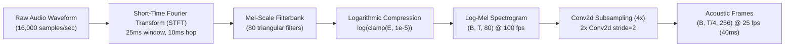
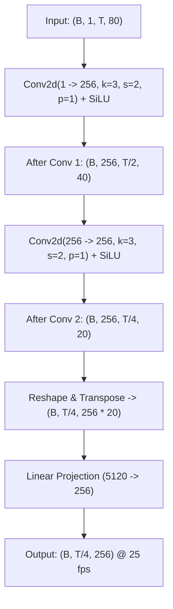
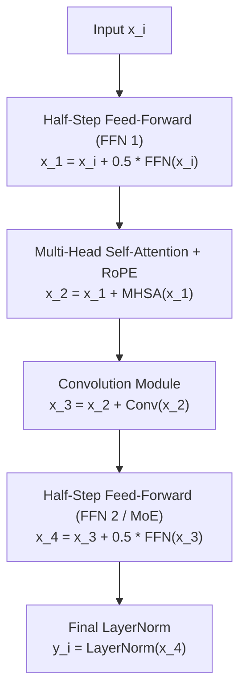
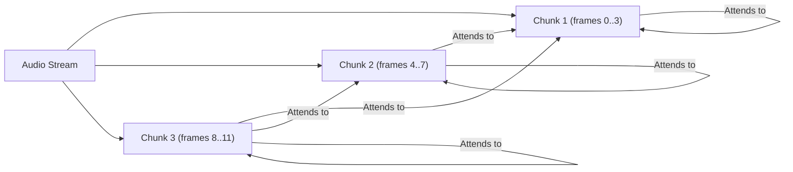

# 01 — Architectural Foundations & Acoustic Front-End

This document details the core neural acoustic architecture, feature extraction pipelines, mathematical formulations, and tokenization principles that form the foundation of our Marathi ASR system.

---

## 1. Acoustic Front-End & Signal Representation

Speech recognition starts by transforming a 1-dimensional continuous pressure wave into a compact, spectro-temporal time-frequency representation.



### 1.1 GPU-Accelerated Log-Mel Extraction

In standard pipelines, audio is often preprocessed on the CPU using `librosa` or `torchaudio` before batching, leading to CPU bottlenecks. Our implementation ([`model/asr_model.py`](file:///d:/marathi-asr/model/asr_model.py#L16-L51)) runs feature extraction directly on the GPU as part of the model's `forward` pass via `LogMelSpectrogramFrontEnd`.

#### Mathematical Formulation

Given raw discrete audio waveform $x[n]$ sampled at $f_s = 16,000\text{ Hz}$:

1. **Short-Time Fourier Transform (STFT)**:
   A Hann window $w[n]$ of length $N_{win} = 400$ samples (25 ms) is shifted by hop length $H = 160$ samples (10 ms, yielding 100 frames/second):
   $$X[k, m] = \sum_{n=0}^{N_{win}-1} x[mH + n] \cdot w[n] \cdot e^{-j \frac{2\pi k n}{N_{FFT}}}$$
   where $N_{FFT} = 400$ and $k \in \{0, 1, \dots, N_{FFT}/2\}$.

2. **Power Spectrum**:
   $$P[k, m] = |X[k, m]|^2$$

3. **Mel Filterbank Projection**:
   Frequencies are warped to the perceptual Mel scale:
   $$m(f) = 2595 \log_{10}\left(1 + \frac{f}{700}\right)$$
   A filterbank of $M = 80$ triangular filters $H_m[k]$ computes the energy in each band:
   $$E[m, t] = \sum_{k=0}^{N_{FFT}/2} P[k, t] \cdot H_m[k], \quad m \in \{1, \dots, 80\}$$

4. **Logarithmic Dynamic Range Compression**:
   $$S[m, t] = \ln \left( \max(E[m, t], 10^{-5}) \right)$$
   The resulting tensor has dimensions $(B, T, 80)$ where $T \approx \frac{\text{num\_samples}}{160}$.

---

## 2. 4x Convolutional Subsampling (`Conv2dSubsampling4`)

At 100 frames/second, an 8-second utterance produces 800 temporal frames. Self-attention computational complexity scales quadratically $\mathcal{O}(T^2)$ with sequence length. Furthermore, individual 10ms acoustic frames contain redundant linguistic information.

To optimize compute and capture acoustic context, [`Conv2dSubsampling4`](file:///d:/marathi-asr/model/conformer.py#L39-L71) applies two consecutive 2D convolutions with stride 2:



### Tensor Dimensional Derivations:
- **Time Reduction**: $T' = \lfloor \frac{\lfloor \frac{T - 1}{2} + 1 \rfloor - 1}{2} + 1 \rfloor = \lceil T / 4 \rceil$.
- **Frequency Reduction**: $80 \to \lfloor \frac{80 + 2(1) - 3}{2} + 1 \rfloor = 40 \to \lfloor \frac{40 + 2(1) - 3}{2} + 1 \rfloor = 20$.
- **Feature Projection**: The flattened spatial dimensions $C \times F' = 256 \times 20 = 5120$ are linearly projected back to $d_{model} = 256$.
- **Frame Temporal Resolution**: Each subsampled frame represents exactly $4 \times 10\text{ms} = 40\text{ms}$ of speech.

---

## 3. Conformer Backbone Architecture

The Conformer (Gulati et al., 2020) combines the global contextual modeling of Self-Attention with the local inductive bias of Depthwise Convolutions.

Our backbone ([`model/conformer.py`](file:///d:/marathi-asr/model/conformer.py#L258-L299)) consists of 12 cascaded Conformer blocks arranged in a **Macaron-style structure**:



### 3.1 Macaron-Style Dual Feed-Forward Modules
In standard Transformers, a single FFN follows self-attention. The Macaron architecture splits the FFN into two half-step modules sandwiching the attention and convolution modules:
$$x^{(1)} = x + \frac{1}{2} \text{FFN}_1(x)$$
$$x^{(2)} = x^{(1)} + \text{MHSA}(x^{(1)})$$
$$x^{(3)} = x^{(2)} + \text{Conv}(x^{(2)})$$
$$x^{(4)} = x^{(3)} + \frac{1}{2} \text{FFN}_2(x^{(3)})$$
$$y = \text{LayerNorm}(x^{(4)})$$

Each FFN module computes:
$$\text{FFN}(u) = W_2 \cdot \text{Dropout}\left(\text{SiLU}(W_1 \cdot \text{LayerNorm}(u) + b_1)\right) + b_2$$
where $W_1 \in \mathbb{R}^{4d_{model} \times d_{model}}$ (expansion factor 4) and $W_2 \in \mathbb{R}^{d_{model} \times 4d_{model}}$.

> [!IMPORTANT]
> The **$\frac{1}{2}$ scaling factor** is essential. It originates from Numerical ODE integration (the Macaron Net behaves as a second-order Strang-Marchuk splitting scheme). Omitting this factor or failing to subtract the residual during MoE adaptation causes gradient instability and alters the identity shortcut.

---

### 3.2 Rotary Position Embedding (RoPE) Multi-Head Self-Attention

Standard sinusoidal positional embeddings add absolute position vectors to token embeddings: $\tilde{x}_t = x_t + p_t$. However, speech recognition is inherently relative: an acoustic phoneme's meaning depends on its distance to neighbouring frames, regardless of whether the utterance began at second 1 or second 10.

Our implementation uses **Rotary Position Embedding (RoPE)** ([`model/conformer.py`](file:///d:/marathi-asr/model/conformer.py#L157-L196)) directly applied to the query and key projections:

$$\langle R_m q_m, R_n k_n \rangle = q_m^T R_{n-m} k_n$$

#### Mathematical Derivation of RoPE:
For a 2D component with frequency $\theta$:
$$R_m = \begin{pmatrix} \cos m\theta & -\sin m\theta \\ \sin m\theta & \cos m\theta \end{pmatrix}$$
Extended to head dimension $d_k = 64$ ($d_{model} = 256$, $n_{heads} = 4$):
$$R_m = \text{diag}\left( R_m^{(1)}, R_m^{(2)}, \dots, R_m^{(d_k/2)} \right)$$
where the frequency sequence is defined by:
$$\theta_i = 10000^{-2(i-1)/d_k}, \quad i \in \{1, 2, \dots, d_k/2\}$$

The scaled dot-product attention with attention mask $M$ is computed as:
$$\text{Attention}(Q, K, V) = \text{Softmax}\left(\frac{(R Q)(R K)^T}{\sqrt{d_k}} + M\right) V$$

---

### 3.3 Conformer Convolution Module
While attention captures long-range dependencies, Depthwise Separable Convolutions capture localized acoustic-phonetic patterns (formant transitions, stop bursts, nasalization):

```
x (B, T, D)
 └─> LayerNorm
 └─> Pointwise Conv1d (D -> 2D)
 └─> Gated Linear Unit (GLU): splits into two D-dim halves, a * sigmoid(b)
 └─> 1D Depthwise Conv (kernel_size=31, groups=D, padding=15)
 └─> GroupNorm(num_groups=1, num_channels=D)
 └─> SiLU Activation (Swish)
 └─> Pointwise Conv1d (D -> D)
 └─> Dropout(0.1)
 └─> Residual Addition: x + output
```

- **Receptive Field**: A kernel size of 31 on 40ms subsampled frames spans:
  $$\text{Receptive Field} = 31 \times 40\text{ms} = 1,240\text{ms}$$
  This captures over 1.2 seconds of localized phonetic context within a single layer.
- **GroupNorm vs LayerNorm**: GroupNorm over all channels (equivalent to LayerNorm across channels per frame) stabilizes gradients across varying audio sequence lengths.

---

## 4. Dynamic Chunk Causal Masking

To deploy a single model that operates both as an **offline high-accuracy model** and a **low-latency streaming engine**, we use **Dynamic Chunk Causal Masking** ([`model/conformer.py`](file:///d:/marathi-asr/model/conformer.py#L374-L381)).



### Mathematical Definition of the Chunk Mask
Let $i$ be the query frame index and $j$ be the key frame index. For a given chunk size $C$ (in subsampled 40ms frames):
$$M_{i, j} = \begin{cases} 0 & \text{if } \lfloor j / C \rfloor \le \lfloor i / C \rfloor \\ -\infty & \text{if } \lfloor j / C \rfloor > \lfloor i / C \rfloor \end{cases}$$

This means:
1. Frames within the same chunk can attend bidirectionally to each other.
2. Frames can attend to all past chunks (causal history).
3. Frames **cannot** attend to any future chunk.

### Chunk Schedule During Training
During supervised training (Stage 2 onwards), chunk size $C$ is dynamically sampled per batch:
| Chunk Size $C$ | Subsampled Frames | Audio Latency | Sampling Probability | Target Deployment |
|---|---|---|---|---|
| **$C=1$** | 1 frame | **40 ms** | 25% | Ultra-low-latency real-time transcription |
| **$C=4$** | 4 frames | **160 ms** | 25% | Standard interactive voice assistants |
| **$C=8$** | 8 frames | **320 ms** | 20% | Live captioning / subtitles |
| **$C=16$** | 16 frames | **640 ms** | 15% | High-accuracy streaming |
| **$C=-1$** | $\infty$ (Full context) | **Full sequence** | 15% | Offline batch transcription |

> [!TIP]
> By exposing the model to this dynamic distribution during training, the network learns to operate without future lookahead for small $C$ while exploiting full context when available, without needing separate model weights.

---

## 5. Tokenizer & Marathi Devanagari Character Modeling

The model outputs probability distributions over a discrete vocabulary of size **$V = 105$** tokens ([`data_utils/vocab.json`](file:///d:/marathi-asr/data_utils/vocab.json)).

### 5.1 Tokenizer Vocabulary Structure
- **Index 0**: `<blank>` (CTC Blank symbol, essential for CTC alignment).
- **Index 1**: `<unk>` (Unknown/Out-of-vocabulary character).
- **Index 2**: `|` (Word boundary delimiter / space).
- **Indices 3 to 104**: 
  - Standard Devanagari Consonants: `क, ख, ग, घ, ङ, च, छ, ज, झ, ञ, ट, ठ, ड, ढ, ण, त, थ, द, ध, न, प, फ, ब, भ, म, य, र, ल, व, श, ष, स, ह, ळ, क्ष, ज्ञ`
  - Vowels & Diphthongs: `अ, आ, इ, ई, उ, ऊ, ऋ, ए, ऐ, ओ, औ, ऑ, ॲ`
  - Dependent Vowel Signs (Matras): `ा, ि, ी, ु, ू, ृ, े, ै, ो, ौ, ॉ, ॅ`
  - Diacritics: Anusvara (`ं`), Visarga (`ः`), Chandrabindu (`ँ`), Nukta (`़`), Virama / Halant (`्`)
  - Marathi / Devanagari Digits: `०, १, २, ३, ४, ५, ६, ७, ८, ९`
  - Dialectal Phonetic Variants: Specific phonetic tokens used in Konkani, Malvani, Ahirani, and Varhadi.

### 5.2 Devanagari Unicode Normalization (NFC)
Devanagari characters can have multiple Unicode byte representations for the identical glyph (e.g., composite characters vs base consonant + combining matra).
Our tokenizer enforces Unicode **Normalization Form C (NFC)**:
```python
import unicodedata
text = unicodedata.normalize("NFC", raw_text)
```
Without NFC normalization, two identical words would produce different token sequences, artificially inflating the Character Error Rate (CER).
