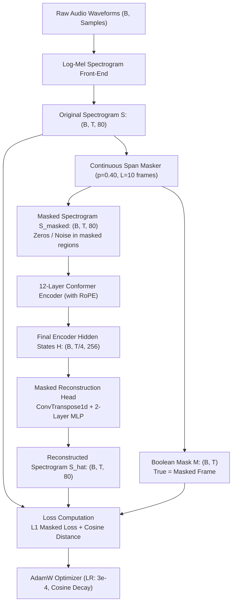
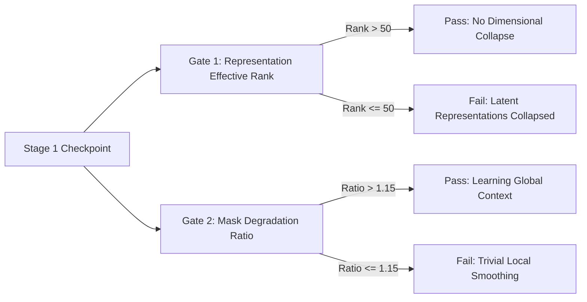

# 02 — Stage 1: Self-Supervised Acoustic Pretraining (SSL)

This document decodes **Stage 1: Self-Supervised Acoustic Pretraining**, which trains the Conformer encoder on 1,435+ hours of untranscribed and multi-dialect Marathi speech without requiring human labels.

---

## 1. Motivation & Problem Formulation

### 1.1 The Low-Resource Challenge in Marathi Speech
While Marathi is spoken by over 83 million people, high-quality, phonetically aligned speech transcripts are scarce compared to English or Mandarin. Furthermore, regional dialects (Malvani, Ahirani, Varhadi, Khandeshi) have virtually zero labeled gold-standard training data.

However, large quantities of **unlabeled or weakly labeled audio** exist across datasets like:
- **`ai4bharat/Shrutilipi`**: Large-scale regional radio broadcasts and news (~1,000+ hours).
- **`ARTPARK-IISc/Vaani`**: Diverse conversational and spontaneous speech across multiple Maharashtra districts (~350+ hours).
- **`AI4Bharat/IndicVoices` & `IndicVoices-R`**: Multi-speaker community recordings.

### 1.2 Self-Supervised Masked Reconstruction
Instead of predicting text, Stage 1 tasks the neural network with **reconstructing intentionally corrupted audio spectrograms**:
$$\text{Corrupted Spectrogram } \tilde{S} \xrightarrow[\text{Backbone}]{\text{Conformer}} \text{Latent Representation } H \xrightarrow[\text{Head}]{\text{Reconstruction}} \text{Original Spectrogram } S$$

By predicting what speech sounded like underneath masked temporal spans, the Conformer is forced to learn:
1. Short-term formant trajectories and spectral envelopes (phonetic structure).
2. Long-term co-articulation patterns and pitch contours (prosody and dialectal cadence).
3. Robust representations resilient to ambient noise, microphone reverberation, and speaker variations.

---

## 2. Architectural Blueprint for Stage 1

### 2.1 The Span Masking Algorithm
Random independent frame masking (e.g. standard BERT token masking) is ineffective for speech because consecutive 10ms acoustic frames are highly correlated. A model could simply linearly interpolate between frame $t-1$ and $t+1$ without learning any phonetic understanding.

Therefore, [`SpanMasker`](file:///d:/marathi-asr/model/masking.py) applies **continuous span masking**:
- **Target Masking Ratio**: $P_{\text{mask}} = 0.40$ (40% of the utterance is masked).
- **Mean Span Length**: $L = 10$ frames ($10 \times 10\text{ms} = 100\text{ms}$ or up to $400\text{ms}$ depending on subsampling).
- **Span Length Distribution**: Drawn geometrically with parameter $p = 1 / L$.

The probability of initiating a mask span at any unmasked time step $t$ is:
$$p_{\text{start}} = \frac{P_{\text{mask}}}{L \cdot (1 - P_{\text{mask}}) + P_{\text{mask}}}$$
Overlapping spans are merged. All feature bins in masked time steps are replaced with zero vectors (or learnable mask embeddings).

### 2.2 The Reconstruction Head
The encoder outputs subsampled representations $H \in \mathbb{R}^{B \times \frac{T}{4} \times d_{\text{model}}}$.
The [`MaskedReconstructionHead`](file:///d:/marathi-asr/model/heads.py#L13-L52) upsamples this back to the original time resolution $T$:
1. **Temporal Upsampling**: Either 1D Transposed Convolution or linear interpolation to stretch $T/4 \to T$.
2. **2-Layer MLP Projection**:
   $$H_{\text{proj}} = \text{LayerNorm}\left(\text{GELU}(W_{\text{up}} H_{\text{upsampled}} + b_{\text{up}})\right)$$
   $$\hat{S} = W_{\text{out}} H_{\text{proj}} + b_{\text{out}}$$
   where $W_{\text{up}} \in \mathbb{R}^{512 \times d_{\text{model}}}$ and $W_{\text{out}} \in \mathbb{R}^{80 \times 512}$.

---

## 3. Mathematical Loss Formulation

The loss is calculated **strictly over the masked frames** ($M_{b, t} = 1$). Computing loss on unmasked frames would reward the model for copying visible input rather than predicting missing structure.

### 3.1 Masked $L_1$ Reconstruction Loss
The $L_1$ loss provides sharp spectral gradients without over-penalizing outliers (unlike $L_2$ Mean Squared Error, which tends to produce overly blurred spectral averages):

$$\mathcal{L}_{L1} = \frac{1}{\sum_{b=1}^B \sum_{t=1}^T M_{b, t}} \sum_{b=1}^B \sum_{t=1}^T M_{b, t} \cdot \left( \frac{1}{D} \sum_{d=1}^D |S_{b, t, d} - \hat{S}_{b, t, d}| \right)$$
where $D = 80$ is the Mel feature dimension.

### 3.2 Spectral Cosine Similarity Loss
While $L_1$ penalizes absolute amplitude errors, **Cosine Similarity** forces the model to reconstruct the correct *relative spectral envelope shape* (formant peak ratios) regardless of global volume:

$$\mathcal{L}_{\text{cos}} = \frac{1}{\sum_{b=1}^B \sum_{t=1}^T M_{b, t}} \sum_{b=1}^B \sum_{t=1}^T M_{b, t} \cdot \left( 1 - \frac{S_{b, t} \cdot \hat{S}_{b, t}}{\|S_{b, t}\|_2 \cdot \|\hat{S}_{b, t}\|_2 + \epsilon} \right)$$

### 3.3 Total Pretraining Objective
$$\mathcal{L}_{\text{SSL}} = \mathcal{L}_{L1} + \lambda_{\text{cos}} \cdot \mathcal{L}_{\text{cos}}$$
Typically $\lambda_{\text{cos}} = 0.5$.

---

## 4. Intrinsic Verification Gates

How do we know if Stage 1 is actually learning phonetic semantics before proceeding to supervised training? 

[`pretraining/train.py`](file:///d:/marathi-asr/pretraining/train.py#L75-L113) executes two **Intrinsic Evaluation Gates** at regular checkpoint intervals:

### 4.1 Gate 1: Representation Effective Rank (Collapse Detector)
In self-supervised learning, encoders can suffer from **dimensional collapse**, where hidden states occupy only a low-dimensional subspace of $\mathbb{R}^{d_{\text{model}}}$.

We compute the **Effective Rank** via Singular Value Decomposition (SVD) of the centered hidden state matrix $H \in \mathbb{R}^{N \times d_{\text{model}}}$:
1. Compute singular values $\sigma_1, \sigma_2, \dots, \sigma_K$ of $H$.
2. Normalize singular values to form a probability distribution:
   $$p_k = \frac{\sigma_k}{\sum_{j=1}^K \sigma_j}$$
3. Compute the Shannon Entropy of this distribution:
   $$H(p) = -\sum_{k=1}^K p_k \ln(p_k)$$
4. The Effective Rank is:
   $$\text{Rank}_{\text{eff}} = \exp\left( H(p) \right)$$

- **Pass Condition**: $\text{Rank}_{\text{eff}} > 50.0$ (out of $d_{\text{model}} = 256$). A rank below 50 indicates representation collapse.

### 4.2 Gate 2: Mask Degradation Ratio
We compare the reconstruction loss under two conditions:
- **Short Mask** ($L = 4$ frames $\approx 40$ms)
- **Long Mask** ($L = 20$ frames $\approx 200$ms)

$$\text{Degradation Ratio} = \frac{\mathcal{L}_{\text{masked}}(L=20)}{\mathcal{L}_{\text{masked}}(L=4)}$$

- **Intuition**: If the model has truly learned deep contextual speech dynamics, predicting 20 missing frames should be moderately harder than 4 frames, but not catastrophically harder.
- **Pass Condition**: $\text{Degradation Ratio} > 1.15$. If the ratio is near $1.0$, the model is merely smoothing inputs without encoding structural context.

---

## 5. Streaming Data Engineering & Caching

### 5.1 The Local Storage Problem
Downloading 1,435 hours of uncompressed audio requires over **500 GB** of local disk space. To prevent disk exhaustion on Windows/Linux development workstations:
1. **Network Streaming**: Data is streamed in chunks directly from the Hugging Face Hub using `datasets.load_dataset(..., streaming=True)`.
2. **Small-Chunk Disk Caching (`CachedRelayedStream`)**:
   [`pretraining/dataset_loader.py`](file:///d:/marathi-asr/pretraining/dataset_loader.py) maintains a small rolling cache on disk (e.g. 5–10 GB) storing audio tar/parquet chunks. Once a chunk is consumed, it is evicted to make room for new downloads.
3. **Threaded Prefetching (`ThreadedPrefetchLoader`)**:
   Background worker threads decode MP3/WAV streams and resample to 16 kHz asynchronously while the GPU computes the forward-backward pass, eliminating GPU starvation.
4. **HTTP 429 Rate Limit Resilience**:
   Hugging Face frequently rate-limits aggressive streaming requests. The stream loader implements exponential backoff with jitter (retrying 1s, 2s, 4s, 8s, up to 60s) to keep multi-day pretraining runs alive without human intervention.

---

## 6. Trade-offs & Failure Modes

| Aspect | Decision | Trade-off / Rationale |
|---|---|---|
| **Reconstruction vs Contrastive (wav2vec 2.0)** | Log-Mel Reconstruction | Contrastive learning requires vector quantization (Gumbel-Softmax) and codebook diversity losses, which are notoriously unstable and hyperparameter-sensitive. Direct spectrogram reconstruction is stable and trains reliably with AdamW. |
| **Mask Length $L$** | 10 frames (100–400ms) | If $L < 3$, the model learns trivial bilinear interpolation from neighbor frames. If $L > 30$, the acoustic gap spans entire words, making reconstruction ill-posed. |
| **Mask Fraction $P_{\text{mask}}$** | 40% | In NLP (BERT), 15% is standard. In audio, speech has high temporal redundancy; masking 40% is necessary to make the task non-trivial. |
| **Reconstruction Target** | Original Log-Mel | Reconstructing raw waveform audio requires complex neural vocoders (HiFi-GAN). Reconstructing 80-dim Log-Mel targets focuses representations purely on perceptual speech features. |
