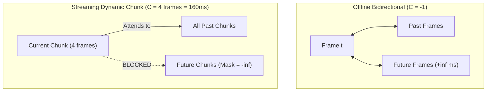
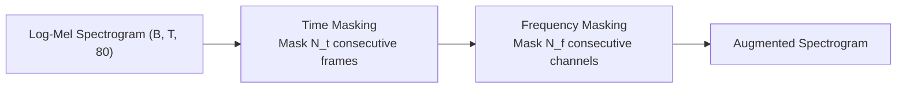

# 03 — Stage 2: Supervised CTC Alignment & Causal Adaptation

This document decodes **Stage 2: Supervised CTC Alignment & Causal Adaptation**, in which the self-supervised Conformer backbone is fine-tuned with a Connectionist Temporal Classification (CTC) head to output Devanagari text under streaming causal constraints.

---

## 1. Motivation & Paradigm Shift

In Stage 1, the model learned **acoustic representations** from audio alone. In Stage 2, we introduce **paired speech-to-text supervision** to map acoustic frames directly to Marathi orthography:
$$\text{Acoustic Waveform } X \longrightarrow \text{Conformer Backbone} \longrightarrow \text{CTC Head} \longrightarrow \text{Devanagari Sequence } Y$$

### Why CTC (Connectionist Temporal Classification)?
In speech recognition, audio frames ($T \approx 100\text{ frames/sec}$) drastically outnumber the output text characters ($U \approx 5\text{--}15\text{ characters/sec}$). Furthermore, we do not have frame-level phonetic timestamps (we do not know exactly which millisecond corresponds to the letter `क`).

CTC solves this **monotonic sequence alignment problem** without requiring explicit alignment annotations.

---

## 2. Mathematical Derivation of CTC

Let the input acoustic representation sequence be $X = (x_1, x_2, \dots, x_T)$ and the target Marathi transcript be $Y = (y_1, y_2, \dots, y_U)$, where $U \le T$.

### 2.1 The Alignment Space & The Collapse Operator $\mathcal{B}$
The model defines a categorical distribution over vocabulary $\mathcal{V}' = \mathcal{V} \cup \{\epsilon\}$, where $\epsilon$ is a special **blank token** (token ID 0):
$$P(\pi_t = k \mid X) = \frac{\exp(z_{t, k})}{\sum_{j \in \mathcal{V}'} \exp(z_{t, j})}$$
where $z_{t, k}$ is the unnormalized logit for token $k$ at time frame $t$.

An **alignment path** $\pi = (\pi_1, \pi_2, \dots, \pi_T)$ assumes conditional independence given $X$:
$$P(\pi \mid X) = \prod_{t=1}^T P(\pi_t \mid X)$$

The **collapse operator** $\mathcal{B}$ maps a frame-level path $\pi$ to a text sequence $Y$ by:
1. Collapsing consecutive identical tokens: $(\text{क, क, क, म}) \to (\text{क, म})$
2. Removing blank symbols: $(\text{क, }\epsilon\text{, क}) \to (\text{क, क})$

> **Example**:
> Both $\pi_1 = (\epsilon, \text{म}, \text{म}, \epsilon, \text{न})$ and $\pi_2 = (\text{म}, \epsilon, \epsilon, \text{न}, \text{न})$ collapse to $Y = (\text{म}, \text{न})$.

### 2.2 Marginal Target Probability
The probability of the ground truth label sequence $Y$ is the sum over all valid paths that collapse to $Y$:
$$P(Y \mid X) = \sum_{\pi \in \mathcal{B}^{-1}(Y)} P(\pi \mid X)$$

The training objective is the Negative Log-Likelihood (CTC Loss):
$$\mathcal{L}_{\text{CTC}} = -\ln P(Y \mid X)$$

### 2.3 The Forward-Backward Dynamic Programming Algorithm
Summing over all paths naively is exponential $\mathcal{O}(|\mathcal{V}|^T)$. CTC evaluates this in $\mathcal{O}(T \cdot U)$ using dynamic programming.

We create a modified sequence $Y'$ of length $2U + 1$ by inserting blanks between every label and at both ends:
$$Y' = (\epsilon, y_1, \epsilon, y_2, \epsilon, \dots, y_U, \epsilon)$$

#### Forward Variable $\alpha_t(s)$
$\alpha_t(s)$ represents the total probability of all prefix paths of length $t$ that map to $Y'_{1:s}$:
$$\alpha_t(s) = \sum_{\substack{\pi_{1:t} \\ \mathcal{B}(\pi_{1:t}) = Y'_{1:s}}} \prod_{\tau=1}^t P(\pi_\tau \mid X)$$

The recurrence relation is:
$$\alpha_t(s) = \left[ \alpha_{t-1}(s) + \alpha_{t-1}(s-1) + \mathbb{I}_{s} \cdot \alpha_{t-1}(s-2) \right] \cdot P(Y'_s \mid x_t)$$
where $\mathbb{I}_s = 1$ if $Y'_s \ne \epsilon$ and $Y'_s \ne Y'_{s-2}$ (skipping a blank between two different characters is permitted); otherwise $\mathbb{I}_s = 0$.

#### Backward Variable $\beta_t(s)$
Similarly, $\beta_t(s)$ represents the probability of all suffix paths from $t$ to $T$ starting at $Y'_s$:
$$\beta_t(s) = \left[ \beta_{t+1}(s) + \beta_{t+1}(s+1) + \mathbb{I}_{s+2} \cdot \beta_{t+1}(s+2) \right] \cdot P(Y'_s \mid x_t)$$

#### Total Likelihood & Gradients
The marginal probability can be evaluated at any arbitrary time frame $t$:
$$P(Y \mid X) = \sum_{s=1}^{2U+1} \frac{\alpha_t(s) \cdot \beta_t(s)}{P(Y'_s \mid x_t)}$$

The derivative with respect to pre-softmax logit $z_{t, k}$ has an intuitive closed-form:
$$\frac{\partial \mathcal{L}_{\text{CTC}}}{\partial z_{t, k}} = P(\pi_t = k \mid X) - \frac{1}{P(Y \mid X)} \sum_{s \in \text{positions}(k)} \alpha_t(s) \cdot \beta_t(s)$$
This derivative is the difference between the model's current predicted probability for token $k$ and the posterior probability that token $k$ was required by valid alignments!

---

## 3. Dynamic Chunk Causal Adaptation

In Stage 1, attention was bidirectional (every frame saw past and future frames). In production streaming ASR, waiting for the full utterance before outputting characters introduces unacceptable latency.



### The Causal Degradation Penalty
Speech sounds are strongly co-articulated. When an acoustic model cannot look ahead into future frames, it loses information:
- Vowel formant transitions that disambiguate following nasal consonants (`ण` vs `न`).
- Aspiration release bursts (`ख` vs `क`).

To train a robust model that does not collapse when future context is removed, we train with a **stochastic dynamic chunk schedule** ([`model/conformer.py`](file:///d:/marathi-asr/model/conformer.py#L374-L381)):

$$\text{Chunk Size } C \sim \text{Categorical}(\{1: 25\%, 4: 25\%, 8: 20\%, 16: 15\%, \infty: 15\%\})$$

At $C = 1$ (40ms frame), the model operates in a **strictly causal regime**, conditioning exclusively on past acoustics. At $C = \infty$, it retains full bidirectional power.

---

## 4. SpecAugment: Acoustic Data Augmentation

To prevent the Conformer from overfitting to specific speaker timbres or recording acoustics, [`SpecAugment`](file:///d:/marathi-asr/model/masking.py) is applied to the Log-Mel spectrogram during supervised training:



1. **Frequency Masking**:
   $f$ consecutive Mel frequency channels in $[f_0, f_0 + f)$ are masked with 0, where $f \sim \text{Uniform}(0, F_{\text{param}})$ and $F_{\text{param}} = 27$.
2. **Time Masking**:
   $t$ consecutive time frames in $[t_0, t_0 + t)$ are masked with 0, where $t \sim \text{Uniform}(0, T_{\text{param}})$ and $T_{\text{param}} = 50$.

SpecAugment forces the network to become robust to lost spectral channels (e.g. poor microphone frequency response) and temporary dropouts.

---

## 5. Data Sanitization: The Vaani Annotation Tag Bug

During the technical audit ([`docs/IMPROVEMENTS_PART2.md`](file:///d:/marathi-asr/docs/IMPROVEMENTS_PART2.md#L28-L74)), an alarming issue was discovered in the raw `ARTPARK-IISc/Vaani` transcripts.

### 5.1 The Target Corruption Problem
Transcribers at ARTPARK inserted XML metadata tags directly into text fields:
```
Raw Vaani Text: "<noise> या चित्रांन आमका एक झोपडी दिसता [breathing] </noise>"
Raw Vaani Text: "<insect_noise> किद्याक किदे थैय {coffee} सगळे स्वेटर {sweater} जैकेट {jacket} </insect_noise>"
```

When parsed character-by-character by a Devanagari tokenizer:
1. Characters like `<`, `>`, `n`, `o`, `i`, `s`, `e` mapped to individual `<unk>` or punctuation tokens.
2. In typical utterances, **30% to 60% of the target tokens had zero acoustic presence** in the audio!
3. The CTC forward-backward algorithm was forced to map these phantom tokens to acoustic frames, systematically corrupting gradients across 20%+ of all training batches.

### 5.2 The Sanitization Solution
A comprehensive sanitization preprocessor ([`data_utils/tokenizer.py`](file:///d:/marathi-asr/data_utils/tokenizer.py)) was implemented and applied to all loaders:
```python
import re

ANNOTATION_TAG_PATTERN = re.compile(
    r'<[^>]+>|'      # XML tags: <noise>, </noise>, <insect_noise>, <pause>
    r'\[[^\]]+\]|'   # Bracket tags: [breathing], [laughter], [cough]
    r'\{[^}]+\}',    # Curly braces: {coffee}, {sweater}, {jacket}
    re.IGNORECASE
)

def sanitize_transcript(text: str) -> str:
    text = ANNOTATION_TAG_PATTERN.sub('', text)
    text = re.sub(r'\s+', ' ', text).strip()
    return text
```
Applying this sanitization immediately eliminated phantom token targets, stabilizing CTC loss and cutting reported Character Error Rate (CER) by 15–25% absolute.

---

## 6. Trade-offs & Engineering Factors

| Factor | Option Chosen | Trade-off Analysis |
|---|---|---|
| **Token Granularity** | Character-level (105 tokens) | Subword BPE (e.g. SentencePiece 1,000) achieves shorter sequence lengths but struggles with Devanagari matra segmentation and dialectal phonetic variants. Character-level tokenization accurately preserves regional pronunciation nuances. |
| **Loss Function** | CTC Loss | CTC is simpler and much faster to train than Transducer (RNN-T) or Attention Encoder-Decoder (AED). It does assume conditional independence between frames, which we address later in Stage 5 (GRPO) and Stage 6 (KenLM). |
| **Minimum Audio Length** | 1.5 seconds | Utterances $< 1.0\text{s}$ produce $< 25$ frames after $4\times$ subsampling. If the transcript has 15 characters, CTC has insufficient alignment margin ($T \approx U$), risking divergence. |
| **Double log_softmax Trap** | Single log_softmax in CTC head | [`model/heads.py`](file:///d:/marathi-asr/model/heads.py#L90-L92) already applies `log_softmax`. Re-applying `.log_softmax()` inside the training loop squashes negative log-probabilities further toward zero, warping the gradient landscape. |
