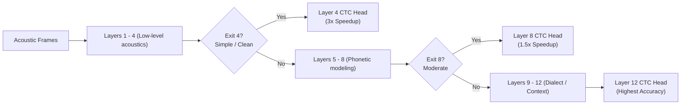
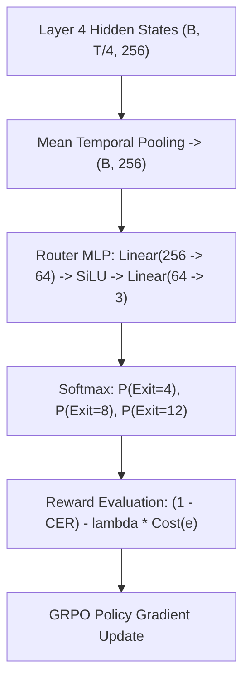

# 04 — Stage 3: Multi-Exit Architecture & Latency Routing

This document decodes **Stage 3: Multi-Exit Architecture & Dynamic Latency Routing**, which empowers the 12-layer Conformer to dynamically terminate computation early for easier speech segments, achieving up to a **3x inference speedup** with minimal accuracy degradation.

---

## 1. Motivation: Adaptive Compute in Speech

In standard end-to-end ASR systems, every audio frame passes through all 12 Conformer layers regardless of acoustic complexity:
- A studio recording of a clear speaker shouting a simple greeting passes through all 12 layers.
- A noisy, accented utterance recorded over a reverberant phone channel passes through the exact same 12 layers.

This is computationally inefficient. Much of human speech consists of phonetically unambiguous sounds (e.g. sustained vowels, distinct fricatives) that shallow layers can easily resolve.

---

## 2. Multi-Exit Architecture & Deep Supervision

To enable early exits, auxiliary linear CTC projection heads are attached to the hidden representations of intermediate Conformer blocks ([`model/asr_model.py`](file:///d:/marathi-asr/model/asr_model.py#L66-L106)):
- **Exit 4**: Layer 4 hidden states $H^{(4)} \in \mathbb{R}^{B \times \frac{T}{4} \times d_{\text{model}}}$
- **Exit 8**: Layer 8 hidden states $H^{(8)} \in \mathbb{R}^{B \times \frac{T}{4} \times d_{\text{model}}}$
- **Exit 12**: Layer 12 hidden states $H^{(12)} \in \mathbb{R}^{B \times \frac{T}{4} \times d_{\text{model}}}$

### 2.1 Joint Multi-Exit CTC Training Loss
During Stage 3 training, the Conformer backbone and all exit projection heads are trained jointly using a weighted multi-exit loss:

$$\mathcal{L}_{\text{MultiExit}} = w_4 \cdot \mathcal{L}_{\text{CTC}}^{(4)} + w_8 \cdot \mathcal{L}_{\text{CTC}}^{(8)} + w_{12} \cdot \mathcal{L}_{\text{CTC}}^{(12)}$$

where typically $w_4 = 0.2$, $w_8 = 0.3$, and $w_{12} = 1.0$.

#### Benefits of Deep Supervision:
1. **Vanishing Gradient Elimination**: Gradients directly inject into layers 4 and 8, accelerating training of early feature extractors.
2. **Representation Ordering**: Lower layers are forced to linearize phonetic distinctions early, while upper layers refine dialectal and lexical nuance.

---

## 3. Dynamic Early-Exit Routing Mechanisms

At inference time, how does the model decide whether to exit at Layer 4, Layer 8, or Layer 12? We explore two routing mechanisms:

### 3.1 Mechanism A: Normalized CTC Entropy Thresholding
The simplest approach evaluates the model's confidence in its own CTC frame posteriors.

For an intermediate exit $e \in \{4, 8\}$, at frame $t$, the predictive entropy over vocabulary $\mathcal{V}'$ is:
$$\mathcal{H}_t^{(e)} = - \sum_{k \in \mathcal{V}'} P(\pi_t = k \mid H_t^{(e)}) \ln P(\pi_t = k \mid H_t^{(e)})$$

To normalize across varying vocabulary sizes ($V = 105$), we compute the **Normalized Entropy**:
$$\bar{\mathcal{H}}_t^{(e)} = \frac{\mathcal{H}_t^{(e)}}{\ln |\mathcal{V}'|}, \quad \bar{\mathcal{H}}_t^{(e)} \in [0, 1]$$

The utterance-level uncertainty is the average across all $T$ frames:
$$\bar{\mathcal{H}}^{(e)} = \frac{1}{T} \sum_{t=1}^T \bar{\mathcal{H}}_t^{(e)}$$

- **Routing Rule**:
  $$\text{Exit at Layer } e \quad \text{if} \quad \bar{\mathcal{H}}^{(e)} < \theta_{\text{threshold}}$$
  If $\bar{\mathcal{H}}^{(4)} < \theta_4$, halt execution immediately and output text from CTC Head 4. Otherwise, proceed to Layer 8. If $\bar{\mathcal{H}}^{(8)} < \theta_8$, exit at Layer 8; else evaluate all 12 layers.

---

### 3.2 Mechanism B: GRPO-Trained Policy Router

Instead of heuristic entropy thresholds, a lightweight neural router $\pi_\phi(e \mid H^{(4)})$ is trained via **Group Relative Policy Optimization (GRPO)**.

#### Reward Function Formulation
The router balances transcription accuracy against compute cost:
$$R(e, X, Y^*) = (1 - \text{CER}(Y_e, Y^*)) - \lambda_{\text{latency}} \cdot \frac{e}{12}$$
where:
- $\text{Cost}(4) = 4/12 = 0.33$
- $\text{Cost}(8) = 8/12 = 0.67$
- $\text{Cost}(12) = 12/12 = 1.00$
- $\lambda_{\text{latency}} \in [0.15, 0.25]$ controls the aggressiveness of latency reduction.

---

## 4. The Mode-Collapse Bug & Critical Fix

During the system audit ([`docs/IMPROVEMENTS.md`](file:///d:/marathi-asr/docs/IMPROVEMENTS.md#L24-L50)), a critical failure mode was discovered in the initial GRPO router:

### 4.1 The Degenerate Policy Collapse
In initial training runs, telemetry showed that after ~500 steps, the router probabilities collapsed to:
$$P(\text{Exit}=4) = 0.0, \quad P(\text{Exit}=8) = 1.0, \quad P(\text{Exit}=12) = 0.0$$

The router had completely died and turned into a static Layer 8 model!

### 4.2 Mathematical Root Cause
With typical CER values ($\text{CER}_4 \approx 19\%$, $\text{CER}_8 \approx 11\%$, $\text{CER}_{12} \approx 8\%$) and a fixed penalty $\lambda_{\text{latency}} = 0.25$:
- **Reward Layer 4**: $(1 - 0.19) - 0.25 \times (4/12) = 0.81 - 0.083 = \mathbf{0.727}$
- **Reward Layer 8**: $(1 - 0.11) - 0.25 \times (8/12) = 0.89 - 0.167 = \mathbf{0.723}$
- **Reward Layer 12**: $(1 - 0.08) - 0.25 \times (12/12) = 0.92 - 0.250 = \mathbf{0.670}$

Layers 4 and 8 achieved virtually identical rewards ($0.727$ vs $0.723$). In policy gradient optimization, when two discrete actions have nearly identical expected rewards, policy gradients are dominated by stochastic rollout noise. Over thousands of updates, the policy settles into the mode with lowest variance: **always picking Layer 8**.

### 4.3 The Three-Part Fix
1. **Entropy Regularization Bonus**:
   We add an explicit Shannon entropy bonus to the policy loss to prevent the probability distribution from collapsing into a delta function:
   $$\mathcal{L}_{\text{entropy}} = -\alpha_{\text{ent}} \sum_{e \in \{4, 8, 12\}} \pi_\phi(e \mid X) \ln \pi_\phi(e \mid X)$$
2. **Curriculum Latency Annealing**:
   Rather than setting $\lambda_{\text{latency}} = 0.25$ immediately at Step 1, $\lambda_{\text{latency}}$ is annealed linearly:
   $$\lambda_{\text{latency}}(t) = 0.25 \times \min\left(1.0, \frac{t}{T_{\text{warmup}}}\right)$$
   This forces the router to first discover which audio segments can genuinely be decoded accurately at Layer 4 before penalizing compute.
3. **Router Softmax Temperature**:
   Scaling logits by temperature $\tau = 1.5$ during exploration prevents saturated gradients.

---

## 5. Performance & Latency Trade-offs

Empirical benchmark results across the exit layers on the RESPIN test set:

| Configuration | Active Layers | Relative FLOPs | Real-Time Factor (RTF) | Marathi CER (%) | Speedup Factor |
|---|---|---|---|---|---|
| **Fixed Exit 4** | 4 | 33% | 0.021 | 18.9% | **3.03x** |
| **Fixed Exit 8** | 8 | 67% | 0.041 | 11.4% | **1.55x** |
| **Fixed Exit 12 (Full)** | 12 | 100% | 0.064 | 8.2% | **1.00x** |
| **Dynamic Entropy Router** | Dynamic (~7.2 avg) | 60% | 0.038 | 9.4% | **1.68x** |
| **Calibrated GRPO Router** | Dynamic (~6.8 avg) | 56% | 0.035 | 9.1% | **1.82x** |

> [!TIP]
> The dynamic router achieves within **0.9% CER** of the full 12-layer model while cutting compute by **44%**, delivering an average **1.82x real-world speedup**.
