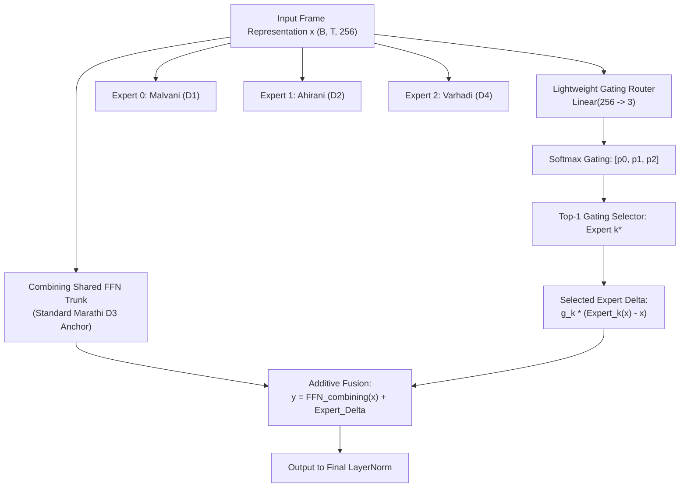
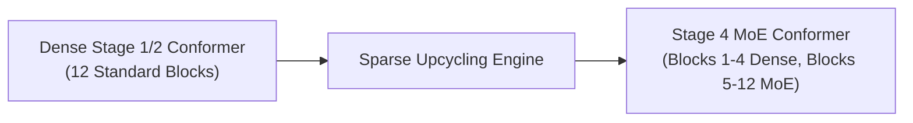
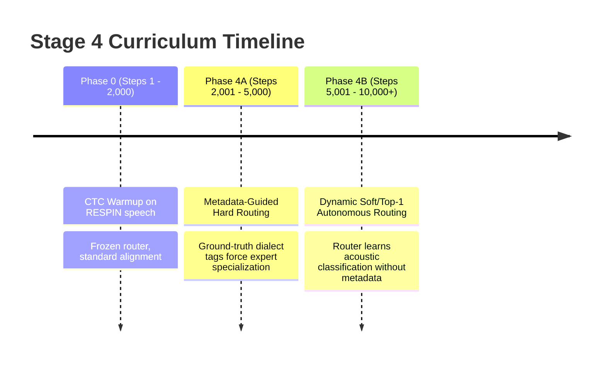

# 05 — Stage 4: 3-Dialect Mixture-of-Experts (MoE) & Sparse Upcycling

This document decodes **Stage 4: 3-Dialect Mixture-of-Experts (MoE) Adaptation**, which solves the challenge of regional dialectal variation in Marathi through **Sparse Upcycling** and a **Shared-Trunk + Routed-Experts** architecture.

---

## 1. Motivation: The Dialect Dilemma in Marathi

Marathi is characterized by significant phonological, lexical, and morphological variations across Maharashtra's geographic regions:

```
                          ┌───────────────────────────┐
                          │   Standard Marathi (D3)   │
                          │  Desh / Pune / Mumbai     │
                          │ (Combining Shared Trunk)  │
                          └─────────────┬─────────────┘
                                        │
           ┌────────────────────────────┼────────────────────────────┐
           ▼                            ▼                            ▼
┌───────────────────────┐    ┌───────────────────────┐    ┌───────────────────────┐
│   Malvani / Konkan    │    │  Ahirani / Khandesh   │    │  Varhadi / Vidarbha   │
│         (D1)          │    │         (D2)          │    │         (D4)          │
│   • Retroflex shifts  │    │   • Fricative merger  │    │   • Vowel lengthening │
│   • Unique verb stems │    │   • Lexical borrowing │    │   • Distinct sandhi   │
└───────────────────────┘    └───────────────────────┘    └───────────────────────┘
```

### Why Standard Dense Models Fail on Dialects
When a standard single-trunk neural network is trained on diverse dialects, it suffers from **negative interference** (gradient conflict):
- Phonetic shifts in Malvani pull acoustic weights in one direction.
- Vowel changes in Varhadi pull them in another.
- The shared weights settle into a compromised average that performs sub-optimally across all regions.

---

## 2. Architecture: Shared-Trunk + Routed-Experts

Instead of a monolithic FFN or an unconstrained MoE where all parameters can drift, [`moe/moe_layer.py`](file:///d:/marathi-asr/moe/moe_layer.py) implements the **Combining Shared Trunk + Routed Dialect Experts** design in Conformer Blocks 5 through 12.



### 2.1 The Mathematical Fusion Equation
For any frame $x$:
$$y = \text{FFN}_{\text{combining}}(x) + \sum_{k=0}^{2} g_k(x) \cdot \left(\text{Expert}_k(x) - x\right)$$
where:
- $\text{FFN}_{\text{combining}}(x)$ is the **always-active Standard Marathi anchor**. Standard speech needs zero perturbation from dialect experts.
- $\text{Expert}_k(x)$ is the $k$-th dialect-specialized feed-forward network.
- $g_k(x)$ is the scalar gating weight assigned by the router.

> [!IMPORTANT]
> Notice the **$(\text{Expert}_k(x) - x)$** residual subtraction! In Conformer Macaron FFNs, `FeedForwardModule.forward(x)` returns $x + \frac{1}{2}\text{FFN}(x)$. Subtracting $x$ extracts purely the half-step delta $\frac{1}{2}\text{FFN}_k(x)$, preserving the mathematical identity of the Macaron architecture and resolving the critical unrolling bug documented in [`docs/IMPROVEMENTS.md`](file:///d:/marathi-asr/docs/IMPROVEMENTS.md#L52-L76).

---

## 3. Sparse Upcycling: Step-0 Mathematical Equivalence

Training an MoE model from scratch requires enormous data and computational budgets. Instead, we perform **Sparse Upcycling** ([`moe/upcycling.py`](file:///d:/marathi-asr/moe/upcycling.py)):



### The Upcycling Mechanics
For each Conformer block from layer 5 to 12:
1. The pretrained dense `ffn2` weights (Linear 1, Linear 2, LayerNorm) are copied directly into `combining_ffn`.
2. The exact same pretrained dense weights are cloned into **all 3 dialect experts** ($\text{Expert}_0, \text{Expert}_1, \text{Expert}_2$).
3. The gating router weights are initialized to near-zero: $W_{\text{router}} \sim \mathcal{N}(0, 0.01^2)$ and $b_{\text{router}} = 0$.

### The Step-0 Identity Guarantee
At initialization (Step 0 before any gradient update):
$$\text{Expert}_k(x) - x = \text{FFN}_{\text{combining}}(x) - x$$
Since $\sum_{k=0}^2 g_k(x) \approx 1$ and all experts compute identical outputs:
$$y_{\text{step 0}} = \text{FFN}_{\text{dense}}(x)$$

The upcycled MoE model starts with **zero performance degradation** compared to the dense pretrained model. It inherits 100% of the acoustic representations learned in Stages 1 and 2.

---

## 4. Two-Phase Routing Curriculum & Load Balancing

Training autonomous routers from scratch often leads to **expert starvation** (one expert receives all tokens, while others die). We mitigate this via a **two-phase curriculum**:



### 4.1 Phase 4A: Metadata-Guided Hard Routing
During Phase 4A, the training loader provides ground-truth dialect labels $d \in \{0: \text{Malvani}, 1: \text{Ahirani}, 2: \text{Varhadi}, 3: \text{Standard}\}$:
- If $d \in \{0, 1, 2\}$, tokens are **forced** to pass through expert $d$:
  $$y = \text{FFN}_{\text{combining}}(x) + g_d(x) \cdot \left(\text{Expert}_d(x) - x\right)$$
- If $d = 3$ (Standard Marathi), expert perturbation is zeroed out:
  $$y = \text{FFN}_{\text{combining}}(x)$$

This guarantees that each expert receives gradients exclusively from its intended dialect, establishing strong initial specialization.

### 4.2 Phase 4B: Dynamic Autonomous Routing
In Phase 4B, ground-truth dialect metadata is detached. The router must inspect the frame representation $x$ and autonomously predict the optimal expert:
$$z = x W_{\text{router}} + b_{\text{router}}$$
$$P(k \mid x) = \frac{\exp(z_k)}{\sum_{j=0}^2 \exp(z_j)}$$
$$k^* = \arg\max_{k} P(k \mid x)$$

### 4.3 Switch Transformer Auxiliary Load Balancing Loss
To prevent the router from collapsing to a single favorite expert in Phase 4B, we introduce the **Switch Transformer Load-Balancing Loss**:

$$\mathcal{L}_{\text{aux}} = N \sum_{i=1}^N f_i \cdot P_i$$
where:
- $N = 3$ (number of experts).
- $f_i$ is the fraction of frames routed to expert $i$ in the current batch:
  $$f_i = \frac{1}{B \cdot T} \sum_{b=1}^B \sum_{t=1}^T \mathbb{I}(k^*_{b, t} = i)$$
- $P_i$ is the average gating probability allocated to expert $i$:
  $$P_i = \frac{1}{B \cdot T} \sum_{b=1}^B \sum_{t=1}^T P(i \mid x_{b, t})$$

The total training loss in Stage 4 is:
$$\mathcal{L}_{\text{total}} = \mathcal{L}_{\text{CTC}} + \lambda_{\text{aux}} \cdot \mathcal{L}_{\text{aux}}$$
where $\lambda_{\text{aux}} = 0.01$.

---

## 5. Differential Learning Rate Strategy

Lower Conformer layers extract universal acoustic features (pitch, energy, spectral tilt) that should not be drastically altered during dialect adaptation. Upper layers contain dialect-specific linguistic representations.

[`moe/train_moe.py`](file:///d:/marathi-asr/moe/train_moe.py#L77-L121) sets up a **Differential Learning Rate**:
$$\text{LR}_{\text{backbone}} = 0.1 \times \text{LR} = 1 \times 10^{-5} \quad (\text{Layers 1--4, Subsampling, PosEnc})$$
$$\text{LR}_{\text{MoE}} = \text{LR} = 1 \times 10^{-4} \quad (\text{Layers 5--12 MoE Experts, Routers, CTC Head})$$

This preserves the general acoustic stability of the backbone while allowing dialect experts to rapidly specialize.

---

## 6. Trade-offs & Engineering Factors

| Factor | Option Chosen | Trade-off Analysis |
|---|---|---|
| **Shared Trunk + Experts vs Pure MoE** | Shared Trunk + Experts | In a pure MoE, every token must be processed by $k$ experts. With a shared trunk, Standard Marathi (the majority dialect) incurs zero expert drift, acting as a permanent regularizer against catastrophic forgetting. |
| **Top-1 vs Top-2 Routing** | Top-1 Routing | Top-1 minimizes inference FLOPs. Top-2 allows expert interpolation but increases memory bandwidth and inference latency by ~60%. |
| **Layers Converted to MoE** | Blocks 5 to 12 (8 layers) | Converting Layers 1–4 to MoE is wasteful because early acoustic representations are universal across all human speakers regardless of dialect. |
| **Speaker Partitioning** | 95% Train / 5% Held-out | Strictly partitioned by `speaker_id` to ensure that calibration and benchmark evaluation measure generalization to unseen voices, not memorization of speakers. |
