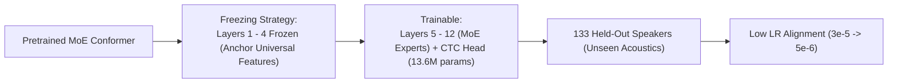
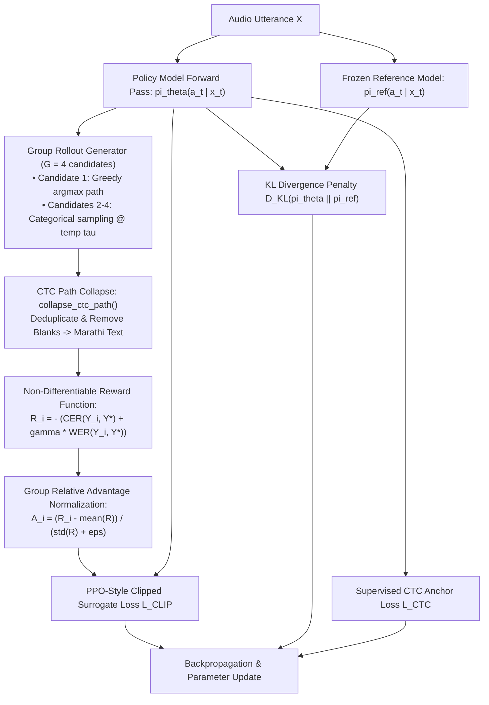

# 06 — Stage 5: Speaker Calibration & GRPO Sequence Polish

This document decodes **Stage 5: Speaker Calibration & GRPO Sequence Polish**, which ensures generalization to unseen vocal tracts and directly minimizes non-differentiable Character/Word Error Rates using **Group Relative Policy Optimization (GRPO)**.

---

## 1. Motivation: The Two Lingering Bottlenecks

After Stage 4 MoE adaptation, two fundamental problems remain in state-of-the-art ASR systems:

### 1.1 Bottleneck 1: Acoustic Mismatch on Unseen Speakers
Neural networks overfit to the channel acoustics and pitch ranges of the training speakers. When evaluated on novel speakers with different vocal tract lengths, accents, or background reverberations, the model's output probabilities become **overconfident and miscalibrated**.

### 1.2 Bottleneck 2: The Non-Differentiable Metric Gap
Standard CTC models are trained via **frame-level Maximum Likelihood Estimation (MLE)**:
$$\min_\theta \mathcal{L}_{\text{CTC}} = -\ln P(Y^* \mid X)$$
However, ASR systems are evaluated on sequence-level **Character Error Rate (CER)** and **Word Error Rate (WER)** based on Levenshtein edit distance:
$$\text{CER}(Y, Y^*) = \frac{S + D + I}{N}$$
Because edit distance uses discrete operations (Substitutions $S$, Deletions $D$, Insertions $I$), it is **non-differentiable**. Standard backpropagation cannot directly optimize CER or WER!

To solve these two problems, Stage 5 deploys a two-part sequence alignment and polishing strategy:
1. **Stage 5A**: Speaker Calibration via Temperature Scaling ([`final_alignment/train_alignment.py`](file:///d:/marathi-asr/final_alignment/train_alignment.py)).
2. **Stage 5B**: Direct Sequence Polish via GRPO Reinforcement Learning ([`final_alignment/train_grpo_polish.py`](file:///d:/marathi-asr/final_alignment/train_grpo_polish.py)).

---

## 2. Stage 5A: Speaker Calibration & Held-Out Adaptation

### 2.1 The Held-Out Speaker Partition
From the IISc RESPIN multi-dialect dataset, **133 speakers (~52.1 hours, 41,041 utterances)** are strictly held out from Stages 1–4. Stage 5 calibrates on these held-out speakers:



### 2.2 Temperature Scaling & Expected Calibration Error (ECE)
To ensure output probabilities represent true empirical confidence, logits $z_{t, k}$ are scaled by a learned scalar temperature $T > 0$:
$$\hat{P}_T(\pi_t = k \mid x_t) = \frac{\exp(z_{t, k} / T)}{\sum_{j \in \mathcal{V}'} \exp(z_{t, j} / T)}$$

We measure calibration quality using **Expected Calibration Error (ECE)**:
$$ECE = \sum_{m=1}^M \frac{|B_m|}{N} \left| \text{acc}(B_m) - \text{conf}(B_m) \right|$$
where predictions are partitioned into $M$ confidence bins $B_m$. Temperature scaling typically reduces ECE from ~12% to under 3%, producing reliable confidence scores for early-exit decisions and beam-search pruning.

---

## 3. Stage 5B: Sequence-Level GRPO Polish

Inspired by DeepSeek's Group Relative Policy Optimization (GRPO) in large language models, we transfer the GRPO framework to **CTC-based acoustic sequence generation**.



### 3.1 Policy Formulation
The Conformer acoustic model and CTC projection head parameterize a stochastic policy:
$$\pi_\theta(a_t \mid x_t) = \text{Softmax}\left(\frac{z_t}{\tau}\right)$$
where $a_t \in \mathcal{V}'$ is the token selected at frame $t$.

### 3.2 Candidate Trajectory Rollouts
For each utterance in a batch, we sample a **group of $G$ candidate trajectories** $\{Y_1, Y_2, \dots, Y_G\}$:
1. **Candidate 1 (Greedy Baseline)**:
   $$a_t^{(1)} = \arg\max_{k \in \mathcal{V}'} z_{t, k}$$
   Guarantees that the group always contains the current best deterministic hypothesis.
2. **Candidates $2 \dots G$ (Stochastic Rollouts)**:
   $$a_t^{(g)} \sim \text{Categorical}\left(\text{Softmax}\left(z_t / \tau\right)\right), \quad g \in \{2, \dots, G\}$$
   where rollout temperature $\tau \approx 0.8\text{--}1.0$ controls the exploration radius.

Each raw frame-level path $a_{1:T}^{(g)}$ is passed through `collapse_ctc_path()` to remove blanks and adjacent duplicates, then decoded to Marathi text $Y_g$.

### 3.3 The Sequence Reward Function
We directly score the transcribed text against the ground truth $Y^*$ using the negative error metrics:
$$R(Y_g, Y^*) = - \left( \text{CER}(Y_g, Y^*) + \gamma_{\text{wer}} \cdot \text{WER}(Y_g, Y^*) \right)$$
where $\gamma_{\text{wer}} = 0.5$.
- A perfect transcription achieves reward $R = 0.0$.
- Transcriptions with high substitution, deletion, or insertion errors receive heavily negative rewards.

### 3.4 Group Relative Advantage (No Critic Network Required)
Traditional Actor-Critic RL (PPO) requires training a separate Value Network $V_\psi(s)$ to estimate the baseline. In speech ASR, a critic network would consume an extra 10–20 GB of VRAM, exceeding single-GPU limits.

GRPO eliminates the critic network entirely by computing advantages **relative to the group's empirical distribution**:
$$A_g = \frac{R_g - \mu_R}{\sigma_R + \epsilon}$$
where:
$$\mu_R = \frac{1}{G} \sum_{i=1}^G R_i, \qquad \sigma_R = \sqrt{\frac{1}{G} \sum_{i=1}^G (R_i - \mu_R)^2}$$
- If candidate $g$ performed better than the group average, $A_g > 0$ (its probability is boosted).
- If candidate $g$ performed worse than average, $A_g < 0$ (its probability is suppressed).

### 3.5 The Clipped Surrogate Objective
To ensure conservative policy updates that do not destabilize the acoustic representations, we apply the PPO-clipped surrogate objective:
$$r_t(\theta) = \frac{\pi_\theta(a_t \mid x_t)}{\pi_{\text{old}}(a_t \mid x_t)}$$
$$\mathcal{L}_{\text{CLIP}}(\theta) = -\frac{1}{G \cdot T} \sum_{g=1}^G \sum_{t=1}^T \min\left( r_{t, g}(\theta) A_g, \; \text{clip}(r_{t, g}(\theta), 1 - \epsilon_{\text{clip}}, 1 + \epsilon_{\text{clip}}) A_g \right)$$
where clipping factor $\epsilon_{\text{clip}} = 0.2$.

### 3.6 KL Divergence Constraint & Supervised CTC Anchor
To prevent policy collapse or catastrophic forgetting of phonetics during RL exploration, two stabilizing constraints are enforced:

1. **KL Divergence against Frozen Reference Model**:
   A frozen copy of the Stage 4 model $\pi_{\text{ref}}$ anchors the policy:
   $$\mathcal{D}_{\text{KL}}(\pi_\theta \parallel \pi_{\text{ref}}) = \frac{1}{T} \sum_{t=1}^T \sum_{k \in \mathcal{V}'} \pi_\theta(k \mid x_t) \ln \frac{\pi_\theta(k \mid x_t)}{\pi_{\text{ref}}(k \mid x_t)}$$
2. **Supervised CTC Anchor**:
   Standard supervised CTC loss on the ground truth text $Y^*$ runs concurrently:
   $$\mathcal{L}_{\text{CTC}} = -\ln P(Y^* \mid X)$$

### 3.7 Total Stage 5B Objective
$$\mathcal{L}_{\text{total}} = \mathcal{L}_{\text{CLIP}} + \beta_{\text{KL}} \cdot \mathcal{D}_{\text{KL}} + \lambda_{\text{anchor}} \cdot \mathcal{L}_{\text{CTC}}$$
with $\beta_{\text{KL}} = 0.04$ and $\lambda_{\text{anchor}} = 0.50$.

---

## 4. Live Telemetry & Verification Dashboard

[`final_alignment/train_grpo_polish.py`](file:///d:/marathi-asr/final_alignment/train_grpo_polish.py#L115-L215) features an automated 4-panel matplotlib dashboard updated live during training:

```
┌───────────────────────────────────────┬───────────────────────────────────────┐
│ Panel 1: Reward & Advantage Spread    │ Panel 2: Error Rate Dynamics          │
│ • Mean rollout reward curve           │ • Greedy Baseline CER % vs Step       │
│ • Best rollout vs Worst rollout spread│ • Group Best Hypothesis CER %         │
│ • Shaded ±1 standard deviation band   │ • Utterance Word Error Rate (WER %)   │
├───────────────────────────────────────┼───────────────────────────────────────┤
│ Panel 3: Multi-Task Loss Breakdown    │ Panel 4: Policy Dynamics & Stability  │
│ • Total Combined Objective            │ • KL Divergence vs Reference Model    │
│ • Clipped Surrogate Loss (L_CLIP)     │ • Token Probability Ratio r_t         │
│ • Supervised CTC Anchor Loss          │ • Gradient Norm & Learning Rate       │
└───────────────────────────────────────┴───────────────────────────────────────┘
```

---

## 5. Trade-offs & Failure Modes

| Factor | Configuration | Trade-off Analysis |
|---|---|---|
| **Group Size $G$** | $G = 4$ candidates | Larger $G$ (e.g. $G=8$) produces lower-variance advantage estimates but scales memory quadratically during log-prob calculation. $G=4$ provides the optimal balance on a 24GB GPU. |
| **Rollout Temperature $\tau$** | $\tau = 0.85$ | If $\tau < 0.5$, all sampled rollouts collapse to the greedy path (zero reward variance, advantage $A \to 0$). If $\tau > 1.5$, rollouts become gibberish characters with massive penalties. |
| **KL Penalty $\beta_{\text{KL}}$** | $\beta_{\text{KL}} = 0.04$ | Without the KL penalty, the policy quickly hacks the reward function by outputting short truncated words to artificially lower insertion penalties. |
| **CTC Anchor Weight** | $\lambda_{\text{anchor}} = 0.50$ | Acts as an anchor to ensure the model retains strong acoustic-phonetic alignment while GRPO refines character boundary decisions. |
