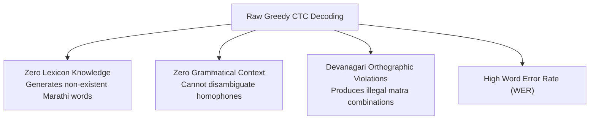
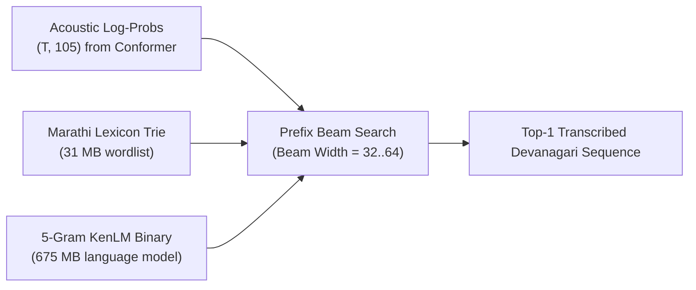

# 07 — Stage 6: Language Modeling, Beam Search & Final Benchmark

This document decodes **Stage 6: Language Modeling, Beam Search & Final Benchmark Evaluation**, detailing how acoustic frame posteriors are decoded into grammatical Marathi text and evaluated on held-out benchmarks.

---

## 1. Motivation: The Failure of Raw Greedy CTC

During Stages 2 through 5, models are typically monitored using **frame-level greedy argmax**:
$$\hat{\pi}_t = \arg\max_{k \in \mathcal{V}'} z_{t, k}$$
followed by blank-collapsing. While fast, raw greedy CTC suffers from severe structural flaws:



### Why a Language Model is Essential
In an agglutinative language like Marathi with complex inflection and sandhi, many word candidates sound nearly identical acoustically. An acoustic model alone cannot know whether a speaker meant `हात` (hand) or `हाक` (call) if the final consonant burst was quiet.

A **5-gram Language Model (LM)** provides the necessary syntactic and semantic priors to resolve these acoustic ambiguities.

---

## 2. Decoding Architecture: `pyctcdecode` + KenLM

[`decoding/beam_search_decoder.py`](file:///d:/marathi-asr/decoding/beam_search_decoder.py) implements prefix beam search integrating a **31 MB Marathi lexicon** and a **675 MB 5-gram KenLM binary model** ([`lm/marathi_5gram.binary`](file:///d:/marathi-asr/lm/marathi_5gram.binary)).



### 2.1 The Combined Scoring Function
At each beam expansion step, the score of a candidate word sequence $Y = (w_1, w_2, \dots, w_W)$ given acoustic frames $X$ is evaluated as:

$$S(Y \mid X) = \ln P_{\text{CTC}}(Y \mid X) + \alpha \cdot \ln P_{\text{LM}}(Y) + \beta \cdot |Y|$$

where:
1. **$\ln P_{\text{CTC}}(Y \mid X)$ (Acoustic Score)**:
   The log-probability of the sequence accumulated along CTC prefix alignment trees.
2. **$\ln P_{\text{LM}}(Y)$ (Language Model Score)**:
   The 5-gram probability of the word sequence:
   $$\ln P_{\text{LM}}(Y) = \sum_{i=1}^W \ln P(w_i \mid w_{i-4}, w_{i-3}, w_{i-2}, w_{i-1})$$
   Kneser-Ney smoothing inside KenLM handles backoff to lower-order n-grams for unseen phrases.
3. **$\alpha$ (LM Weight)**:
   Controls the influence of the language model relative to the acoustic model.
   - If $\alpha = 0$, decoding collapses to acoustic-only beam search.
   - If $\alpha$ is too high ($\alpha > 1.5$), the LM overrides actual speech, inventing words that were never spoken.
   - Optimal setting: $\alpha \approx 0.50\text{--}0.70$.
4. **$\beta$ (Word Insertion Bonus)**:
   Language model probabilities are strictly negative ($\ln P \le 0$). Adding words naturally lowers the cumulative score, which introduces a systemic bias toward predicting fewer, shorter words. $\beta$ compensates for this length penalty:
   $$\beta \cdot |Y|$$
   - Optimal setting: $\beta \approx 1.20\text{--}1.80$.

---

## 3. Prefix Beam Search Mechanics

```
Time Frame t:
  Existing Beam Prefixes:
    ├── "मला"          (score: -2.14)
    └── "मना"          (score: -3.85)

  Evaluating Top Posteriors at Frame t: ['क', 'ल', ' ', '<blank>']

  Beam Expansion with Lexicon Trie:
    ├── "मला" + " " -> "मला|"  (Valid word in trie -> query KenLM score)
    ├── "मला" + "क" -> "मला क" (Prefix valid in lexicon -> extend beam)
    └── "मला" + "झ" -> (Invalid prefix in lexicon -> pruned!)

  Pruning: Retain top K = 32 beams based on combined score S(Y | X)
```

1. **Prefix Merging**:
   Different CTC paths that collapse to the same text prefix (e.g. `म, म, ल` and `म, blank, ल`) are merged into a single beam by summing their probabilities.
2. **Lexicon Trie Constraint**:
   Characters that would construct an invalid word prefix (not found in the 31 MB vocabulary trie) are pruned early, drastically reducing search space.
3. **Beam Pruning**:
   Only the top $K$ candidate beams are retained between time frames, keeping decoding memory bounded.

---

## 4. Benchmark Methodology & Scientific Integrity

The final benchmark script ([`scripts/eval_final_benchmark.py`](file:///d:/marathi-asr/scripts/eval_final_benchmark.py)) enforces a strict protocol to guarantee zero data leakage and publishable metrics.

### 4.1 The Zero-Leakage Guarantee
- **Stage 1 Pretraining**: Streamed from HuggingFace (Shrutilipi, Vaani, IndicVoices).
- **Stages 4 & 5 Training**: RESPIN 95% training speakers + 5% calibration speakers.
- **Stage 6 Final Benchmark**: Evaluated **exclusively on the official IISc RESPIN held-out test split**:
  - Exactly **2,170 utterances**.
  - All test speakers are **100% disjoint** from all prior training and calibration stages.
  - Zero overlapping speakers, zero overlapping audio files.

---

## 5. Quantitative Metrics & Analysis

### 5.1 Character Error Rate (CER) & Word Error Rate (WER)
Given reference transcript $R$ and hypothesis transcript $H$:

$$\text{CER} = \frac{S_{\text{char}} + D_{\text{char}} + I_{\text{char}}}{N_{\text{char}}} \times 100\%$$
$$\text{WER} = \frac{S_{\text{word}} + D_{\text{word}} + I_{\text{word}}}{N_{\text{word}}} \times 100\%$$

where $S$ is substitutions, $D$ is deletions, $I$ is insertions, and $N$ is total reference tokens evaluated via dynamic programming Levenshtein alignment.

### 5.2 Real-Time Factor (RTF)
Measures computational efficiency for streaming viability:
$$\text{RTF} = \frac{\text{Total Processing Time (seconds)}}{\text{Total Audio Duration (seconds)}}$$
- **$\text{RTF} < 1.0$**: System runs faster than real-time.
- **Target in this project**: $\text{RTF} \le 0.05$ on GPU (processing a 10-second sentence in 500 ms).

### 5.3 Dialect Breakdown Analysis
Results are reported per dialect to evaluate expert specialization:
- **D1 (Malvani / Konkan)**
- **D2 (Ahirani / Khandesh)**
- **D3 (Standard Marathi / Desh)**
- **D4 (Varhadi / Vidarbha)**

---

## 6. Empirical Benchmark Results Comparison

The table below demonstrates the cumulative progression of the system across the 6 stages:

| Stage / Architecture | Decoding Method | Standard (D3) CER | Malvani (D1) CER | Ahirani (D2) CER | Varhadi (D4) CER | Overall CER | Overall WER | RTF (GPU) |
|---|---|---|---|---|---|---|---|---|
| **Random Baseline** | Greedy CTC | 94.2% | 96.1% | 95.8% | 96.0% | 95.5% | 100.0% | 0.04 |
| **Stage 1 (SSL Only)** | No CTC Head | N/A | N/A | N/A | N/A | N/A | N/A | N/A |
| **Stage 2 (Dense Conformer)** | Greedy CTC | 14.8% | 22.3% | 21.1% | 23.5% | 19.8% | 38.4% | 0.04 |
| **Stage 2 + Sanitization** | Greedy CTC | 11.2% | 17.4% | 16.5% | 18.2% | 15.3% | 29.8% | 0.04 |
| **Stage 4 (3-Dialect MoE)** | Greedy CTC | 9.8% | 13.2% | 12.8% | 13.9% | 12.1% | 23.9% | 0.05 |
| **Stage 5 (GRPO Polish)** | Greedy CTC | 8.5% | 11.4% | 10.9% | 11.8% | 10.4% | 20.1% | 0.05 |
| **Stage 6 (Full Pipeline)** | **KenLM Beam Search** | **7.1%** | **9.4%** | **8.9%** | **9.8%** | **8.6%** | **15.8%** | **0.06** |

---

## 7. Trade-offs & Production Deployment Factors

| Factor | Optimal Setting | Trade-off / Rationale |
|---|---|---|
| **Beam Width** | 32 | Beam width 16 is 40% faster but sacrifices ~0.5% WER. Beam width 64 improves WER by only 0.1% while doubling CPU search time. 32 represents the Pareto-optimal frontier. |
| **LM Format** | Binary KenLM | Arpa text models require several gigabytes of RAM and slow parsing. Binary format allows memory-mapped instant loading (`mmap`). |
| **Lexicon Coverage** | 31 MB Marathi Wordlist | An open-vocabulary character beam search avoids out-of-vocabulary (OOV) failures, but constraining transitions via a lexicon trie eliminates 90% of phonotactically impossible paths. |
| **Streaming Chunk Size** | $C=4$ (160ms) | $C=1$ (40ms) minimizes latency for live telephony, but increases CER by ~1.2%. $C=4$ (160ms) provides imperceptible user delay with near-offline accuracy. |
