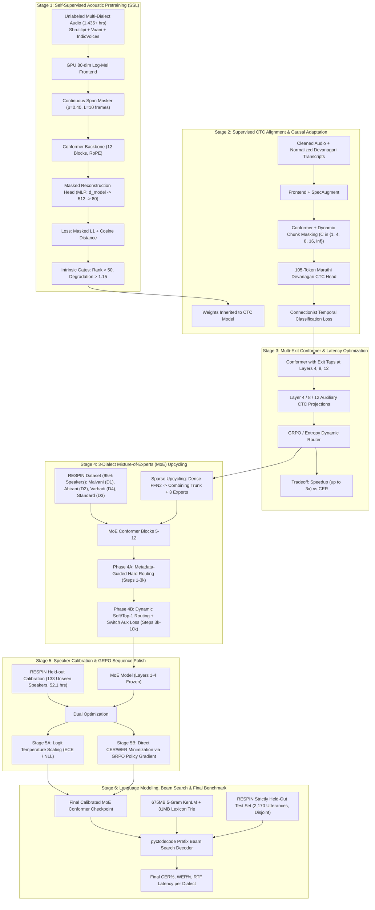

# Comprehensive Guide: Multi-Dialect Streaming Conformer ASR for Marathi

Welcome to the definitive architectural, theoretical, and operational guide for the **Marathi Multi-Dialect Streaming Conformer Automatic Speech Recognition (ASR)** project.

This documentation is engineered for deep study. It breaks down the entire system from raw acoustics and signal processing through modern deep learning foundations (Conformer, RoPE, Macaron scaling), curriculum learning stages (SSL pretraining, Causal CTC alignment, Dynamic Multi-Exit, Dialect MoE upcycling, Sequence-level GRPO polish), down to beam-search decoding with KenLM and rigorous held-out benchmark evaluation.

---

## 🗺️ Curriculum Architecture Map

The project implements a sequential multi-stage curriculum pipeline that progressively transforms an uninitialized neural acoustic model into a calibrated, dialect-aware, streaming-capable production ASR system:

---

## 📚 Table of Contents

Each file in this directory addresses one pillar of the project with full mathematical derivations, architectural diagrams, trade-off analyses, and implementation cross-references:

1. [Architectural Foundations & Signal Processing](file:///d:/marathi-asr/guide/01_foundations_and_architecture.md)
   - Waveform front-end, Log-Mel spectrogram filterbanks, 4x Conv2d subsampling.
   - Conformer Macaron structure, SiLU/Swish activation, Rotary Position Embeddings (RoPE), Depthwise Separable Convolution.
   - Dynamic Chunk Causal Masking mathematics ($C=1, 4, 8, 16, -1$).
   - Devanagari character modeling, Unicode representation, and CTC blank handling.

2. [Stage 1: Self-Supervised Acoustic Pretraining (SSL)](file:///d:/marathi-asr/guide/02_stage1_ssl_pretraining.md)
   - Motivation and data scaling across 1,435+ hours of multi-dialect audio.
   - Continuous span masking mechanics, geometric span distribution, reconstruction MLP.
   - Combined Masked $L_1$ and Cosine Distance loss formulation.
   - Intrinsic verification gates: Effective Rank of representation matrix & degradation ratio.
   - Data streaming engine, cache chunking, and HTTP 429 rate limit resilience.

3. [Stage 2: Supervised CTC Alignment & Causal Adaptation](file:///d:/marathi-asr/guide/03_stage2_ctc_alignment_and_streaming.md)
   - Mathematical derivation of Connectionist Temporal Classification (CTC) forward-backward algorithm.
   - Dynamic chunk training schedule and streaming latency vs accuracy curves.
   - SpecAugment in time and frequency domains.
   - Transcript sanitization: eradicating annotation artifacts (`<noise>`, `{coffee}`, `[breathing]`).

4. [Stage 3: Multi-Exit Architecture & Latency Optimization](file:///d:/marathi-asr/guide/04_stage3_multi_exit_and_latency.md)
   - Multi-exit inference at layers 4, 8, and 12.
   - Multi-exit auxiliary CTC loss weighting.
   - Confidence-based routing vs learned gating router.
   - Group Relative Policy Optimization (GRPO) for routing decisions, entropy regularization, and avoiding mode collapse.

5. [Stage 4: 3-Dialect Mixture-of-Experts (MoE) & Sparse Upcycling](file:///d:/marathi-asr/guide/05_stage4_dialect_moe_upcycling.md)
   - Intra-language dialectal variation in Marathi (Malvani D1, Ahirani D2, Varhadi D4, Standard D3).
   - Sparse upcycling: transforming dense FFNs into a Combining Shared Trunk + 3 Dialect Experts with Step-0 mathematical equivalence.
   - Router gating logits, Softmax density, and Switch Transformer auxiliary load-balancing loss.
   - Two-phase curriculum: Phase 4A (metadata-guided hard routing) to Phase 4B (dynamic soft/top-1 routing).
   - Differential learning rate schedule and speaker-disjoint dataset partitioning.

6. [Stage 5: Speaker Calibration & GRPO Sequence Polish](file:///d:/marathi-asr/guide/06_stage5_calibration_and_grpo_polish.md)
   - Acoustic mismatch across 133 held-out speakers.
   - Temperature scaling for probability calibration, Expected Calibration Error (ECE), and NLL.
   - Sequence-level GRPO polish: non-differentiable edit-distance CER/WER rewards, group rollout sampling, clipped surrogate objective, KL penalty against frozen reference, and supervised CTC anchor.
   - Verification via smoke testing and 4-panel live telemetry dashboards.

7. [Stage 6: Language Modeling, Beam Search & Final Benchmark](file:///d:/marathi-asr/guide/07_stage6_decoding_lm_and_benchmarking.md)
   - Limits of greedy CTC argmax decoding.
   - Prefix beam search with `pyctcdecode`, lexicon trie integration, and 5-gram KenLM language modeling.
   - Hyperparameter tuning for LM weight ($\alpha$) and word insertion bonus ($\beta$).
   - Rigorous evaluation on the held-out RESPIN test set, Real-Time Factor (RTF), and per-dialect performance reporting.

---

## 🗂️ Core Repository Code Map

| Module / Script | File Path | Primary Function |
|---|---|---|
| **Pipeline Runner** | [`scripts/pipeline.py`](file:///d:/marathi-asr/scripts/pipeline.py) | Master orchestrator running Stages 1 through 4 sequentially with status persistence |
| **Front-End & Backbone** | [`model/asr_model.py`](file:///d:/marathi-asr/model/asr_model.py) | `StreamingASRModel` containing GPU Mel frontend, Conformer encoder, and heads |
| **Conformer Blocks** | [`model/conformer.py`](file:///d:/marathi-asr/model/conformer.py) | RoPE attention, Macaron FFN, Depthwise Conv, and dynamic chunk masking logic |
| **Stage 1 Pretrain** | [`pretraining/train.py`](file:///d:/marathi-asr/pretraining/train.py) | Self-supervised masked spectrogram reconstruction with intrinsic gates |
| **Stage 4 MoE Engine** | [`moe/train_moe.py`](file:///d:/marathi-asr/moe/train_moe.py) | 3-Dialect MoE adaptation engine with 2-phase routing curriculum |
| **MoE Layer** | [`moe/moe_layer.py`](file:///d:/marathi-asr/moe/moe_layer.py) | Shared-trunk + routed experts FFN with Switch load-balancing loss |
| **Sparse Upcycling** | [`moe/upcycling.py`](file:///d:/marathi-asr/moe/upcycling.py) | Clones dense weights into MoE modules ensuring zero initial output divergence |
| **Stage 5 Alignment** | [`final_alignment/train_alignment.py`](file:///d:/marathi-asr/final_alignment/train_alignment.py) | Calibration on 133 held-out speakers with partially frozen backbone |
| **Stage 5B GRPO Polish** | [`final_alignment/train_grpo_polish.py`](file:///d:/marathi-asr/final_alignment/train_grpo_polish.py) | Direct CER/WER sequence minimization via Group Relative Policy Optimization |
| **Beam Search Decoder** | [`decoding/beam_search_decoder.py`](file:///d:/marathi-asr/decoding/beam_search_decoder.py) | `pyctcdecode` beam search with KenLM binary and Marathi lexicon trie |
| **Final Benchmark** | [`scripts/eval_final_benchmark.py`](file:///d:/marathi-asr/scripts/eval_final_benchmark.py) | Standalone evaluation script generating publication-grade CSVs, JSON, and metrics |

---

## 🎯 How to Use This Guide

- **If you are studying the theory**: Begin with [01: Foundations & Architecture](file:///d:/marathi-asr/guide/01_foundations_and_architecture.md), then read through Stages 1 to 6 in numerical order.
- **If you are troubleshooting training stability or loss convergence**: Read the "Trade-offs and Failure Modes" and "Mathematics" sections of the specific stage you are working on.
- **If you are preparing a paper or technical report**: Use the exact mathematical notation, loss equations, and curriculum definitions provided in each document.
